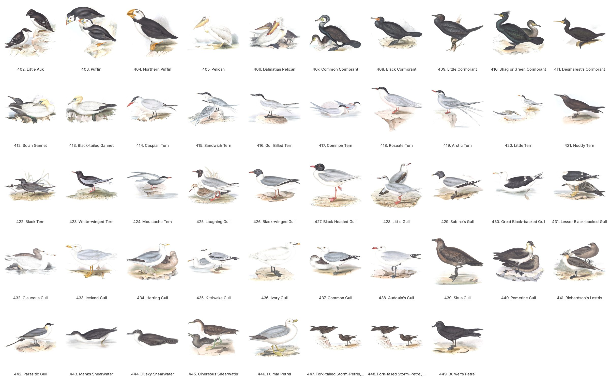

# Historical bird plates

This dataset gives the modern species on every plate of the great nineteenth-century bird folios, plate by plate. Each identification carries identifiers other tools can join on: eBird, Wikidata, GBIF, Avibase and BirdNET.

Old plates name their birds the way their authors did, and many of those names now belong to different species. Gould's "Black-headed Gull" is today's Mediterranean Gull. Audubon's "Hudsonian Curlew" is the Hudsonian Whimbrel, now split from the Eurasian bird. A plate is worth little to a birder, a cataloguer or an app until someone has worked out which bird it shows. This repo is that work, with its reasoning, released CC0 so anyone can build on it.

| Folio | Plates | Identified | Images |
|---|---|---|---|
| [`gould-europe/`](gould-europe/): John Gould, *The Birds of Europe* (1832–37) | 449 | 422, 411 checked against the engraved caption | cleaned sheets and art crops in the [`gould-europe-v1`](https://github.com/wr/historical-bird-plates/releases/tag/gould-europe-v1) release |
| [`havell/`](havell/): John James Audubon, *The Birds of America*, Havell edition (1827–38) | 435 | 430 | links only (see [`havell/README.md`](havell/README.md)) |

Gould's *Birds of Great Britain*, *Birds of Asia* and *Birds of Australia* are next, in the same shape.



*Gould's* Birds of Europe, *plates 402–449. Every plate is in [`gould-europe/`](gould-europe/#the-plates).*

## What is in a folio

Every folio folder has the same two tables. [`datapackage.json`](datapackage.json) describes each column ([Frictionless Data](https://specs.frictionlessdata.io/data-package/)).

- **`plates.csv`**: one row per plate. It gives the plate's number in the folio's own numbering and its printed title. For a scanned folio it also says where to find the plate: the BHL item, page and leaf, plus a link to the unaltered full-resolution scan.
- **`species.csv`**: one row per plate and modern species. Columns:
  - `scientific`, `common` and `ebird_code`, in the taxonomy named in the row's `taxonomy` column (eBird/Clements 2025 throughout).
  - `wikidata`, `gbif` and `avibase`, joined through Wikidata by eBird code.
  - `birdnet_label`, the class name in BirdNET GLOBAL 6K V2.4.
  - `form`: `subspecies`, `variant`, or `pre-split` for a plate drawn before a split.
  - On a sheet with several birds, the `figure` key as printed.
  - `confidence`, `caption_checked`, and the `reason` and `sources` for the identification.

**Unresolved plates stay in the tables.** A plate nobody has identified keeps its row, with an empty species and the reason. A doubtful identification stays with `confidence` `medium` or `low`. Those rows are the open questions, and the easiest way to contribute.

`confidence` means:
- `high`: certain.
- `judged`: a considered call, argued in `reason`.
- `medium` / `low`: open.
- `none`: not identified.

`caption_checked` is `yes` only where someone read the plate's engraved caption on the scan and checked the identification against it.

## Licence and credit

- **The tables** (identifications, crosswalks, notes): original work, dedicated to the public domain under [CC0 1.0](LICENSE). No permission is needed and no attribution is required. A citation is appreciated (see [`CITATION.cff`](CITATION.cff)).
- **The plates:** public domain works of the 1820s–30s.
- **The cleaned images** in the releases carry no new copyright: a faithful reproduction of a public-domain work is not an original work. They are marked [Public Domain Mark 1.0](https://creativecommons.org/publicdomain/mark/1.0/), not licensed. The Gould scans come from the Smithsonian Libraries' copy, via the Biodiversity Heritage Library. BHL marks them public domain and asks for the credit line "Smithsonian Libraries and Archives, via the Biodiversity Heritage Library".
- **Names:** the eBird codes, Wikidata, GBIF and Avibase ids, and BirdNET's label strings are used only as names for joining. BirdNET's labels file is CC BY-NC-SA 4.0, so it is not included here. `tools/validate.py` downloads it to check against.

## Checking the data

```sh
python3 tools/validate.py            # needs network once: eBird taxonomy + BirdNET labels, cached in .cache/
python3 tools/validate.py --offline  # structure only
```

The script runs on every push. It checks:
- every column against `datapackage.json`;
- every `ebird_code` against the eBird taxonomy the row names, including that the code's scientific name matches;
- every `birdnet_label` verbatim against BirdNET's labels;
- that every id is well formed.

## Adding a folio or fixing a plate

**Fixing a plate** is a pull request to that folio's `species.csv`. Put the evidence in `reason` and `sources`. The best evidence is what the plate itself shows: the caption, the figure, the bird.

**Adding a folio** means a new folder with the same two tables and a `README.md`. The README covers:
- the edition and the copy scanned;
- how its plates were found;
- how the names were checked;
- the traps a later reader would fall into.

Add the folio's tables to `datapackage.json`, then run the validator.

## Where this comes from

This dataset was made for [Featherframe](https://github.com/wr/featherframe), an e-paper frame that shows the birds a [BirdNET](https://birdnet.cornell.edu/) station hears as plates from these folios. Featherframe's folio files are exported here (`server/scripts/export_dataset.py`). This repo is the public record of every plate, and Featherframe uses only the plates it needs.
