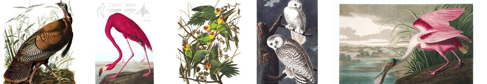
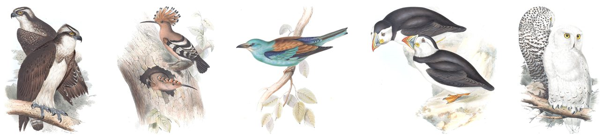
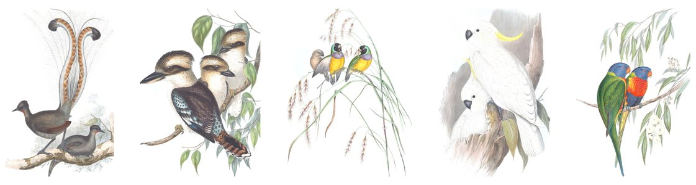
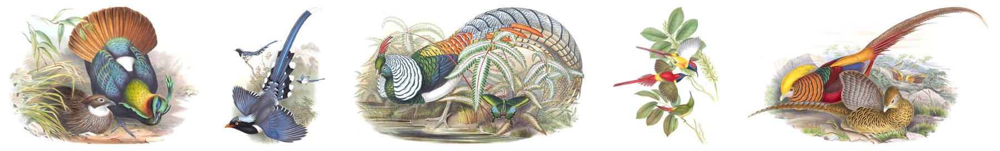
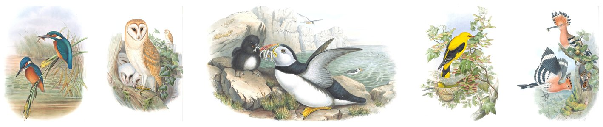

# Historical bird plates

[](https://doi.org/10.5281/zenodo.22964828)
[](LICENSE)
[](https://github.com/wr/historical-bird-plates/actions/workflows/validate.yml)

Every plate of five great nineteenth-century bird folios, identified to modern species. Each identification carries the IDs other tools join on: eBird, Wikidata, GBIF, Avibase and BirdNET. The plate images are cleaned and cut two ways.

Old plates name their birds the way their authors did, and many of those names now belong to other species. Gould's "Black-headed Gull" is today's Mediterranean Gull. This dataset matches each plate to the bird it actually shows, gives the reasoning, and is released CC0.

## The folios

### Audubon, *The Birds of America* (Havell edition, 1827–38)

[](havell/#the-plates)

435 plates · 399 identified · [browse all plates](havell/#the-plates) · [tables](havell/) · [images](https://github.com/wr/historical-bird-plates/releases/tag/havell-v1)

### Gould, *The Birds of Europe* (1832–37)

[](gould-europe/#the-plates)

449 plates · 403 identified, 392 checked against the engraved caption · [browse all plates](gould-europe/#the-plates) · [tables](gould-europe/) · [images](https://github.com/wr/historical-bird-plates/releases/tag/gould-europe-v1)

### Gould, *The Birds of Australia* and *Supplement* (1840–69)

[](gould-australia/#the-plates)

681 plates · 678 identified, 660 checked · [browse all plates](gould-australia/#the-plates) · [tables](gould-australia/) · [images](https://github.com/wr/historical-bird-plates/releases/tag/gould-australia-v1)

### Gould, *The Birds of Asia* (1850–83)

[](gould-asia/#the-plates)

530 plates · 354 identified · 526 captions read · [browse all plates](gould-asia/#the-plates) · [tables](gould-asia/) · [images](https://github.com/wr/historical-bird-plates/releases/tag/gould-asia-v1)

### Gould, *The Birds of Great Britain* (1862–73)

[](gould-britain/#the-plates)

367 plates · 367 drafts, 7 checked · [browse all plates](gould-britain/#the-plates) · [tables](gould-britain/) · [images](https://github.com/wr/historical-bird-plates/releases/tag/gould-britain-v1)

## Get the data

- **Tables:** clone the repo, or read a CSV straight from GitHub, e.g. `https://raw.githubusercontent.com/wr/historical-bird-plates/main/gould-europe/species.csv`. [`datapackage.json`](datapackage.json) describes every column.
- **Images:** each folio has a release of cleaned full sheets and art crops, with a sha256 manifest. For example:

  ```sh
  gh release download gould-europe-v1 -R wr/historical-bird-plates -p 'crop-*'
  ```

- **Cite:** Riley, W. *Historical bird plates: modern identifications*. Zenodo. [doi:10.5281/zenodo.22964828](https://doi.org/10.5281/zenodo.22964828). See [`CITATION.cff`](CITATION.cff).

---

## Reference

### By the numbers

| Folio | Plates | Plates identified | Caption-checked | Species | Rows: `high` / `judged` / `medium` / `low` / `none` | BirdNET-labelled | Wikidata-linked | Kansas disagreements |
|---|---:|---:|---:|---:|---|---:|---:|---:|
| `havell` | 435 | 399 | – | 430 | 430 / 0 / 0 / 0 / 36 | 408 / 430 | 418 / 430 | – |
| `gould-europe` | 449 | 403 | 392 | 410 | 430 / 18 / 0 / 20 / 0 | 422 / 422 | 406 / 422 | 27 |
| `gould-australia` | 681 | 678 | 660 | 583 | 654 / 0 / 21 / 6 / 0 | 498 / 678 | 659 / 678 | 69 |
| `gould-asia` | 530 | 354 | 526 | 310 | 259 / 9 / 78 / 8 / 176 | 342 / 354 | 333 / 354 | 118 |
| `gould-britain` | 367 | 367 | 7 | 338 | 7 / 0 / 357 / 3 / 0 | 356 / 367 | 352 / 367 | – |

*Great Britain* is a first pass, and its `medium` drafts are open questions. So are *Asia*'s 176 unidentified plates.

### Tables

Every folio folder has `plates.csv` and `species.csv`. Some also have `ku-disagreements.csv` and a `sources/` folder holding the working record. [`datapackage.json`](datapackage.json) ([Frictionless Data](https://specs.frictionlessdata.io/data-package/)) is the schema.

| File | One row per | Key columns |
|---|---|---|
| `plates.csv` | plate | `plate` in the folio's own numbering (plus `volume` where a folio numbers per volume: *Australia*, *Great Britain*, *Asia*); printed title and Latin; BHL `bhl_item`, `leaf`, `bhl_page`; `scan_url` (the unaltered JPEG 2000); `sheet_asset`, `crop_asset` |
| `species.csv` | plate × modern species | `scientific`, `common`, `ebird_code`, `taxonomy` (eBird/Clements 2025); `wikidata`, `gbif`, `avibase`; `birdnet_label` (BirdNET GLOBAL 6K V2.4, verbatim); `form`; `figure`; `confidence`; `caption_checked`; `reason`; `sources` |
| `ku-disagreements.csv` | plate where the University of Kansas catalogue differs | KU's record and name, ours, and the `kind` of disagreement (error, crossed, typo, old name, pre-split, composite, …) |

- **`confidence`:** `high` is certain; `judged` is a considered call, argued in `reason`; `medium` and `low` are open; `none` is not identified.
- **`caption_checked`:** `yes` only where someone read the engraved caption on the scan and checked the identification against it.
- **`form`:** blank for the species itself; otherwise `subspecies`, `variant`, or `pre-split` (a plate drawn before a split stands for the parent species).
- **Unresolved plates keep their rows,** with an empty species and the reason, so the open questions are in the data.
- **Taxonomy:** names and codes follow eBird/Clements 2025. Where BirdNET's older taxonomy differs, `birdnet_label` keeps BirdNET's name. A species split since then is resolved per folio: Audubon's Barn Owl is the American Barn Owl, Gould's the Western.

### Images

Each Gould release has two cuts of every plate leaf. `havell-v1` has audubon.org's plates as published, plus crops with the lettering removed.

- **`sheet-…`:** the full sheet, stood upright, with the paper evened and cleared to white and the caption kept.
- **`crop-…`:** the art alone, with the caption and pencilled number cut away and a white margin added. *Australia* and *Asia* ship their crops as `crops.zip`.
- **`manifest.json`, `SHA256SUMS`:** sha256, size and plate for every file.

Every `plates.csv` row also links the unaltered BHL scan (`scan_url`), for anyone who wants the paper as it is.

### Licence and credit

- **Tables:** original work, dedicated to the public domain under [CC0 1.0](LICENSE). No permission or attribution is needed; a citation is appreciated.
- **Plates:** public-domain works of the 1820s–80s. The cleaned images carry no new copyright and are marked [Public Domain Mark 1.0](https://creativecommons.org/publicdomain/mark/1.0/).
- **Gould scans:** from the Smithsonian Libraries' copies, via the Biodiversity Heritage Library. Credit "Smithsonian Libraries and Archives, via the Biodiversity Heritage Library".
- **Havell scans:** from audubon.org. Credit "Courtesy of the John James Audubon Center at Mill Grove, Montgomery County Audubon Collection, and Zebra Publishing" (see [`havell/README.md`](havell/README.md)).
- **Names:** eBird codes, Wikidata, GBIF and Avibase IDs, and BirdNET's label strings are used only as names to join on. BirdNET's labels file is CC BY-NC-SA 4.0, so it isn't included; the validator downloads it.

### Validation

```sh
python3 tools/validate.py            # downloads the eBird taxonomy and BirdNET labels once, into .cache/
python3 tools/validate.py --offline  # checks structure only
```

The validator runs on every push. It checks:
- every column against `datapackage.json`;
- every `ebird_code` against the eBird taxonomy the row names, including that the code's scientific name matches;
- every `birdnet_label`, verbatim, against BirdNET's labels;
- that every ID is well formed.

`tools/quickstatements.py FOLIO` writes a [QuickStatements](https://quickstatements.toolforge.org/) batch that creates one Wikidata item per plate: instance of, part of the work with its plate number, creator, title, BHL page ID, and `depicts`, referenced to this dataset. It skips plates Wikidata already has.

### Contributing

- **Fix a plate:** open a pull request to that folio's `species.csv`, with the evidence in `reason` and `sources`. The best evidence is the plate itself: the caption, the figure, the bird.
- **Add a folio:** add a new folder with the same tables and a `README.md`. The README covers the edition and the copy scanned, how the plates were found, how the names were checked, and the traps. Add its tables to `datapackage.json`, then run the validator.

### Acknowledgements

- **Nathan Buchar's [audubon-bird-plates](https://github.com/nathanbuchar/audubon-bird-plates):** the Havell plate list (the titles and image links in `havell/plates.csv`) comes from it, and it's the other public mirror of Audubon's plates.
- **The [Biodiversity Heritage Library](https://www.biodiversitylibrary.org/) and Smithsonian Libraries and Archives:** they scanned Gould's *Birds of Europe*, *Australia*, *Great Britain* and *Asia* and publish them openly.
- **The University of Kansas Spencer Library:** its [Gould catalogue](https://digital.lib.ku.edu/ku-gould/11233) was the cross-check for the Gould identifications.
- **Wikimedia Commons, the University of Pittsburgh's Darlington Library and the New-York Historical Society:** their catalogues settled the hard Havell plates.

### Provenance

This dataset was made for [Featherframe](https://github.com/wr/featherframe), an e-paper frame that shows the birds a [BirdNET](https://birdnet.cornell.edu/) station hears as plates from these folios. `server/scripts/export_dataset.py` exports Featherframe's folio files here. This repo is the public record of every plate; Featherframe uses only the plates it needs.
