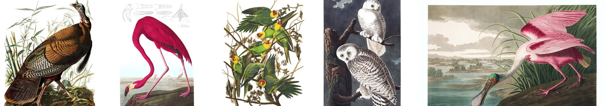
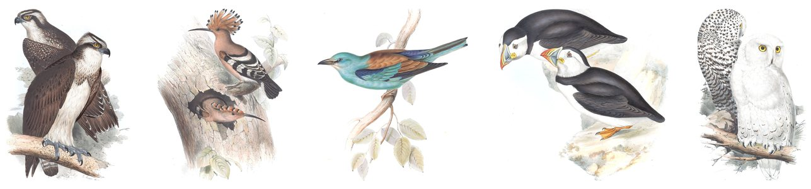
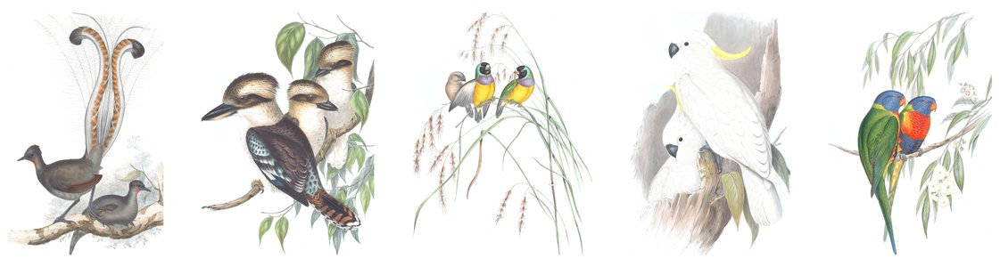
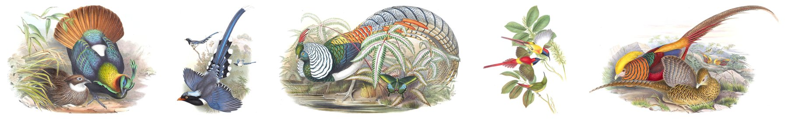
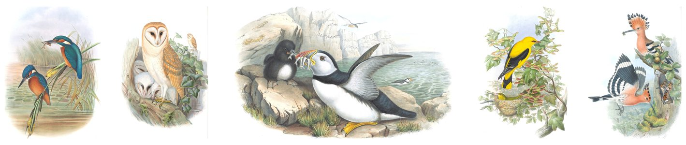

# Historical bird plates

[](https://doi.org/10.5281/zenodo.22964828)
[](LICENSE)
[](https://github.com/wr/historical-bird-plates/actions/workflows/validate.yml)

Every plate of five great nineteenth-century bird folios, identified to modern species. Each identification carries the IDs other tools join on: eBird, Wikidata, GBIF, Avibase and BirdNET. The plate images are cleaned and cut two ways.

Old plates name their birds the way their authors did, and many of those names now belong to other species. Gould's "Black-headed Gull" is today's Mediterranean Gull. This dataset matches each plate to the bird it actually shows, gives the reasoning, and is released CC0. [64 plates](#names-that-now-mean-another-bird) carry a printed name that eBird now gives to a different species.

The plates also carry credit lines: the small engraved lines under the art that say who drew a plate, who put it on stone or engraved it, and who printed it. Where this copy shows them, they are read off the plate, given as engraved, and parsed into who they name and for what; 1,940 of the 2,027 Gould plates have at least one line read. By their credit lines, Gould's plates were drawn and put on stone by Elizabeth Gould (433 plates), Edward Lear (57), H. C. Richter (1,278), Joseph Wolf (78) and William Hart (153) as well as by Gould himself (1,768). Audubon's credit lines name W. H. Lizars and Robert Havell Jr. as engravers.

## The folios

### Audubon, *The Birds of America* (Havell edition, 1827–38)

[](havell/#the-plates)

435 plates · 428 identified · [browse all plates](havell/#the-plates) · [tables](havell/) · [images](https://github.com/wr/historical-bird-plates/releases/tag/havell-v1)

### Gould, *The Birds of Europe* (1832–37)

[](gould-europe/#the-plates)

449 plates · 447 identified, 392 checked against the engraved caption · [browse all plates](gould-europe/#the-plates) · [tables](gould-europe/) · [images](https://github.com/wr/historical-bird-plates/releases/tag/gould-europe-v1)

[Credit lines](gould-europe/#who-made-the-plates): John and Elizabeth Gould 356 · Edward Lear 56

### Gould, *The Birds of Australia* and *Supplement* (1840–69)

[](gould-australia/#the-plates)

681 plates · 676 identified, 660 checked · [browse all plates](gould-australia/#the-plates) · [tables](gould-australia/) · [images](https://github.com/wr/historical-bird-plates/releases/tag/gould-australia-v1)

[Credit lines](gould-australia/#who-made-the-plates): John Gould 636 · H. C. Richter 560 · Elizabeth Gould 77

### Gould, *The Birds of Asia* (1850–83)

[](gould-asia/#the-plates)

530 plates · 530 identified, every caption read · [browse all plates](gould-asia/#the-plates) · [tables](gould-asia/) · [images](https://github.com/wr/historical-bird-plates/releases/tag/gould-asia-v1)

[Credit lines](gould-asia/#who-made-the-plates): John Gould 488 · H. C. Richter 406 · William Hart 122

### Gould, *The Birds of Great Britain* (1862–73)

[](gould-britain/#the-plates)

367 plates · 367 identified, 366 checked against the engraved caption · [browse all plates](gould-britain/#the-plates) · [tables](gould-britain/) · [images](https://github.com/wr/historical-bird-plates/releases/tag/gould-britain-v2)

[Credit lines](gould-britain/#who-made-the-plates): H. C. Richter 312 · John Gould 288 · Joseph Wolf 55

## Get the data

- **Tables:** clone the repo, or read a CSV straight from GitHub, e.g. `https://raw.githubusercontent.com/wr/historical-bird-plates/main/gould-europe/species.csv`. [`datapackage.json`](datapackage.json) describes every column.
- **Images:** each folio has a release of cleaned full sheets and art crops, with a sha256 manifest. For example:

  ```sh
  gh release download gould-europe-v1 -R wr/historical-bird-plates -p 'crop-*'
  ```

- **Cite:** Riley, W. *Historical bird plates: modern identifications*. Zenodo. [doi:10.5281/zenodo.22964828](https://doi.org/10.5281/zenodo.22964828). See [`CITATION.cff`](CITATION.cff).

---

## Reference

### By the numbers

| Folio | Plates | Plates identified | Caption-checked | Species | Rows: `high` / `judged` / `medium` / `low` / `none` | BirdNET-labelled | Wikidata-linked | Kansas disagreements |
|---|---:|---:|---:|---:|---|---:|---:|---:|
| `havell` | 435 | 429 | – | 445 | 489 / 8 / 0 / 0 / 6 | 472 / 497 | 497 / 497 | – |
| `gould-europe` | 449 | 447 | 392 | 447 | 446 / 14 / 3 / 0 / 2 | 431 / 463 | 463 / 463 | 54 |
| `gould-australia` | 681 | 676 | 660 | 587 | 668 / 7 / 3 / 4 / 0 | 496 / 677 | 676 / 677 | 107 |
| `gould-asia` | 530 | 530 | 530 | 464 | 521 / 12 / 0 / 0 / 0 | 383 / 533 | 533 / 533 | 208 |
| `gould-britain` | 367 | 367 | 366 | 338 | 365 / 4 / 0 / 0 / 0 | 358 / 369 | 369 / 369 | 74 |

The 18 [open rows](#open-questions) (`medium`, `low` and `none`) are the questions the sources haven't settled. Each one's `reason` asks what would decide it: the candidates, and what on the plate or in the text would tell them apart.

### Names that now mean another bird

These plates are printed with an English name that eBird/Clements 2025 now gives to a different species. Look one up by its printed name and you get the wrong bird. `python3 tools/misnamed.py` regenerates the list.

<details>
<summary>64 plates</summary>

**Audubon, *The Birds of America***

- 23: "Yellow-breasted Warbler" → Common Yellowthroat
- 199: "Little Owl" → Northern Saw-whet Owl
- 223: "Pied oyster-catcher" → American Oystercatcher
- 256: "Purple Heron" → Reddish Egret
- 314: "Black-headed Gull" → Laughing Gull
- 372: "Common Buzzard" → Swainson's Hawk
- 394: "Black-headed Siskin" → Hooded Siskin
- 399: "Mourning Warbler" → MacGillivray's Warbler

**Gould, *The Birds of Europe***

- 20: "Lanner Falcon" → Saker Falcon
- 67: "Great Grey Shrike" → Iberian Gray Shrike
- 79: "Naumann's Thrush" → Dusky Thrush
- 173: "Yellow Bunting" → Yellowhammer
- 179: "Meadow Bunting" → Rock Bunting
- 217: "Azure-winged Magpie" → Iberian Magpie
- 311: "Semipalmated Sandpiper" → Willet
- 342: "Common Gallinule" → Eurasian Moorhen
- 378: "Black Scoter" → Common Scoter
- 409: "Little Cormorant" → Pygmy Cormorant
- 425: "Laughing Gull" → Black-headed Gull
- 427: "Black-headed Gull" → Mediterranean Gull
- 447: "Fork-tailed Storm Petrel" → Leach's Storm-Petrel

**Gould, *The Birds of Australia***

- I.33: "Spotted Owl" → Tasmanian Boobook
- II.91: "Shining Flycatcher" → Satin Flycatcher
- III.21: "Banded Wren" → Splendid Fairywren
- IV.4: "Spotted Ground-Thrush" → Spotted Quail-thrush
- IV.7: "Mountain Thrush" → Bassian Thrush
- IV.24: "Long-billed Honey-eater" → New Holland Honeyeater
- IV.32: "Yellow-eared Honey-eater" → Lewin's Honeyeater
- IV.39: "Graceful Honey-eater" → Yellow-plumed Honeyeater
- IV.51: "White-throated Honey-eater" → Rufous-banded Honeyeater
- IV.67: "Obscure Honey-eater" → Dusky Myzomela
- IV.71: "Black-throated Honey-eater" → Black-chinned Honeyeater
- IV.92: "Pheasant Cuckoo" → Pheasant Coucal
- V.33: "Crimson-bellied Parrakeet" → Greater Bluebonnet
- V.62: "Little Green Pigeon" → Pacific Emerald Dove
- VI.46: "White Ibis" → Australian Ibis
- VII.51: "Cook's Petrel" → Gould's Petrel
- VII.70: "Pied Cormorant" → Little Pied Cormorant
- Supp.18: "White-tailed Robin" → Mangrove Robin
- Supp.56: "Little Cuckoo" → Little Bronze-Cuckoo

**Gould, *The Birds of Asia***

- I.1: "Black Vulture" → Red-headed Vulture
- I.13: "Indian Scops Owl" → Oriental Scops-Owl
- I.46: "Blue-and-white Kingfisher" → White-rumped Kingfisher
- I.71: "Mountain Trogon" → Orange-breasted Trogon
- II.45: "Chestnut-bellied Nuthatch" → Indian Nuthatch
- II.48: "White-naped Tit" → Yellow-bellied Tit
- II.52: "Yellow-cheeked Tit" → Himalayan Black-lored Tit
- II.58: "Grey Tit" → Gray-crested Tit
- II.59: "Rufous-bellied Tit" → Rufous-vented Tit
- II.65: "Elegant Tit" → Black-throated Tit
- II.72: "Philippine Oriole" → Black-naped Oriole
- III.60: "Long-billed Wren" → Long-billed Wren-Babbler
- III.64: "White-naped Yuhina" → White-collared Yuhina
- IV.27: "White-tailed Stone-Chat" → Variable Wheatear
- IV.52: "Spotted Wren" → Spotted Elachura
- V.9: "Painted Bunting" → Chestnut-eared Bunting
- V.20: "Black-and-Yellow Grosbeak" → Spot-winged Grosbeak
- V.55: "White-winged Magpie" → Eurasian Magpie
- VI.2: "Blossom-headed Parrakeet" → Plum-headed Parakeet
- VI.4: "Bonaparte's Parrakeet" → Long-tailed Parakeet
- VI.5: "Grey-headed Parrakeet" → Nicobar Parakeet
- VI.6: "Nicobar Parrakeet" → Long-tailed Parakeet
- VI.40: "Rufous Piculet" → White-browed Piculet

**Gould, *The Birds of Great Britain***

- II.71: "Melodious Warbler" → Icterine Warbler

</details>

### Tables

Every folio folder has `plates.csv`, `species.csv` and `credits.csv`, and the root has `artists.csv`. Some folders also have `ku-disagreements.csv` and a `sources/` folder holding the working record. [`datapackage.json`](datapackage.json) ([Frictionless Data](https://specs.frictionlessdata.io/data-package/)) is the schema.

| File | One row per | Key columns |
|---|---|---|
| `plates.csv` | plate | `plate` in the folio's own numbering (plus `volume` where a folio numbers per volume: *Australia*, *Great Britain*, *Asia*); printed title and Latin; BHL `bhl_item`, `leaf`, `bhl_page`; `scan_url` (the unaltered JPEG 2000); `sheet_asset`, `crop_asset`; `imprint` (the plate's credit lines, as engraved) |
| `species.csv` | plate × modern species | `scientific`, `common`, `ebird_code`, `taxonomy` (eBird/Clements 2025); `wikidata`, `gbif`, `avibase`; `birdnet_label` (BirdNET GLOBAL 6K V2.4, verbatim); `form`; `figure`; `confidence`; `caption_checked`; `reason`; `sources` |
| `credits.csv` | plate × name × role | `plate` (plus `volume` where the folio numbers per volume), `name`, `role` (drew, lithographed, engraved, retouched, printed, coloured), `as_printed`; generated from `imprint` by `tools/credits.py` |
| `artists.csv` (root) | person or firm on a credit line | `name`, `kind`, `wikidata`, `note` |
| `ku-disagreements.csv` | plate where the University of Kansas catalogue differs | KU's record and name, ours, and the `kind` of disagreement (error, crossed, typo, old name, pre-split, composite, …) |

- **`confidence`:** `high` is certain; `judged` is a considered call, argued in `reason`; `medium` and `low` are open; `none` is not identified.
- **`caption_checked`:** `yes` only where someone read the engraved caption on the scan and checked the identification against it.
- **`form`:** what the plate's printed name stands for, measured against the row's species.
  - **Blank:** the species itself: its own name, its nominate race, or a synonym of either. Also blank when the author used the name for the whole species (his range or synonymy takes in the nominate's population), even if it is a race name today.
  - **`subspecies`:** the printed name is now a race other than the nominate, under its own name or as a synonym, or the author says his figured bird is such a race. Gould's *Falco aesalon* is *F. columbarius aesalon*.
  - **`variant`:** a colour morph, sex, age or seasonal plumage that the author named or figured as a species of its own, or an aberrant bird: Audubon's young warblers, the Gyrfalcon's white and dark morphs, Sabine's Snipe.
  - **`pre-split`:** the plate stands for a parent species since split, and nothing decides which daughter it shows: Audubon's Traill's Flycatcher (Havell 45), whose two rows give both daughters.
  - Races follow eBird/Clements 2025's groups, and otherwise the IOC World Bird List.
- **Unresolved plates keep their rows,** with an empty species and the reason, so the open questions are in the data.
- **Taxonomy:** names and codes follow eBird/Clements 2025. Where BirdNET's older taxonomy differs, `birdnet_label` keeps BirdNET's name. A species split since then is resolved by where the bird came from: Audubon's Barn Owl is the American Barn Owl; Gould's is the Western in *Europe* and *Great Britain*, and the Eastern in *Australia* (I.31) and *Asia* (I.17).

#### Credit lines

`imprint` gives a plate's credit lines as engraved: the left corner, then the centre, then the right corner, each top to bottom, joined with " | ". `tools/credits.py` reads them into `credits.csv`, one row per plate, name and role, with every name in `artists.csv`. A joint credit gives every name every role, because that is all the plate says: "J. Gould & H. C. Richter, del. et lith." credits both men with drawing and lithographing. Each folio's README says what the sources add.

- **How they were read.** Readers transcribed every line by eye from crops of the plate's corners, working from the image, not from the OCR draft. Each reading was then compared with the OCR draft word by word, and every disagreement was looked at again, on the crop or on the full-resolution scan. Faint, cut or missed lines were read on the scan. On the Gould folios the marks (stops, commas, colons and semicolons) were then checked plate by plate on the lines enlarged 4× (*Great Britain*: at least 2×), and at 8× where a mark was in doubt.
- **As engraved:** the words and their spelling (*Asia* III.22's "Waller"), capitals, & or "and", commas after names, whether a mark follows an abbreviation, and the stop at a line's end. A stop or comma is recorded only where a separate mark can be seen, enlarged to 8× if need be.
- **Written by one convention**, because at the scans' resolution these can't be read consistently:
  - **Spacing:** one space after each stop, comma, colon and semicolon, and none before; one space each side of &. The words of a known wording take a space where they run together ("Drawnfrom" is written "Drawn from"), and so do "by" and "and" run into a capital ("byJ.", "andH.").
  - **Initials:** written "X. ", whatever mark, if any, follows the letter on the plate: "H. C. Richter", "J. & E. Gould".
  - **The mark after an abbreviation** (del, delt, lith, lithog, Imp, Impt, Edwd, Edinr, Junr) is written as a stop, where the plate has a stop, comma, colon or semicolon.
- **Not read:** a line cut off at the sheet's edge or in the binding is read only if every letter can still be told, and left out where only the tops of its letters show. A faint line is read if it is whole and every word can be read. A printer's line whose wording is cut off ("Hullmandel & Walton", with "Imp." lost in the binding) is left out too, with its legible text in `notes`. A plate with no credit line read has an empty `imprint` and a note saying why, and a plate missing one line has a note saying which.
- **One folio's inferences:** where a name form stands for someone only by its folio's pattern, it is listed in `FOLIO_NAMES` in `tools/credits.py` with its reason, and the folio's README names the plates. *Great Britain* III.61 reads "Gould &", its initial cut off; it is credited to John Gould, since the folio postdates Elizabeth Gould's death and every other line of it that names a Gould reads J. Gould. A name no pattern settles is credited to no one, like *Asia* IV.26's "H. Gould".
- **What isn't certain:**
  - **The marks.** A faint stop at the threshold of visibility may have been missed, or kept where there is none. On a line read from the upper half of its letters the stops are unknown, and its note says so.
  - **Faint lines.** A few credits rest on a faint but whole line, read word by word, such as *Europe* 25 and 102 (the printer's line), 33 (the artists') and 119 (both). The record notes in each folio's `sources/imprints.csv` say which lines were faint.
  - **Inferences.** A `FOLIO_NAMES` reading is inferred from its folio, not read. *Asia* IV.26's Gould, credited to no one, may be John Gould, the H an engraving slip like III.22's "Waller".
  - The words rest on two independent readings, the reader's and the OCR draft's, and the marks on the reader's and one check.

### Images

Each Gould release has two cuts of every plate leaf. `havell-v1` has audubon.org's plates as published, plus crops with the lettering removed.

- **`sheet-…`:** the full sheet, stood upright, with the paper evened and cleared to white and the caption kept.
- **`crop-…`:** the art alone, with the caption and pencilled number cut away and a white margin added. *Australia* and *Asia* ship their crops as `crops.zip`.
- **`manifest.json`, `SHA256SUMS`:** sha256, size and plate for every file.

Every `plates.csv` row also links the unaltered BHL scan (`scan_url`), for anyone who wants the paper as it is.

### Licence and credit

- **Tables:** original work, dedicated to the public domain under [CC0 1.0](LICENSE). No permission or attribution is needed; a citation is appreciated.
- **Plates:** public-domain works of the 1820s–80s. The cleaned images carry no new copyright and are marked [Public Domain Mark 1.0](https://creativecommons.org/publicdomain/mark/1.0/).
- **Gould scans:** from the Smithsonian Libraries' copies, via the Biodiversity Heritage Library. Credit "Smithsonian Libraries and Archives, via the Biodiversity Heritage Library".
- **Havell scans:** from audubon.org. Credit "Courtesy of the John James Audubon Center at Mill Grove, Montgomery County Audubon Collection, and Zebra Publishing" (see [`havell/README.md`](havell/README.md)).
- **Names:** eBird codes, Wikidata, GBIF and Avibase IDs, and BirdNET's label strings are used only as names to join on. BirdNET's labels file is CC BY-NC-SA 4.0, so it isn't included; the validator downloads it.

### Validation

```sh
python3 tools/validate.py            # downloads the eBird taxonomy and BirdNET labels once, into .cache/
python3 tools/validate.py --offline  # checks structure only
```

The validator runs on every push. It checks:
- every column against `datapackage.json`;
- every `ebird_code` against the eBird taxonomy the row names, including that the code's scientific name matches;
- every `birdnet_label`, verbatim, against BirdNET's labels;
- that every `credits.csv` is what `tools/credits.py` writes from `imprint`, and every name is in `artists.csv`;
- that a plate with an empty `imprint` has a note saying why;
- that every ID is well formed.

`tools/quickstatements.py FOLIO` writes a [QuickStatements](https://quickstatements.toolforge.org/) batch that creates one Wikidata item per plate: instance of; part of the work, with its plate number; creators and printer from the credit line, each referenced to the plate's BHL page (for Havell, its release sheet) and quoting the line; title; BHL page ID; and `depicts`, referenced to this dataset. A plate with no credit line read gets no creator, and a name with no Wikidata item gets no statement: the printers Walter, T. Walter and Walter & Cohn have none, so the plates they print (all of *Great Britain*'s that name a printer, most of *Asia*'s and 32 of the *Australia* Supplement's) get no `printed by`. It skips plates Wikidata already has. `--fix-creators` writes a batch that corrects the plate items this dataset already made, those the maintainer's Wikidata account created: it adds each artist and the printer the credit line names, and removes an unreferenced `creator: John Gould` (or Audubon) that the line doesn't name. Items whose plate has no artist's line read are left as they are, and so are items someone else made. Each edit to an existing item counts on its own, so split this batch with `--chunk 25`.

### Contributing

- **Fix a plate:** open a pull request to that folio's `species.csv`, with the evidence in `reason` and `sources`. The best evidence is the plate itself: the caption, the figure, the bird.
- **Fix a credit line:** correct `imprint` in that folio's `plates.csv`, as engraved and by the conventions under [Credit lines](#credit-lines), and run `python3 tools/credits.py`. A new wording or name must be added to the tables in `tools/credits.py` first, and a new person or firm to `artists.csv`.
- **Change identifications in bulk:** write the decisions to a CSV (one row per figure: `book`, `volume`, `plate`, `figure`, `scientific`, `form`, `confidence`, `caption_checked`, `reason`, `sources`) and run `python3 tools/identify.py DECISIONS.csv`. It replaces those plates' rows and fills the names and IDs from `scientific`. A species already in the dataset takes its reviewed IDs; a new one gets them by the rule in the script. Every decision is logged to the folio's `sources/decisions.csv`. Add `--dry-run` to see the changes first. `python3 tools/stats.py` prints the numbers table above.
- **Add a folio:** add a new folder with the same tables and a `README.md`. The README covers the edition and the copy scanned, how the plates were found, how the names were checked, and the traps. Add its tables to `datapackage.json`, then run the validator.

#### Open questions

These 18 rows are what's left. Each is a mystery bird, a hybrid, or two candidates the sources haven't separated. If you can settle one, from the plate, Gould's or Audubon's text, a specimen or the literature, open an issue or a pull request with the evidence. The plate number links to the scan. `python3 tools/gaps.py` regenerates this table.

| Book | Plate | Printed name | Leaning to | Status | What would settle it |
|---|---|---|---|---|---|
| Audubon, *America* | [11](https://www.audubon.org/sites/default/files/boa_plates/plate-11-bird-washington.jpg) | Bird of Washington | – | not identified | Audubon's eagle, which he took for a new species. Most authorities take it for a large immature Bald Eagle; no specimen survives to settle it. |
| Audubon, *America* | [55](https://www.audubon.org/sites/default/files/boa_plates/plate-55-cuviers-kinglet.jpg) | Cuvier's Kinglet | – | not identified | Known only from the one bird Audubon shot in Pennsylvania in 1812. An aberrant kinglet or a hybrid has been suggested; no specimen survives to settle it. |
| Audubon, *America* | [60](https://www.audubon.org/sites/default/files/boa_plates/plate-60-carbonated-warbler.jpg) | Carbonated Warbler | – | not identified | Known only from the two birds Audubon shot in Kentucky in 1811, and no specimen survives. Immature or aberrant birds of a known warbler, or hybrids, have been suggested. |
| Audubon, *America* | [164](https://www.audubon.org/sites/default/files/boa_plates/plate-164-tawny-thrush.jpg) | Tawny Thrush | – | not identified | Traditionally the Veery, but Halley (2018) disputes it. Which Catharus thrush does the figure show? |
| Audubon, *America* | [184](https://www.audubon.org/sites/default/files/boa_plates/plate-184-mango-hummingbird.jpg) | Mango Hummingbird | – | not identified | Audubon's Trochilus mango, a mango hummingbird of the Caribbean or Central America. Which species the figures show is disputed. |
| Audubon, *America* | [338](https://www.audubon.org/sites/default/files/boa_plates/plate-338-bemaculated-duck.jpg) | Bemaculated Duck | – | not identified | A hybrid duck, not a species: Audubon's "Bemaculated Duck". Its parent species could still be named from the plate. |
| Gould, *Europe* | [132](https://www.biodiversitylibrary.org/page/42173701) | Yellow Willow Wren | Willow Warbler | leaning | Willow Warbler in yellow first-autumn dress, or a yellow Chiffchaff? It is a Phylloscopus, not a Hippolais: slender bill, long yellow supercilium. Pale legs and the long brow say Willow Warbler. Temminck's figures of a wing as short as the Chiffchaff's point the other way. Primary projection and leg colour on Temminck's specimen would decide. The plate is in the copy: leaf 344, engraved 'Yellow Willow Wren. Sylvia Icterina (Vieill.)', pencilled 133. |
| Gould, *Europe* | [249](https://www.biodiversitylibrary.org/page/42173815) | Hybrid Grouse | – | not identified | Tetrao hybridus is the Rackelhahn, a hybrid Western Capercaillie x Black Grouse, as Gould himself says. No single species to name. |
| Gould, *Europe* | [348](https://www.biodiversitylibrary.org/page/42358296) | Bean Goose | Tundra Bean-Goose | leaning | Tundra or Taiga Bean Goose? Bill shape decides. The figure's bill is short, deep and mostly black with a narrow pink band behind the nail, and Gould stresses the 'diminutive bill', which says Tundra (rossicus). A Taiga bird has a long slender bill with more orange. The pink band and pinkish-orange legs also need a Pink-footed Goose ruled out; it was not separated in Britain until 1839. |
| Gould, *Europe* | [363](https://www.biodiversitylibrary.org/page/42358356) | Bimaculated Teal | – | not identified | Gould's Bimaculated Teal is the Vigors pair taken in an English decoy in 1812, the British 'Bimaculated Duck', a hybrid (Teal x Mallard or Teal x Wigeon), not Pallas's Baikal Teal; Salvadori lists the plate among the Common Teal's hybrids. The male's green head with two brown blotches, black-spotted chestnut breast and grey vermiculated flanks have nothing of the Baikal Teal's face pattern. No single species to name. |
| Gould, *Europe* | [444](https://www.biodiversitylibrary.org/page/42358680) | Dusky Shearwater | Barolo Shearwater | leaning | Which small black-and-white shearwater? The figure is small and grey-brown above, with white around the eye and white underparts. That fits Barolo Shearwater, the E Atlantic bird nearest Gould's 'Mediterranean and African' range. Salvin cites the plate under P. obscurus, which included Audubon's (now Sargasso). The undertail-covert colour decides: white in Barolo, dark in Sargasso. |
| Gould, *Australia* | [V.13](https://www.biodiversitylibrary.org/page/48400982) | Baudin’s Cockatoo | – | low | Baudin's or Carnaby's Black-Cockatoo? The length of the upper mandible decides: Baudin's is long, narrow and projects well past the lower, Carnaby's is short and broad. The figure's head is turned and the bill foreshortened. Gould's name is Lear's baudinii, but his Swan River birds 'mainly subsist' on Banksia, shown on the plate, which is Carnaby's food. |
| Gould, *Australia* | [V.30](https://www.biodiversitylibrary.org/page/48401050) | Fiery Parrakeet | – | low | Is ignitus an aberrant red Eastern Rosella or an Eastern x Crimson hybrid? Leadbeater's single Moreton Bay bird (ex-ZSL, now NHMUK) would decide. The figure has white cheeks (Eastern), but its red rump, wholly red underparts and white wing bands fit neither species. |
| Gould, *Australia* | [VI.2](https://www.biodiversitylibrary.org/page/48400649) | Kiwi-kiwi | – | low | North Island Brown Kiwi or Southern Brown Kiwi (tokoeka)? The two skins figured were given to the Zoological Society by the New Zealand Company, without locality. The plate's soft brown streaked birds could be either. Where the skins came from would decide: Wellington or New Plymouth means A. mantelli, Nelson or the south A. australis. |
| Gould, *Australia* | [VI.59](https://www.biodiversitylibrary.org/page/48400822) | Sombre Egret | Western Reef-Heron | leaning | Gould's single Sombre Egret is drawn as a dark Western Reef-Heron, not a Pacific Reef-Heron (long black tarsi with yellow toes, a slender yellow bill, long plumes), and in his Handbook (1865) he synonymises pannosus with Sykes's Ardea asha and gives its tarsus as about 4 1/2 inches, against under 3 1/2 in the reef heron. But the skin came 'from the neighbourhood of Port Stephens' with no note, far outside the Western Reef-Heron's range, and only the specimen, if it survives, would decide. |
| Gould, *Australia* | [VII.21](https://www.biodiversitylibrary.org/page/48508793) | Skua Gull | Brown Skua | leaning | Brown Skua or Great Skua? The figure is uniformly dark chocolate with a white primary flash and none of the Great Skua's rufous and pale streaking, and Gould wrote of Southern Ocean and Derwent birds, which he found darker. His name and synonymy are the Great Skua's and he names no specimen. The figured skin's origin would decide. |
| Gould, *Australia* | [VII.42](https://www.biodiversitylibrary.org/page/48508877) | Yellow-billed Albatros | Atlantic Yellow-nosed Albatross | leaning | Atlantic or Indian Yellow-nosed Albatross? The heads on the plate are washed blue-grey, which says Atlantic. Gould's text (head snow-white, grey only near the eye) and his Australian records say Indian. The base of the yellow culmen stripe would decide (broad and rounded in Atlantic, narrow and pointed in Indian), but it is foreshortened here. Gould first met the bird at 30°S 20°W and names no specimen. |
| Gould, *Australia* | [VII.83](https://www.biodiversitylibrary.org/page/48509041) | Crested Penguin | – | low | Eastern or Moseley's Rockhopper? Gunn's single bird washed up on the north coast of Tasmania. Crest length and the bare gape would decide: Moseley's has long, dense plumes, Eastern a narrower brow and conspicuous pink gape skin. The plate shows moderate plumes and no gape skin. Gould names Amsterdam, St Paul and Tristan (Moseley's), from Latham, not from his bird. Western Rockhopper (South America) is the unlikely one. |

### Acknowledgements

- **A reader of the r/birding announcement:** pointed out that many plates published under Gould's name were drawn by others, Elizabeth Gould first among them, and should be credited. The credit lines in `plates.csv` and `credits.csv` are the answer.
- **Nathan Buchar's [audubon-bird-plates](https://github.com/nathanbuchar/audubon-bird-plates):** the Havell plate list (the titles and image links in `havell/plates.csv`) comes from it, and it's the other public mirror of Audubon's plates.
- **The [Biodiversity Heritage Library](https://www.biodiversitylibrary.org/) and Smithsonian Libraries and Archives:** they scanned Gould's *Birds of Europe*, *Australia*, *Great Britain* and *Asia* and publish them openly.
- **The University of Kansas Spencer Library:** its [Gould catalogue](https://digital.lib.ku.edu/ku-gould/11233) was the cross-check for the Gould identifications.
- **Wikimedia Commons, the University of Pittsburgh's Darlington Library and the New-York Historical Society:** their catalogues settled the hard Havell plates.

### Provenance

This dataset was made for [Featherframe](https://github.com/wr/featherframe), an e-paper frame that shows the birds a [BirdNET](https://birdnet.cornell.edu/) station hears as plates from these folios. Featherframe's `server/scripts/export_dataset.py` first exported its folio files here. Since then this repo is where the identifications are kept and corrected, and Featherframe checks its pins against it. This repo is the public record of every plate; Featherframe uses only the plates it needs.
