# John Gould, *The Birds of Asia* (1850–83)

Seven volumes, 530 plates. Drawn and lithographed by John Gould with H. C. Richter, Joseph Wolf and William Hart, hand-coloured, published in parts in London. Gould died in 1881 and R. B. Sharpe finished the work.

**Copy:** Smithsonian Libraries, scanned for the Biodiversity Heritage Library (BHL): items 115342, 118636, 118635, 120503, 121124, 122488 and 122491, i.e. volumes I–VII, BHL barcodes `BirdsAsiaJohnGo{I..VII}Goul`. Public domain. Credit: *Smithsonian Libraries and Archives, via the Biodiversity Heritage Library.*

## The plates

Every plate as its art crop, by volume and number. The full-size images are in the [`gould-asia-v1`](https://github.com/wr/historical-bird-plates/releases/tag/gould-asia-v1) release.

**Volume I, plates 1–38**

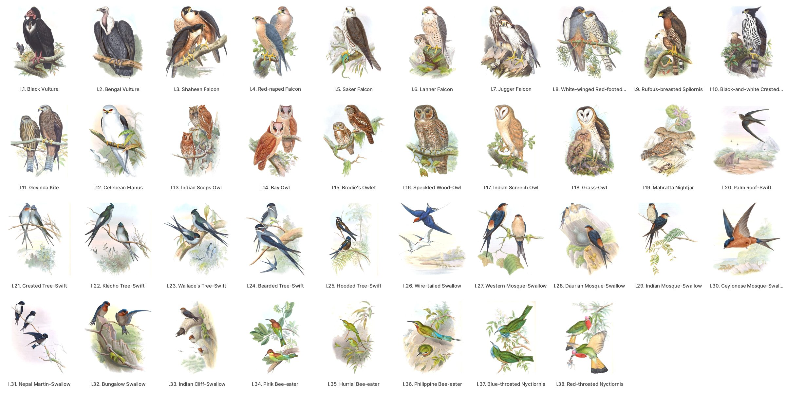

**Volume I, plates 39–76**

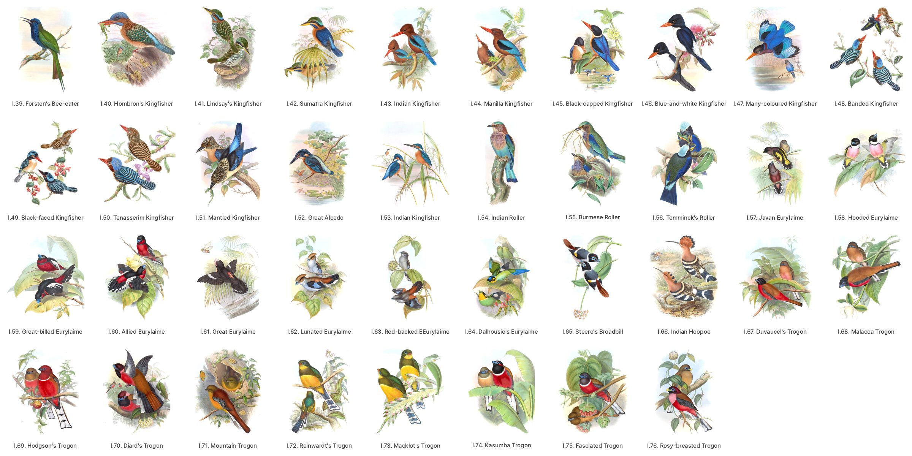

**Volume II, plates 1–38**

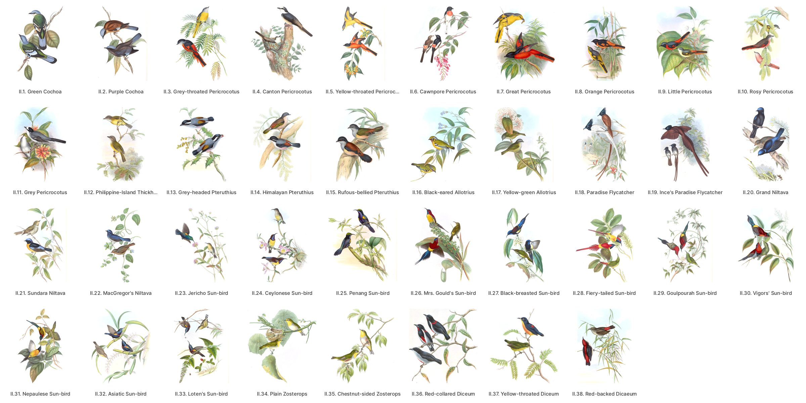

**Volume II, plates 39–75**

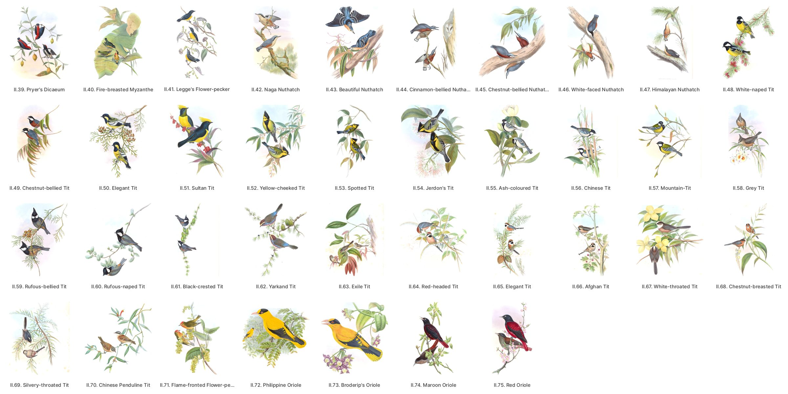

**Volume III, plates 1–39**

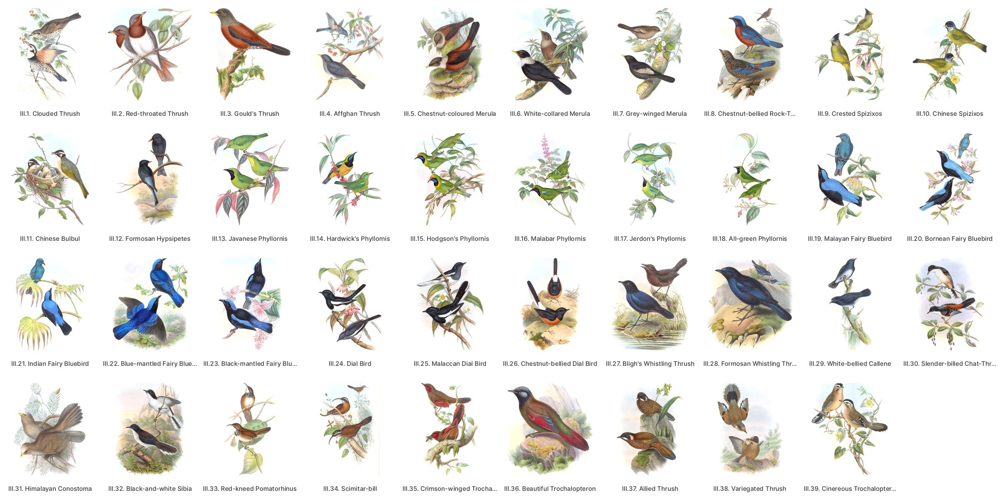

**Volume III, plates 40–78**

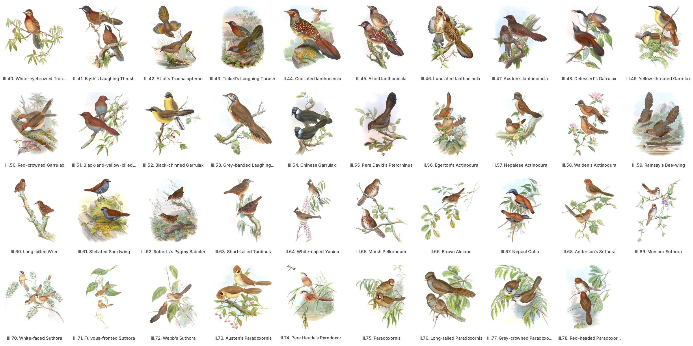

**Volume IV, plates 1–36**

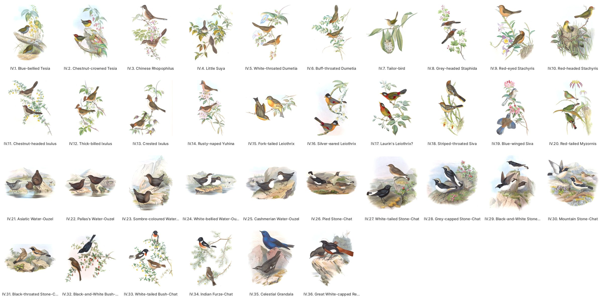

**Volume IV, plates 37–72**

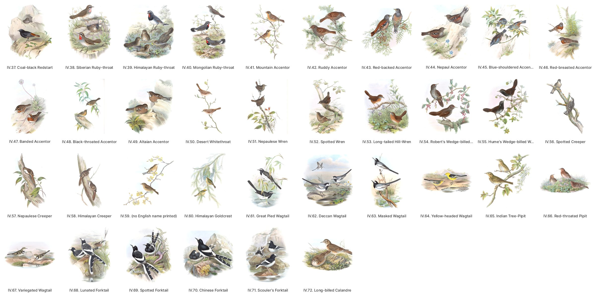

**Volume V, plates 1–42**

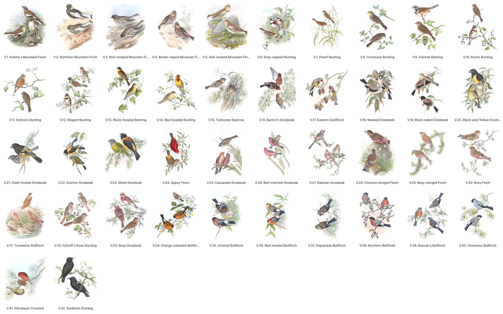

**Volume V, plates 43–83**

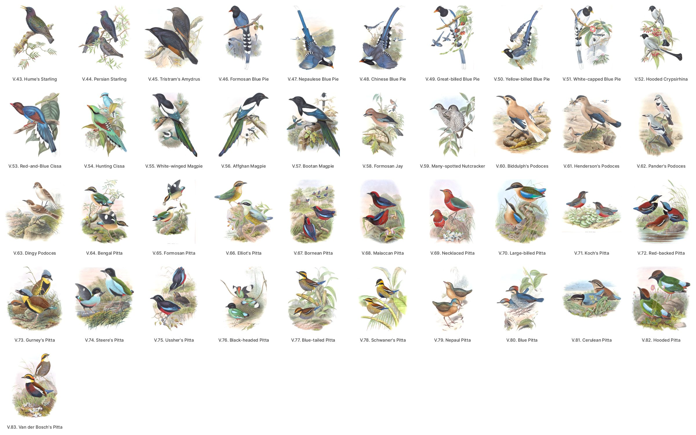

**Volume VI, plates 1–38**

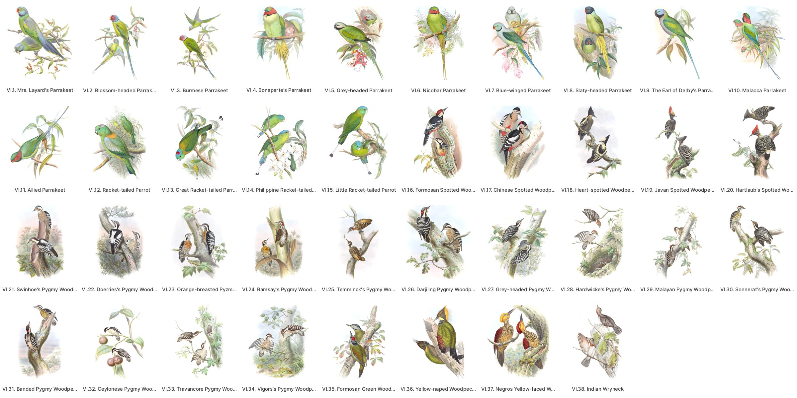

**Volume VI, plates 39–75**

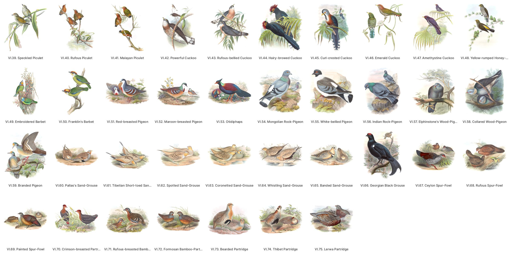

**Volume VII, plates 1–36**

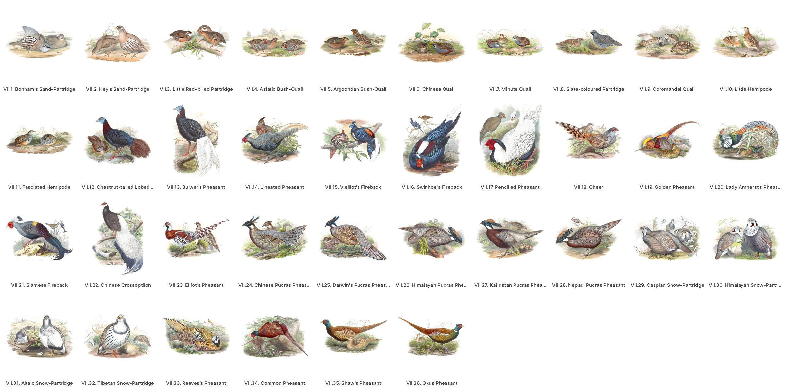

**Volume VII, plates 37–71**

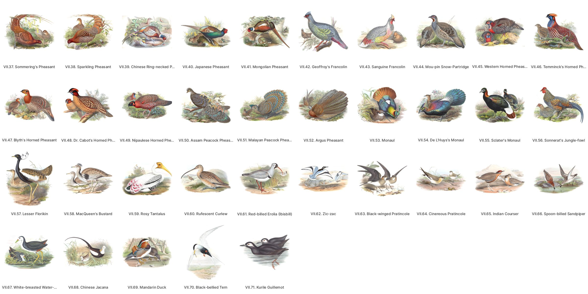

## Files

- **`plates.csv`**: one row per plate. It holds:
  - `volume` and `plate`: each volume prints its own List of Plates, and Sharpe's index cites a plate as "Asia, iv. pl. 49". Together the two are the plate's key.
  - the List's English and Latin names, and the Latin engraved on the plate as read from the scan;
  - where the plate is: BHL item, leaf, BHL PageID, and a link to the page;
  - `scan_url`, the unaltered JPEG 2000 on BHL's open-data bucket;
  - the two release images.
- **`species.csv`**: one row per plate, including the 176 that name no modern species yet.
- **`ku-disagreements.csv`**: the 118 identified plates where the Kansas catalogue gives a different name, each with its kind (see below).
- **`sources/`**: the working record.
  - `plate-leaves.csv`: every plate's leaf, its orientation, its engraved caption as read and how it was read, where the caption starts, and the heading of the text leaf bound after it.
  - `crosswalk.csv`: each plate's modern species, form, confidence and reason, the survey's first reading, and what Featherframe does with it.
  - `ku-catalogue.csv`: the Kansas record for each plate.

## How the plates were identified

1. **Numbering.** The Smithsonian copy is bound in List order, one plate every four leaves: plate n is at leaf `28 + 4(n−1)` in volume I and `12 + 4(n−1)` in the others. The per-volume counts are 76, 75, 78, 72, 83, 75 and 71.
2. **Leaves.** Every pairing was checked twice:
   - against the text leaf bound right after the plate, which opens with the species' name (all 530 carry the plate's genus there);
   - against the plate's own engraved caption, read on the scan with OCR. 498 captions read cleanly, 21 more read with a garbled letter or two that still names the plate, and seven were read by eye. All agree with the List. Four vol. VII captions (29, 30, 31, 47) could not be read.
   The OCR also gave each plate's orientation, since a sideways plate's caption runs down its right edge: 95 plates are bound sideways.
3. **Names.** Each plate's Latin was carried to a modern species, then checked against the Kansas catalogue. Where the two named different birds, the plate decided.
4. **Checking.** `caption_checked` is `yes` for the 526 plates whose caption was read and names the plate as listed.
5. **Forms.** A sixth of the folio shows a race Gould named as a species, now a subspecies. Those rows give the species with `form: subspecies`. The survey's form assignments not confirmed by the Kansas catalogue are `medium`, and eight it contradicts are `low`.
6. **Not identified.** 176 plates name no species here: birds BirdNET does not know and no modern name was settled for. Each row gives the Kansas catalogue's reading in `reason`. These are the open questions.
7. **Modern names.** `scientific` and `common` are eBird/Clements 2025's. Where eBird has moved a name since BirdNET V2.4 (the parrotbills to *Paradoxornis* and *Suthora*; the Japanese Tit into Asian Tit), the row carries eBird's and `birdnet_label` keeps BirdNET's.

## Traps

These are the plates a careful reader would still get wrong.

- **I.35**, printed *Merops viridis* Linn., shows the Green Bee-eater (*M. orientalis*): all green, golden crown, black gorget. Linnaeus's *viridis* is today's Blue-throated Bee-eater, which the plate does not show.
- **IV.32** *Rhodophila melanoleuca* is Jerdon's Bushchat, not the Pied Bushchat.
- **V.53** *Cissa pyrrhocyanea* is the Sri Lanka Blue-Magpie, chestnut and blue, not the Common Green-Magpie.
- **V.6** *Emberiza caniceps* is the White-capped Bunting, and **V.11** *Glycyspina huttoni* the Gray-necked Bunting. They are easily swapped.
- **VI.62** *Pterocles guttatus* is the Spotted Sandgrouse.
- **VII.60** *Numenius rufescens* Gould is the Far Eastern Curlew, not the Eurasian.
- **V.17** *Carduelis orientalis* is the grey-headed *caniceps* goldfinch, a form of the European Goldfinch that looks nothing like the European bird.
- **VII.39** *Phasianus torquatus* is the ringed Chinese stock of the Ring-necked Pheasant, the bird introduced to North America; VII.34 is the nominate, ringless.
- **IV.28** *Saxicola capistrata* and **IV.31** *S. atrogularis* are forms of the Variable and Desert Wheatears, not of the Pied and Black-eared.

## The Kansas catalogue

The University of Kansas Spencer Library's Ellis Collection copy (Ellis Aves H120, records around `ku-gould:15300`–`17700`) gives each plate a modern scientific name, matched from the printed Latin. `ku-disagreements.csv` lists the 118 identified plates where it differs, by kind:

| kind | plates | what it is |
|---|---|---|
| old name | 62 | the same species under an older genus or spelling (*Garrulax* for *Trochalopteron*, *Pitta* for *Hydrornis*) |
| subspecies | 17 | KU names the race |
| pre-split | 13 | KU gives the parent species before a split (Great Tit for the Asian Tit, Asian Paradise-Flycatcher for the Amur) |
| lumped | 1 | I.4: eBird keeps the Barbary Falcon within the Peregrine |
| printed name | 3 | KU follows the printed Latin where the bird says otherwise (I.35, VI.62, VII.60) |
| error | 14 | KU names another species: six Asian trogons sent to New World ones, the Spoon-billed Sandpiper to Lady Amherst's Pheasant |
| open | 8 | a form the survey assigned and KU assigns elsewhere; the row is `low` |

## The images: release `gould-asia-v1`

Two images per plate, 530 plates: the sheets as files, and the crops in `crops.zip` (a release holds at most 1000 files). `manifest.json` and `SHA256SUMS` give each file's sha256.

- **`sheet-<barcode>-<leaf>.jpg`, the cleaned full sheet:**
  - The JPEG 2000 master, stood upright: a sideways plate is turned 90° clockwise so its caption runs along the bottom.
  - The paper is evened, as for *The Birds of Europe*, and anything within 6 % of its own tone becomes pure white. The scans' heavy foxing goes with it.
  - Caption and imprint are kept. JPEG quality 95.
- **`crop-<barcode>-<leaf>.jpg`, the art crop:**
  - An upright plate is cut just above its engraved caption. In volumes I–V the gilt board edge and page stack run down the left of every sheet, to about 10.5 % of its width, so the cut starts at 12 %.
  - The art is then cropped to its own box, with a band of fresh white paper added. A sideways plate keeps its whole painted scene.
  - This is Featherframe's cut for e-paper, and more opinionated than the sheet.
  - The 257 plates Featherframe shows had their crops reviewed on contact sheets. The other 273 are cut by the same rules but not reviewed (`notes`).

For the sheet as it is, with its paper and its age, follow the row's `scan_url` to BHL's original.
