# John Gould, *The Birds of Asia* (1850–83)

Seven volumes, 530 plates. Drawn and lithographed by John Gould (488 plates), H. C. Richter (406), William Hart (122) and Joseph Wolf (23), two to a plate or Hart alone, hand-coloured, published in parts in London. Gould died in 1881 and R. B. Sharpe finished the work.

**Copy:** Smithsonian Libraries, scanned for the Biodiversity Heritage Library (BHL): items 115342, 118636, 118635, 120503, 121124, 122488 and 122491, i.e. volumes I–VII, BHL barcodes `BirdsAsiaJohnGo{I..VII}Goul`. Public domain. Credit: *Smithsonian Libraries and Archives, via the Biodiversity Heritage Library.*

## The plates

Every plate as its art crop, by volume and number. The full-size images are in the [`gould-asia-v1`](https://github.com/wr/historical-bird-plates/releases/tag/gould-asia-v1) release.

**Volume I, plates 1–38**

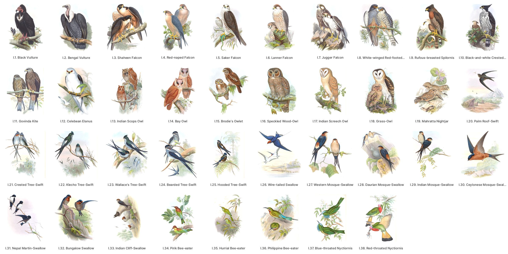

**Volume I, plates 39–76**

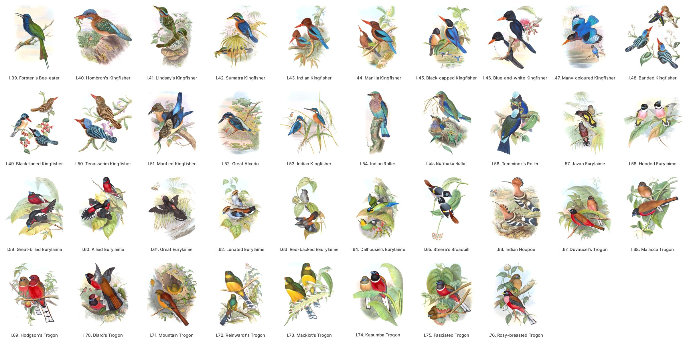

**Volume II, plates 1–38**

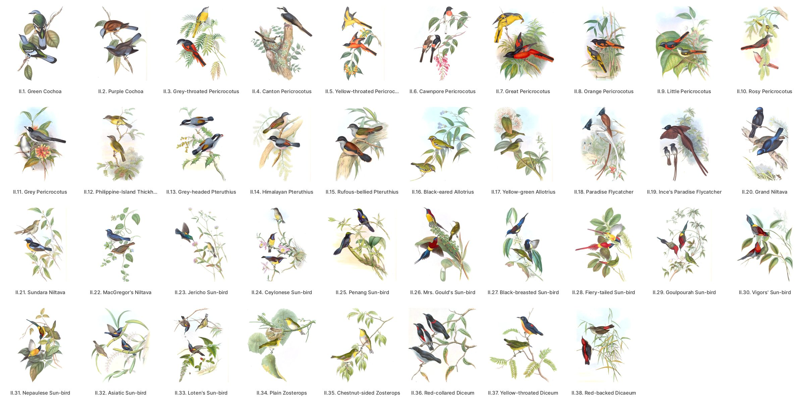

**Volume II, plates 39–75**

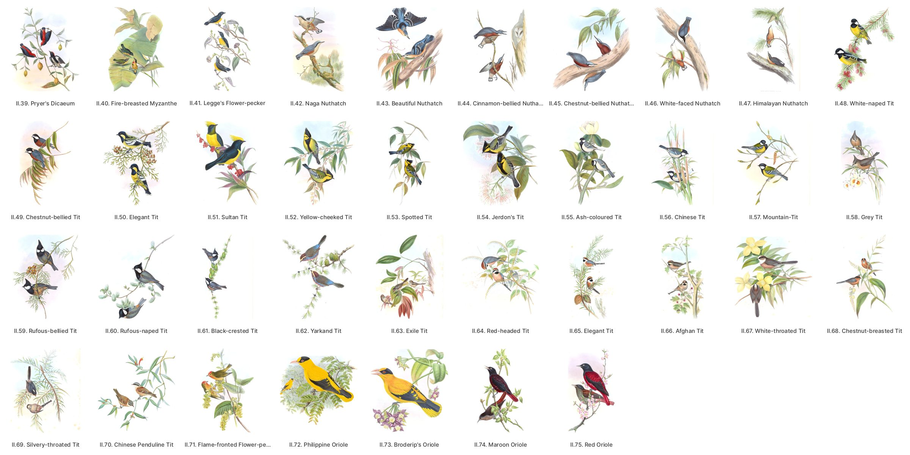

**Volume III, plates 1–39**

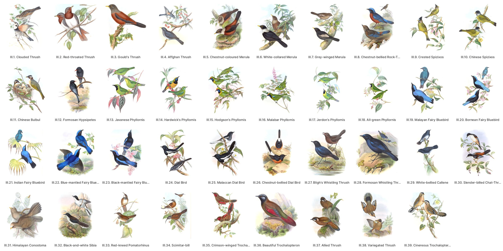

**Volume III, plates 40–78**

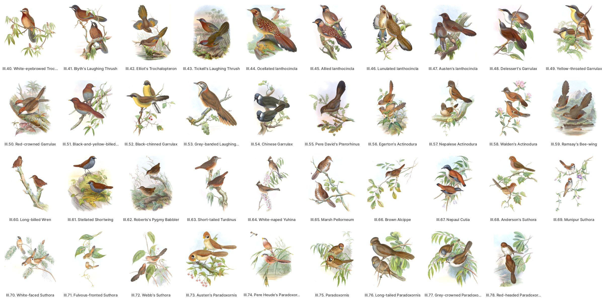

**Volume IV, plates 1–36**

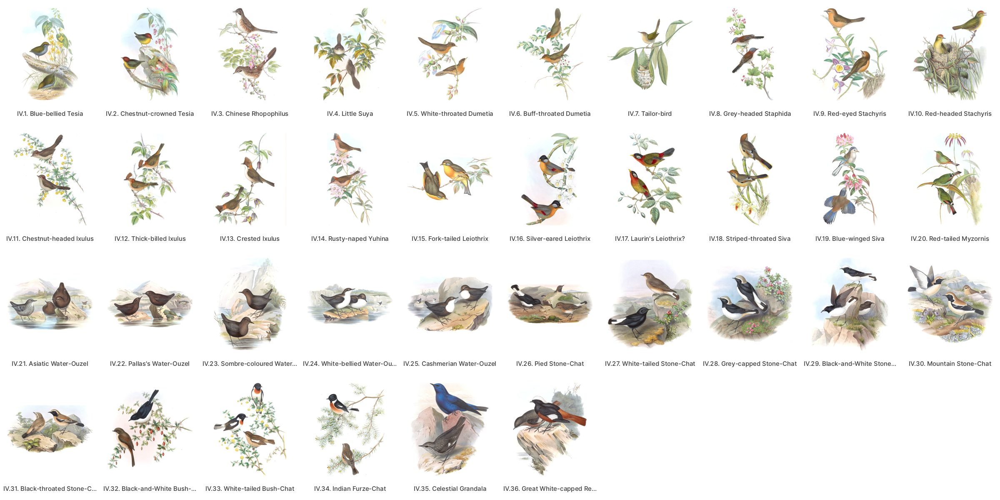

**Volume IV, plates 37–72**

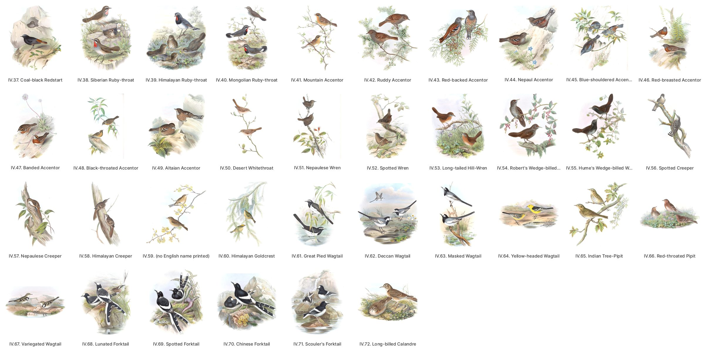

**Volume V, plates 1–42**

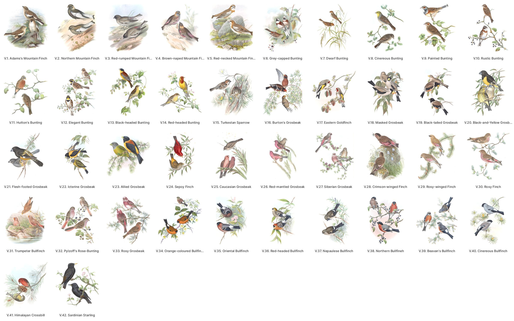

**Volume V, plates 43–83**

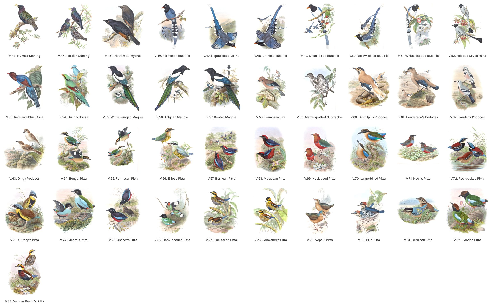

**Volume VI, plates 1–38**

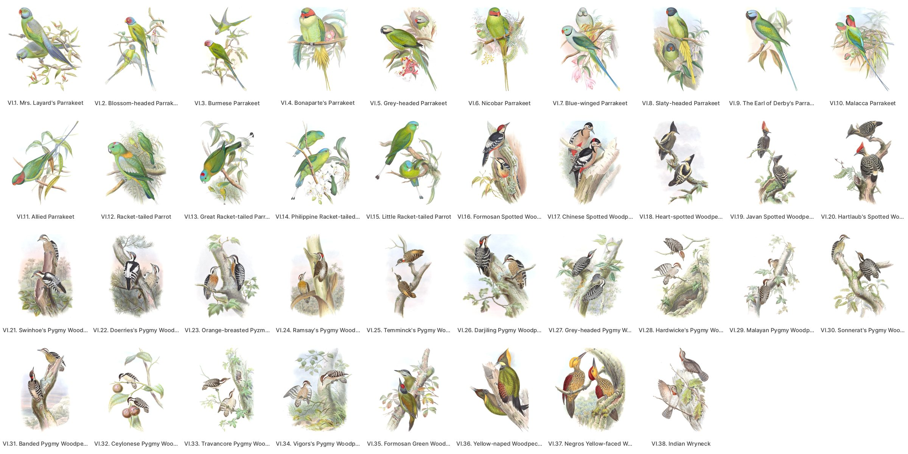

**Volume VI, plates 39–75**

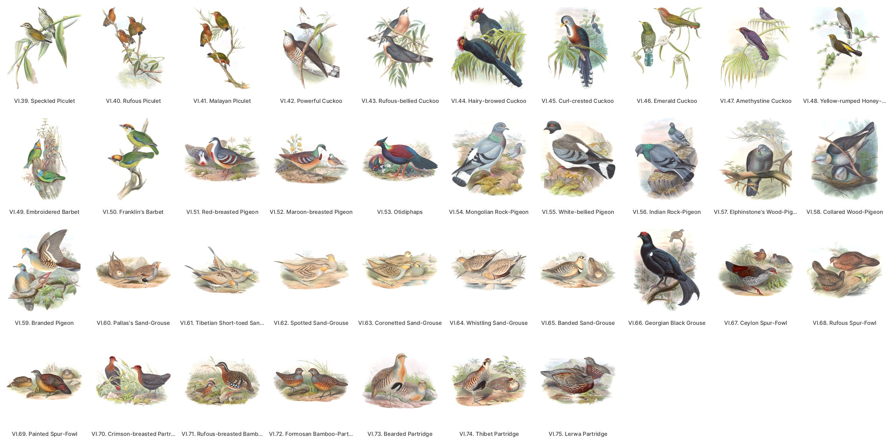

**Volume VII, plates 1–36**

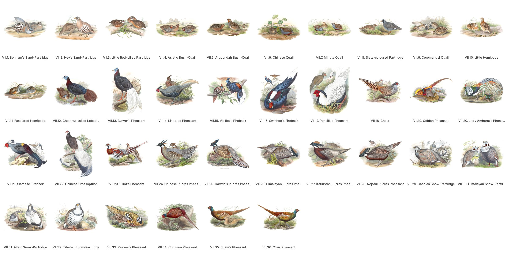

**Volume VII, plates 37–71**

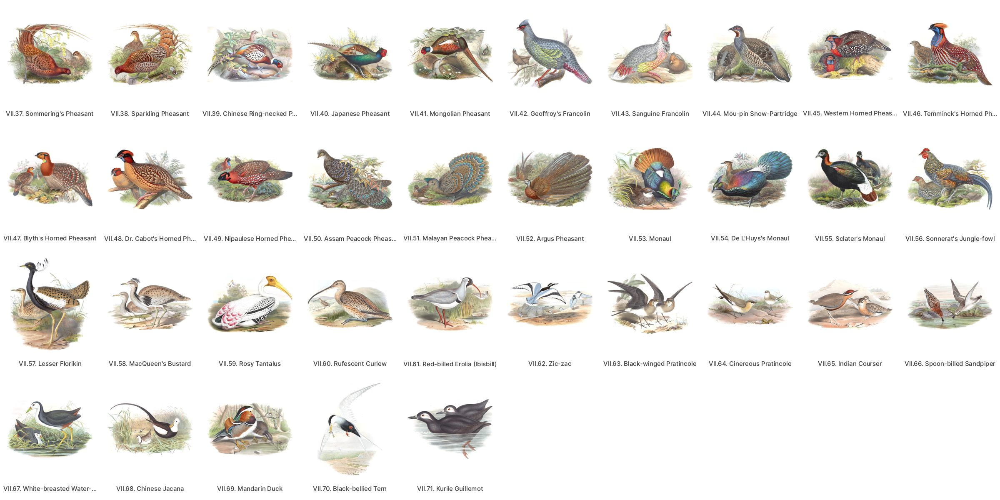

## Files

- **`plates.csv`**: one row per plate. It holds:
  - `volume` and `plate`: each volume prints its own List of Plates, and Sharpe's index cites a plate as "Asia, iv. pl. 49". Together the two are the plate's key.
  - the List's English and Latin names, and the Latin engraved on the plate as read from the scan;
  - where the plate is: BHL item, leaf, BHL PageID, and a link to the page;
  - `scan_url`, the unaltered JPEG 2000 on BHL's open-data bucket;
  - the two release images;
  - `imprint`, the plate's credit lines (see [Who made the plates](#who-made-the-plates)).
- **`species.csv`**: one row per plate and species. Two plates show two species (II.36, IV.57).
- **`credits.csv`**: one row per plate, name and role, from `imprint`.
- **`ku-disagreements.csv`**: the 184 rows where the Kansas catalogue gives a different name, each with its kind (see below).
- **`sources/`**: the working record.
  - `plate-leaves.csv`: every plate's leaf, its orientation, its engraved caption as read and how it was read, where the caption starts, and the heading of the text leaf bound after it.
  - `crosswalk.csv`: the first pass (W-871): each plate's modern species, form, confidence and reason as first settled, the survey's reading, and what Featherframe does with it.
  - `decisions.csv`: every identification made or changed since, as `tools/identify.py` logged it.
  - `ku-catalogue.csv`: the Kansas record for each plate.
  - `imprints.csv`: how each plate's credit lines were read: where they are on the sheet, the OCR draft, whether they were read off the crop (`eye`) or the scan (`scan`) or not at all (`none`), and what the readers noted.

## Who made the plates

Every plate is credited on its face, in small engraved lines below the art: on the left who drew it and put it on stone, on the right who printed it. `imprint` in `plates.csv` gives them as engraved, with spacing, initials and the mark after an abbreviation written by one convention (see [Credit lines](../README.md#credit-lines)). `credits.csv` gives one row per plate, name and role, read from them by `tools/credits.py`.

Lines that differ only in capitals, stops or commas are counted together, under their commonest form.

| Credit line | Credits | Plates |
|---|---|---:|
| J. Gould and H. C. Richter, del. et lith. | John Gould and H. C. Richter: drew, lithographed | 271 |
| J. Gould & H. C. Richter, del et lith. | John Gould and H. C. Richter: drew, lithographed | 110 |
| J. Gould & W. Hart, del et lith. | John Gould and William Hart: drew, lithographed | 105 |
| W. Hart del. et lith. | William Hart: drew, lithographed | 16 |
| J. Wolf and H. C. Richter, del et lith. | Joseph Wolf and H. C. Richter: drew, lithographed | 11 |
| J. Wolf & H. C. Richter, del et lith. | Joseph Wolf and H. C. Richter: drew, lithographed | 7 |
| J. Wolf del. H. C. Richter lith. | Joseph Wolf: drew; H. C. Richter: lithographed | 2 |
| Wolf and H. C. Richter, del. et lith. | Joseph Wolf and H. C. Richter: drew, lithographed | 2 |

One plate each: "J. Gould and C. H. Richter, del. et lith." (IV.5) and "J. Gould. H. C. Richter, del. et lith." (VI.72), John Gould and Richter; "J. Wolf and Hart del et lith." (VII.13), Wolf and Hart; "H. Gould, and H. C. Richter, del et lith." (IV.26), Richter alone (see below). That makes John Gould on 488 plates, H. C. Richter on 406, William Hart on 122 and Joseph Wolf on 23. No plate pairs Gould with Wolf.

| Printer | Credit line | Plates |
|---|---|---:|
| Walter | Walter, Imp. | 261 |
| Hullmandel & Walton | Hullmandel & Walton, Imp. | 214 |
| Walter & Cohn | Walter & Cohn, Imp. | 48 |
| T. Walter | T. Walter, Imp. | 5 |

A joint line credits both names with every role it gives, because that is all it says. Only I.7 and VII.39 divide them: "J. Wolf del. H. C. Richter lith.", Wolf drew and Richter lithographed. The sources say more:
- Gould's own drawings "are never more than rough sketches", with colour notes for his artists (Australian Museum, "Gould the artist").
- Wolf worked for Gould "on a freelance basis" (Australian Museum, "Josef Wolf"), and Richter and Hart put his drawings on stone (KU Libraries, "Joseph Wolf"; Australian Museum, "Josef Wolf"). His drawings for *The Birds of Asia* "were his last for Gould" (KU Libraries, "Joseph Wolf").
- Gould died in 1881, and R. B. Sharpe completed the last three parts (Christie's; Australian Museum, "Gould the publisher"). Sharpe's preface says the final plates "had nearly all been designed by Mr. Gould before his death", and were "faithfully produced on stone by his old and valued coadjutor Mr. Hart" (Sharpe 1883, preface). No credit line names Sharpe, and the lines don't show which plates came after 1881.

The work was "printed by Hullmandel & Walton, Walter or Walter & Cohn" (Christie's). Who Walter and Walter & Cohn were is not established. I.69 to I.73 read "T. Walter, Imp.", and a dealer gives the printer as T. Walter (Marshall Rare Books). Whether he is the Walter of the other plates is not established either, so `artists.csv` lists him apart.

IV.26 reads "H. Gould, and H. C. Richter, del et lith.". H is not John Gould's initial, so its Gould is credited to no one, and only Richter is. It may still be John Gould, the H an engraving slip like III.22's "Waller"; this copy can't tell.

Six readings rest on this folio's own pattern. `tools/credits.py` gives the reason for each, and each plate's note says what is engraved:
- VI.74 and VII.40 read "Wolf", with no initial, and VII.13 "Hart": Joseph Wolf and William Hart, since no other Wolf or Hart is named on any Gould plate in this dataset.
- IV.5 reads "C. H. Richter", the initials reversed: Henry Constantine Richter.
- III.4 reads "Hulmandel & Walton", with one l, and III.22 "Waller", an engraving slip for Walter, who prints the plates either side of it. They are credited to Hullmandel & Walton and to Walter.

One plate has no credit line read: VII.30, bound sideways, whose lines are cut off at the sheet's foot so that only the tops of their letters show (`notes`). Two more have one line only. IV.32's printer's line fades after "Walter, Im", so its wording is lost and the line is left out of `imprint`, its text kept in `notes`. VII.41's foot is in the binding's fold, and its artist's line can't be seen.

Sources:
- Sharpe, R. B. 1883. Preface, in Gould, *The Birds of Asia*, vol. I. [archive.org/details/BirdsAsiaJohnGoIGoul](https://archive.org/details/BirdsAsiaJohnGoIGoul)
- Australian Museum Research Library, *John Gould: illustrations and books*: "Gould the artist" (2021), [australian.museum](https://australian.museum/learn/collections/museum-archives-library/john-gould/gould-the-artist/); "Josef Wolf (1820–1899)" (2018), [australian.museum](https://australian.museum/learn/collections/museum-archives-library/john-gould/josef-wolf-1820-1899/); "Gould the publisher" (2023), [australian.museum](https://australian.museum/learn/collections/museum-archives-library/john-gould/gould-the-publisher/).
- KU Libraries. "Joseph Wolf", in *John Gould: Bird Illustration in the Age of Darwin* (online exhibit). [exhibits.lib.ku.edu](https://exhibits.lib.ku.edu/exhibits/show/gould/art/joseph_wolf)
- Christie's. Gould and Sharpe, *The Birds of Asia*, lot 5909189. [christies.com.cn](https://www.christies.com.cn/en/lot/lot-5909189)
- Marshall Rare Books. *The Birds of Asia*. [marshallrarebooks.com](https://www.marshallrarebooks.com/all-books/archive/the-birds-of-asia/)

## How the plates were identified

1. **Numbering.** The Smithsonian copy is bound in List order, one plate every four leaves: plate n is at leaf `28 + 4(n−1)` in volume I and `12 + 4(n−1)` in the others. The per-volume counts are 76, 75, 78, 72, 83, 75 and 71.
2. **Leaves.** Every pairing was checked twice:
   - against the text leaf bound right after the plate, which opens with the species' name (all 530 carry the plate's genus there);
   - against the plate's own engraved caption, read on the scan with OCR. 498 captions read cleanly, 21 more read with a garbled letter or two that still names the plate, and seven were read by eye. All agree with the List. Four vol. VII captions (29, 30, 31, 47), engraved in outline letters, were read by eye too.
   The OCR also gave each plate's orientation, since a sideways plate's caption runs down its right edge: 95 plates are bound sideways.
3. **Names.** Each plate's Latin was carried to a modern species, then checked against the Kansas catalogue. Where the two named different birds, the plate decided.
4. **Checking.** `caption_checked` is `yes` for all 530 plates: each caption was read and names the plate as listed.
5. **Forms.** A fifth of the folio shows a race Gould named as a species, now a subspecies: 102 rows give the species with `form: subspecies`, and three a colour `variant`.
6. **The rest.** The first pass identified only the birds BirdNET knows. On 1 Oct the other 176 plates were identified from caption, text, synonymy and plate, and the 71 survey drafts and 12 doubtful rows were reviewed (W-929, W-930, W-931). Every plate is now identified: 518 rows `high`, 14 `judged`, none open.
7. **Modern names.** `scientific` and `common` are eBird/Clements 2025's. Where eBird has moved a name since BirdNET V2.4 (the parrotbills to *Paradoxornis* and *Suthora*; the Japanese Tit into Asian Tit), the row carries eBird's and `birdnet_label` keeps BirdNET's.

## Traps

These are the plates a careful reader would still get wrong.

- **III.25** *Copsychus mindanensis*, the "Malaccan Dial Bird", is the Oriental Magpie-Robin's Malayan race *musicus*, not the Philippine Magpie-Robin: Gould never saw it from the Philippines and doubted it lived there.
- **III.50** *Garrulax ruficeps* Gould is the Rufous-crowned Laughingthrush of Formosa, a species of its own in eBird 2025.
- **V.22** shows two species. Gould's "young male" in front is the female Collared Grosbeak, as he concedes in the V.23 text; the rest are Black-and-yellow Grosbeaks.
- **V.26** *Carpodacus rhodochlamys* is Blyth's Rosefinch (`judged`): Gould's figured male is the Himalayan bird he lent to Bonaparte and Schlegel, and Sharpe lists this plate under *C. grandis*.

- **I.35**, printed *Merops viridis* Linn., shows the Green Bee-eater (*M. orientalis*): all green, golden crown, black gorget. Linnaeus's *viridis* is today's Blue-throated Bee-eater, which the plate does not show.
- **IV.32** *Rhodophila melanoleuca* is Jerdon's Bushchat, not the Pied Bushchat.
- **V.53** *Cissa pyrrhocyanea* is the Sri Lanka Blue-Magpie, chestnut and blue, not the Common Green-Magpie.
- **V.6** *Emberiza caniceps* is the White-capped Bunting, and **V.11** *Glycyspina huttoni* the Gray-necked Bunting. They are easily swapped.
- **VI.62** *Pterocles guttatus* is the Spotted Sandgrouse.
- **VII.60** *Numenius rufescens* Gould is the Far Eastern Curlew, not the Eurasian.
- **IV.36** *Ruticilla erythrogastra*, Gould's "Great White-capped Redstart", is the White-winged (Güldenstädt's) Redstart: white wing patch, brown female. The White-capped Redstart has neither.
- **I.17** *Strix indica* Blyth is the Eastern Barn Owl (*Tyto javanica*, race *stertens*), not the Western; Kansas matched *indica* to the Spotted Owlet.
- **V.17** *Carduelis orientalis* is the grey-headed *caniceps* goldfinch, which looks nothing like the European bird. eBird 2025 splits it as the Gray-crowned Goldfinch, *Carduelis caniceps*.
- **VII.39** *Phasianus torquatus* is the ringed Chinese stock of the Ring-necked Pheasant, the bird introduced to North America; VII.34 is the nominate, ringless.
- **IV.28** *Saxicola capistrata* and **IV.31** *S. atrogularis* are forms of the Variable and Desert Wheatears, not of the Pied and Black-eared.
- **VI.2 and VI.3 carry each other's names**, as Gould's VI.2 text says: Blyth named the plates before the synonymy was settled. VI.2, printed *Paleornis rosa* "Blossom-headed Parrakeet", is the Plum-headed Parakeet (emerald ring under the collar, white tail tip, yellow-collared female). VI.3, printed *P. cyanocephala*, is the Blossom-headed.
- **VI.5 and VI.6 cross too:** the "Grey-headed Parrakeet" is the Nicobar Parakeet, and the "Nicobar Parrakeet" is the Nicobar race of the Long-tailed Parakeet.
- **VII.51**, printed *Polyplectron bicalcaratum* "Malayan Peacock Pheasant", is the Malayan Peacock-Pheasant, *P. malacense*: Gould describes "the Malayan bird", browner, with larger ocelli. His Gray Peacock-Pheasant is VII.50, printed *chinquis*.
- **I.68** *Harpactes rutilus* is the Cinnamon-rumped Trogon. Gould applies Vieillot's name to a Malayan trogon that "never has the scarlet mark on the rump".
- **III.15** *Phyllornis hodgsoni* is the Golden-fronted Leafbird, not the Orange-bellied (III.14).
- **IV.23** *Cinclus sordidus* is the dark morph of the White-throated Dipper, not the Brown Dipper.
- **Two-species plates:** II.36's lowest bird, figured as the female Scarlet-collared Flowerpecker, is the Red-keeled, as Gould says in the II.37 text. IV.57 shows the Rusty-flanked Treecreeper above and the Sikkim Treecreeper below.
- **I.27** *Hirundo rufula* is the European Red-rumped Swallow, split from the Eastern (I.29).

## The Kansas catalogue

The University of Kansas Spencer Library's Ellis Collection copy (Ellis Aves H120, records around `ku-gould:15300`–`17700`) gives each plate a modern scientific name, matched from the printed Latin. `ku-disagreements.csv` lists the 208 rows where it differs, by kind:

| kind | rows | what it is |
|---|---|---|
| old name | 89 | the same species under an older genus or spelling (*Garrulax* for *Trochalopteron*, *Pitta* for *Hydrornis*) |
| pre-split | 35 | KU gives the parent species before a split (Great Tit for the Asian Tit, Asian Paradise-Flycatcher for the Amur) |
| subspecies | 44 | KU names the race |
| lumped | 2 | eBird keeps KU's species within ours (I.4: the Barbary Falcon within the Peregrine) |
| printed name | 11 | KU follows the printed name where the bird says otherwise: I.35, II.36, IV.57, VI.2, VI.3, VI.29, VI.38, VI.62, VII.22, VII.51, VII.60 |
| error | 27 | KU names another species: Asian trogons sent to New World ones, the Spoon-billed Sandpiper to Lady Amherst's Pheasant, the Indian barn owl to the Spotted Owlet, Güldenstädt's Redstart to the White-capped, the Daurian Partridge to a Mexican quail |

## The images: release `gould-asia-v1`

Two images per plate, 530 plates: the sheets as files, and the crops in `crops.zip` (a release holds at most 1000 files). `manifest.json` and `SHA256SUMS` give each file's sha256.

- **`sheet-<barcode>-<leaf>.jpg`, the cleaned full sheet:**
  - The JPEG 2000 master, stood upright: a sideways plate is turned 90° clockwise so its caption runs along the bottom.
  - The paper is evened, as for *The Birds of Europe*, and anything within 6 % of its own tone becomes pure white. The scans' heavy foxing goes with it.
  - Caption and imprint are kept. JPEG quality 95.
- **`crop-<barcode>-<leaf>.jpg`, the art crop:**
  - An upright plate is cut just above its engraved caption. In volumes I–V the gilt board edge and page stack run down the left of every sheet, to about 10.5 % of its width, so the cut starts at 12 %.
  - The art is then cropped to its own box, with a band of fresh white paper added. A sideways plate keeps its whole painted scene.
  - This is Featherframe's cut for e-paper, and more opinionated than the sheet.
  - The 257 plates Featherframe shows had their crops reviewed on contact sheets. The other 273 are cut by the same rules but not reviewed (`notes`).

For the sheet as it is, with its paper and its age, follow the row's `scan_url` to BHL's original.
