# John Gould, *The Birds of Australia* (1840–48) and its *Supplement* (1851–69)

Seven volumes and a Supplement, 681 plates. Drawn by John and Elizabeth Gould and H. C. Richter, lithographed and hand-coloured, published in parts in London.

**Copy:** Smithsonian Libraries, scanned for the Biodiversity Heritage Library (BHL): [title 105698](https://www.biodiversitylibrary.org/bibliography/105698) (volumes I–VII, BHL barcodes `birdsAustraliav{1..7}Goul`) and [title 107411](https://www.biodiversitylibrary.org/bibliography/107411) (the Supplement, `birdsAustraliasSuppGoul`). Public domain. Credit: *Smithsonian Libraries and Archives, via the Biodiversity Heritage Library.*

## The plates

Every plate as its art crop, by volume and number. The full-size images are in the [`gould-australia-v1`](https://github.com/wr/historical-bird-plates/releases/tag/gould-australia-v1) release.

**Volume I, plates 1–36**

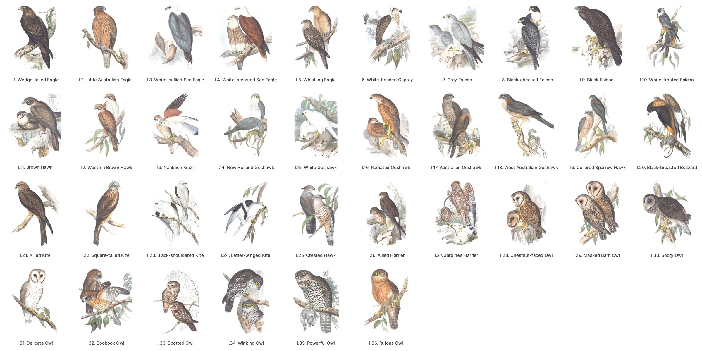

**Volume II, plates 1–35**

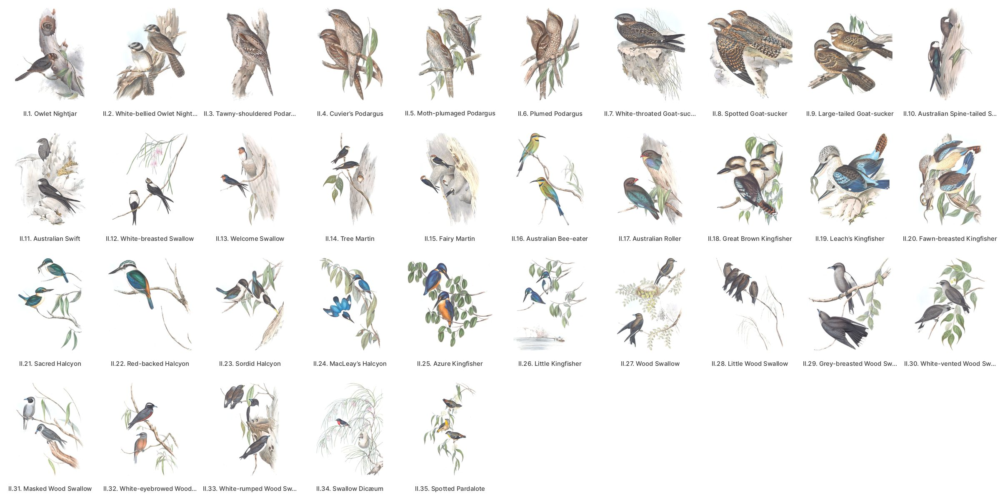

**Volume II, plates 36–70**

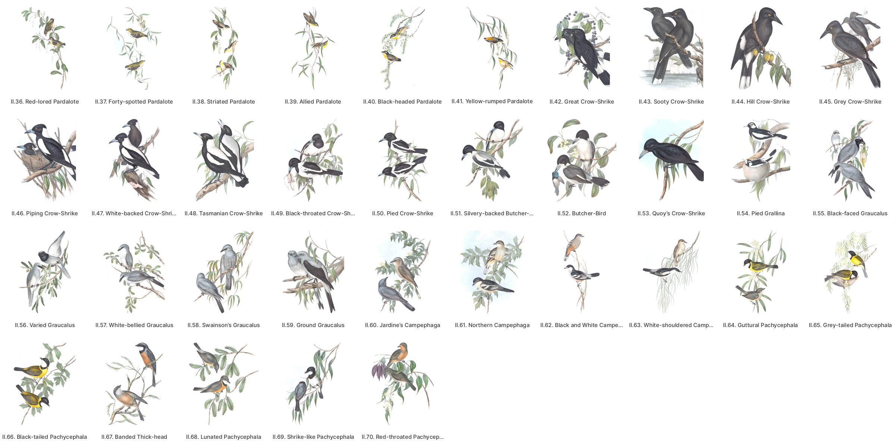

**Volume II, plates 71–104**

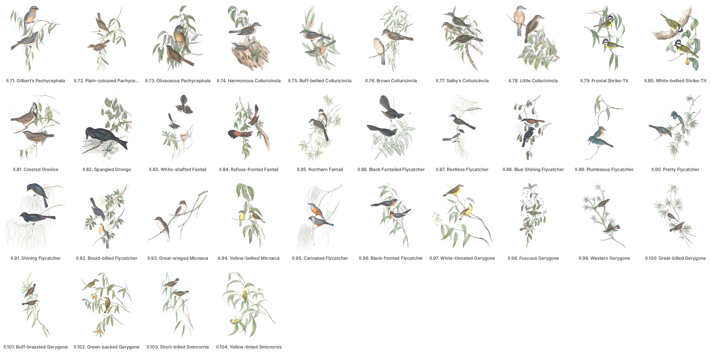

**Volume III, plates 1–49**

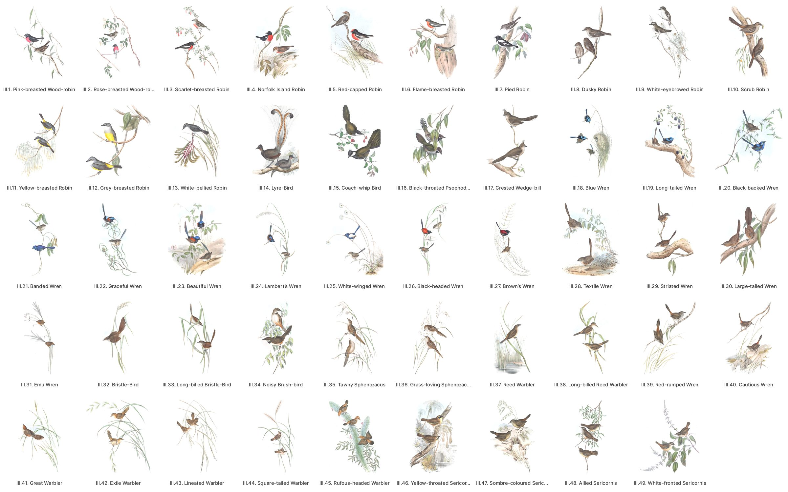

**Volume III, plates 50–97**

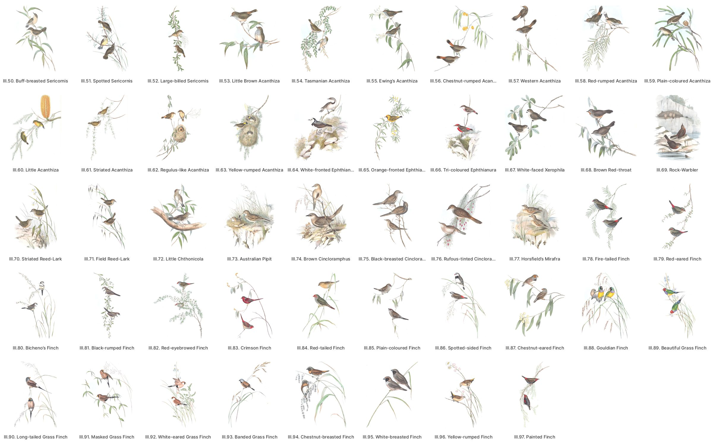

**Volume IV, plates 1–35**

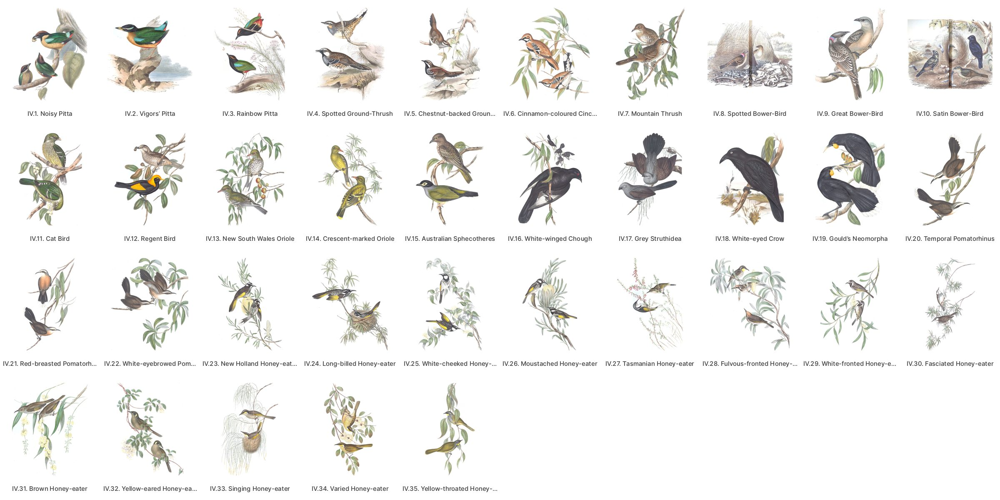

**Volume IV, plates 36–70**

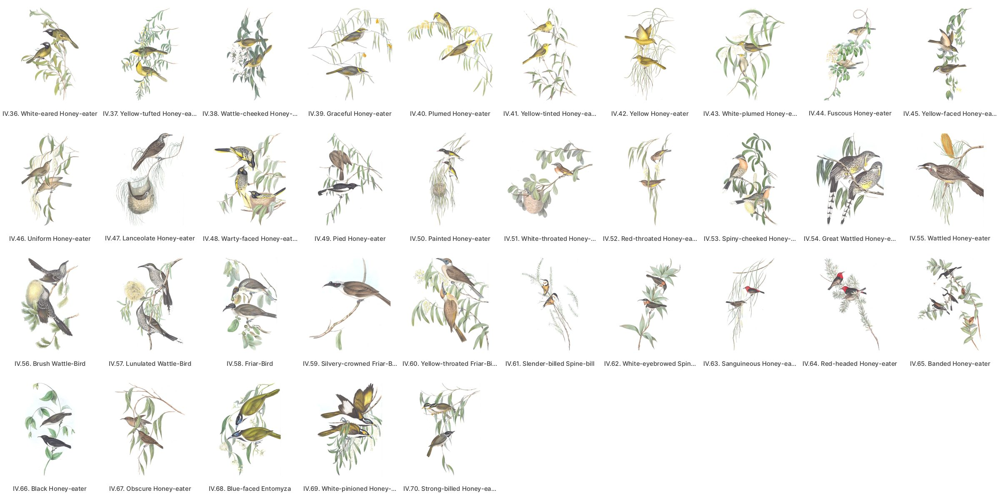

**Volume IV, plates 71–104**

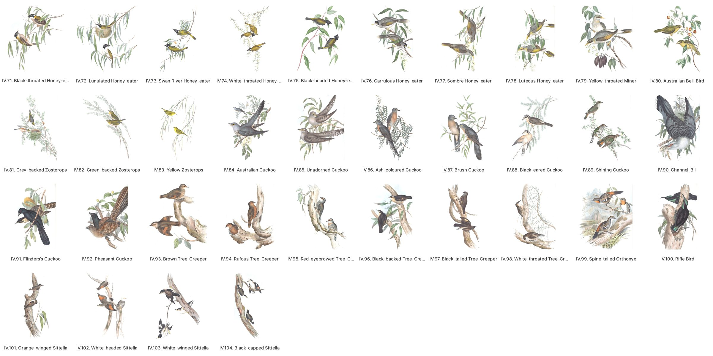

**Volume V, plates 1–46**

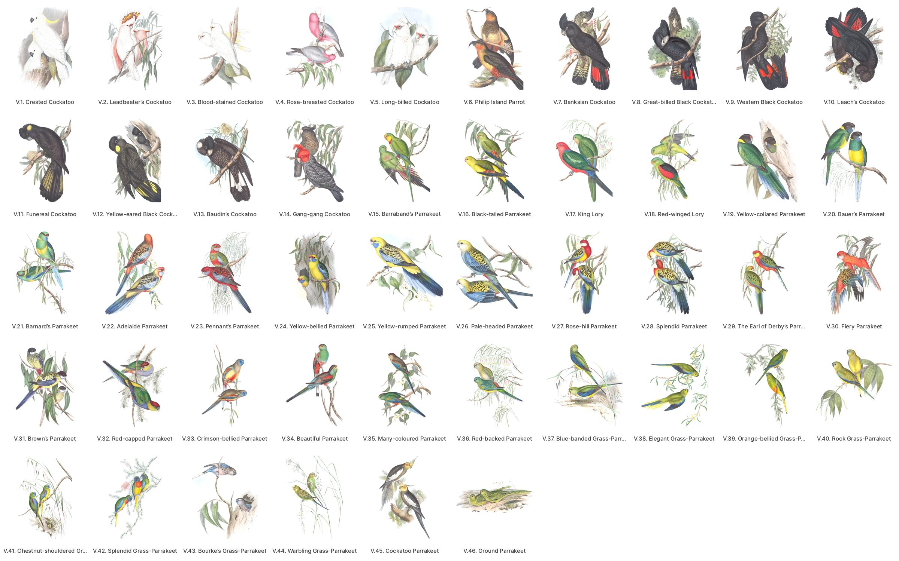

**Volume V, plates 47–92**

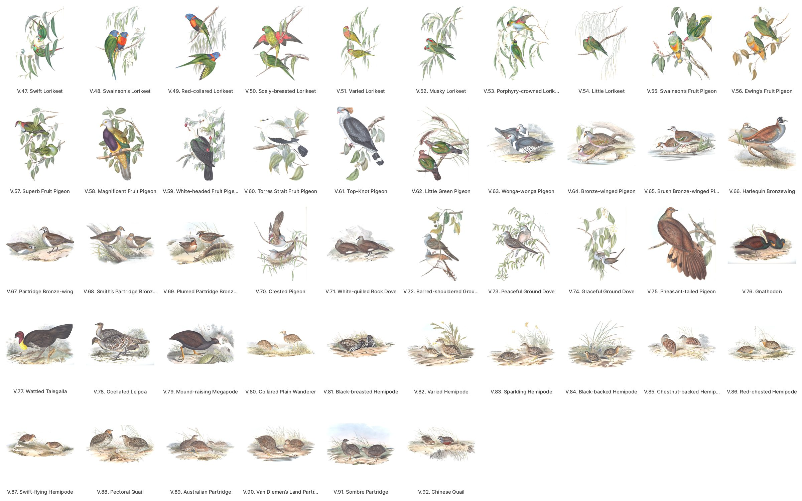

**Volume VI, plates 1–41**

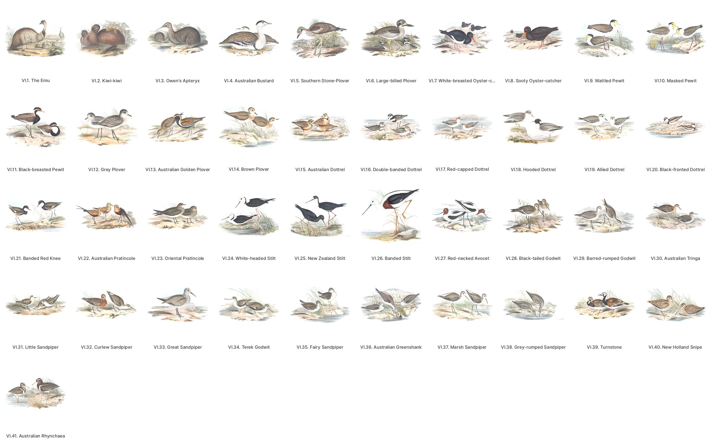

**Volume VI, plates 42–82**

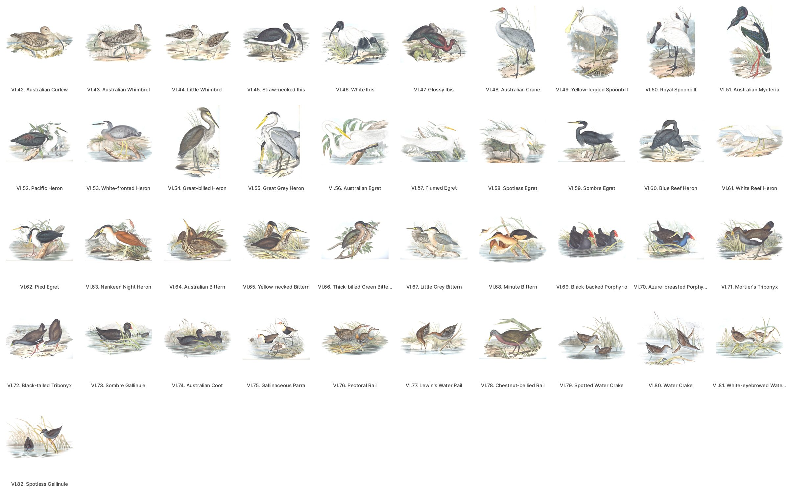

**Volume VII, plates 1–43**

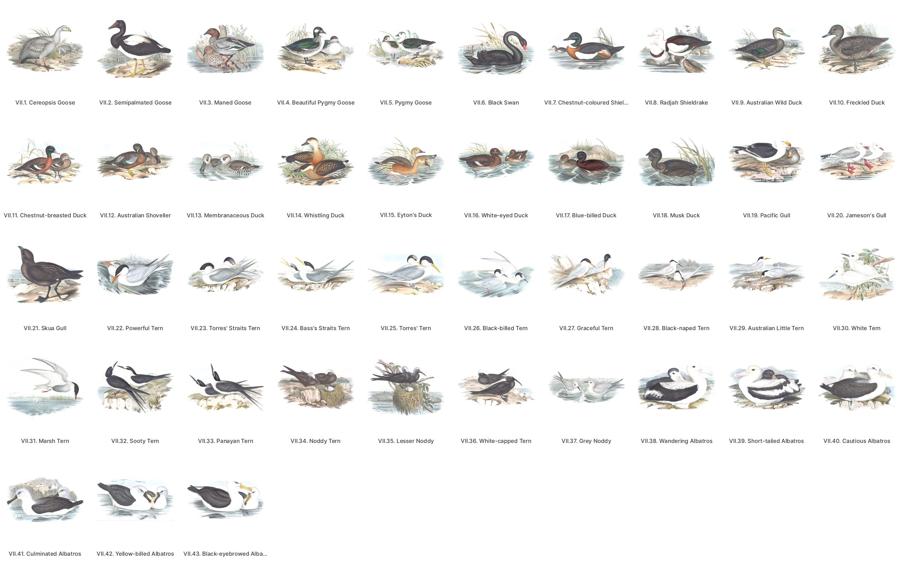

**Volume VII, plates 44–85**

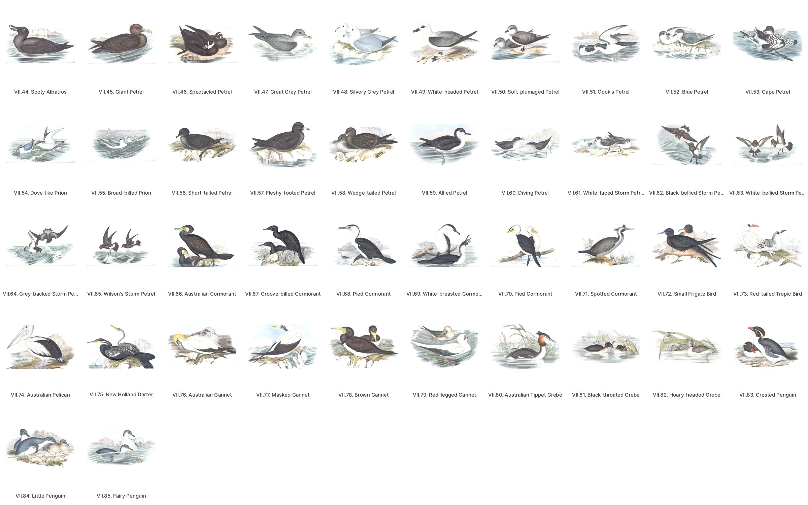

**Supplement, plates 1–41**

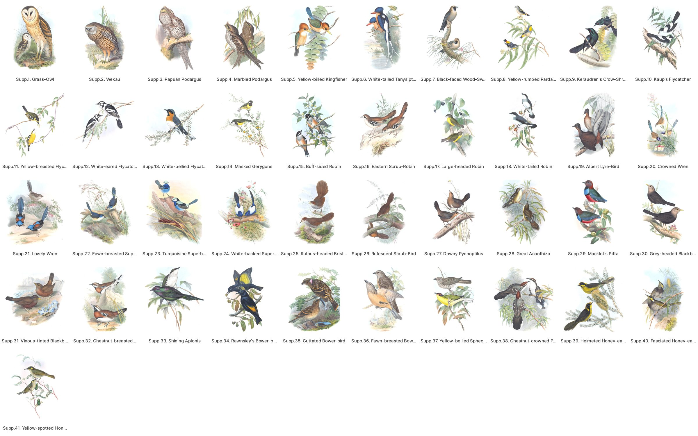

**Supplement, plates 42–81**

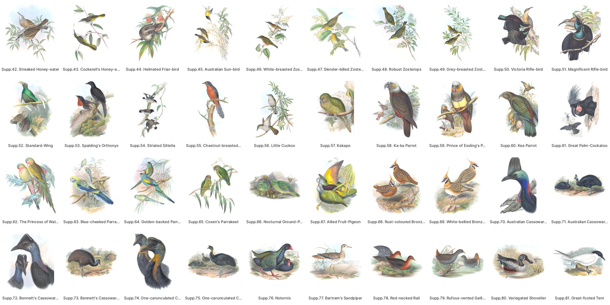

## Files

- **`plates.csv`**: one row per plate. It holds:
  - `volume` and `plate`: Gould numbers his plates per volume, as each volume's List of Plates does ("Australia, ii. pl. 18"). The sheets carry no number. Together the two are the plate's key.
  - the List's English and Latin names, and the Latin name engraved on the plate;
  - where the plate is: BHL item, leaf, BHL PageID, and a link to the page;
  - `scan_url`, the unaltered JPEG 2000 on BHL's open-data bucket;
  - the two release images.
- **`species.csv`**: one row per plate, including the three that name no species.
- **`ku-disagreements.csv`**: the 69 plates where the Kansas catalogue names a different bird than this dataset, beyond a subspecies, an ending or a genus change. Each one is settled (see below).
- **`sources/`**: the working record.
  - `plate-leaves.csv`: every plate's leaf, its engraved caption as read, whether it agrees with the List, its orientation and where its caption starts.
  - `crosswalk.csv`: each plate mapped to a modern species and to BirdNET V2.4's label, with confidence and reason.
  - `ku-catalogue.csv`: the Kansas record for each plate.
  - `ku-check.csv`: the disagreements with Kansas and how each was settled.
  - `review.csv`: the 23 plates Featherframe does not show, and why.
  - `doubtful-decisions.csv`: how 24 doubtful plates were settled.

## How the plates were identified

1. **Numbering.** Each volume prints its own List of Plates, and the Smithsonian copy is bound in List order, one plate every four leaves. The per-volume counts are 36, 104, 97, 104, 92, 82, 85 and 81 (Supplement).
2. **Leaves.** Every plate's leaf was read against its engraved caption (`sources/plate-leaves.csv`).
   - 660 captions name the listed plate.
   - 20 sideways plates have their caption lost in the binding's gutter. The text leaf after each names the species, and the bird agrees.
   - IV.80 is engraved *Myzantha viridis*, Gould's plate name for the Bell-bird. The facing text is the Bell-bird's.
3. **Names.** Each plate was mapped to a modern species from Gould's own text and synonymy, with a confidence and a written reason (`sources/crosswalk.csv`).
4. **Checking.** `caption_checked` is `yes` for the 660 plates whose engraved caption was read and names the plate as listed. The identification is carried from that name through Gould's text.
   - **Open:** 21 identifications are `medium` and 6 `low`.
   - **No species:** III.41 (one specimen of unknown origin, probably not Australian), V.30 (an aberrant or hybrid rosella) and Supp. 34 (Rawnsley's Bower-bird, an intergeneric hybrid).
5. **Modern names.** 498 of the birds are in BirdNET V2.4. `birdnet_label` gives the label, and it can be broader than the species. For example, III.73's Australian Pipit falls under BirdNET's Australasian Pipit. `scientific` and `common` are eBird/Clements 2025's names for the species. Where eBird has since moved a name (the goshawks to *Tachyspiza*, the dotterels to *Anarhynchus*, the bronze-cuckoos to *Chalcites*), the row carries eBird's.

## Traps

These are the plates a careful reader would still get wrong. Gould's binomial now names another bird, so match on the modern name, never on his.

- **Whistlers:** Gould's *Pachycephala pectoralis* (II.67) is the Rufous Whistler, not the Golden.
- **Flycatchers:** his *Myiagra nitida* (II.91) is the Satin Flycatcher. His "Shining Flycatcher" English name now belongs to II.88.
- **Harriers:** his *Circus assimilis* (I.26) is the Swamp Harrier. The Spotted Harrier is his *C. jardinii* (I.27).
- **Treecreepers:** his *Climacteris picumnus* (IV.98) is the White-throated Treecreeper. The Brown Treecreeper is his *C. scandens* (IV.93).
- **Rails:** his *Rallus pectoralis* (VI.76) is the Buff-banded Rail. Lewin's Rail is VI.77.
- **Bassian Thrush:** his *Oreocincla lunulata* (IV.7) is the Bassian Thrush, not the Mountain Thrush of Central America.
- **Thornbills:** his *Acanthiza diemenensis* (III.54) is the Brown Thornbill. The Tasmanian Thornbill is III.55.

## The Kansas catalogue

The University of Kansas Spencer Library's Ellis Collection copy gives each plate a modern scientific name (books `ku-gould:15183` for volume I to `ku-gould:12471` for the Supplement). Its names were matched from the printed Latin, not from the birds.

`ku-disagreements.csv` lists the 69 plates where the two differ, by kind:

| kind | plates | what it is |
|---|---|---|
| same | 34 | the same bird under an older name or a lump |
| ku-error | 31 | Kansas matched the printed Latin, not the bird. It swaps V.15 with V.16 and IV.93 with IV.98 |
| crosswalk-error | 1 | III.41: the crosswalk's guess was wrong. The row now names no species |
| doubtful | VI.2, VI.19, VII.21 | open: the kiwi, the sand-plover and the skua, each argued in `note` |

## The images: release `gould-australia-v1`

Two images per plate, 681 plates: the sheets as files, and the crops in `crops.zip` (a release holds at most 1000 files). `manifest.json` and `SHA256SUMS` give each file's sha256.

- **`sheet-<barcode>-<leaf>.jpg`, the cleaned full sheet:**
  - The JPEG 2000 master, stood upright. A sideways plate is turned so its caption runs along the bottom.
  - The paper is evened, as for *The Birds of Europe*. A quadratic surface is fitted to the paper and divided out, and anything within 6 % of the paper's own tone becomes pure white.
  - Caption and imprint are kept. JPEG quality 95.
- **`crop-<barcode>-<leaf>.jpg`, the art crop:**
  - An upright plate is cut just above its engraved caption, and at 95.5 % of its width, clear of the binding line every volume shows.
  - The art is then cropped to its own box, with a band of fresh white paper added.
  - This is Featherframe's cut for e-paper, and more opinionated than the sheet.
  - The 401 plates Featherframe shows had their crops reviewed on contact sheets, and each sideways one has margins of its own, set to the box of its ink. The other 280 are cut by the same rules but not reviewed (`notes`).

For the sheet as it is, with its paper and its age, follow the row's `scan_url` to BHL's original.
