# John Gould, *The Birds of Australia* (1840–48) and its *Supplement* (1851–69)

Seven volumes and a Supplement, 681 plates. Drawn and lithographed by John Gould with Elizabeth Gould (77 plates) or H. C. Richter (560), hand-coloured, published in parts in London.

**Copy:** Smithsonian Libraries, scanned for the Biodiversity Heritage Library (BHL): [title 105698](https://www.biodiversitylibrary.org/bibliography/105698) (volumes I–VII, BHL barcodes `birdsAustraliav{1..7}Goul`) and [title 107411](https://www.biodiversitylibrary.org/bibliography/107411) (the Supplement, `birdsAustraliasSuppGoul`). Public domain. Credit: *Smithsonian Libraries and Archives, via the Biodiversity Heritage Library.*

## The plates

Every plate as its art crop, by volume and number. The full-size images are in the [`gould-australia-v1`](https://github.com/wr/historical-bird-plates/releases/tag/gould-australia-v1) release.

**Volume I, plates 1–36**

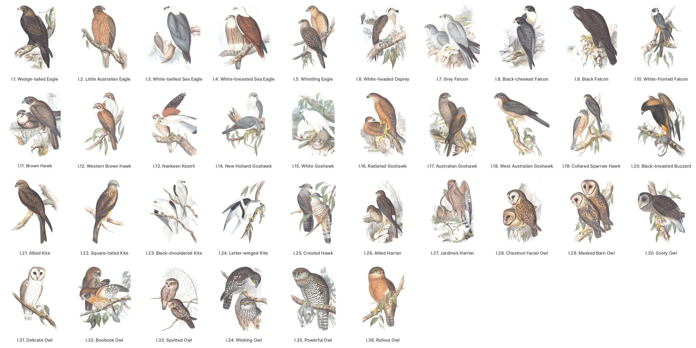

**Volume II, plates 1–35**

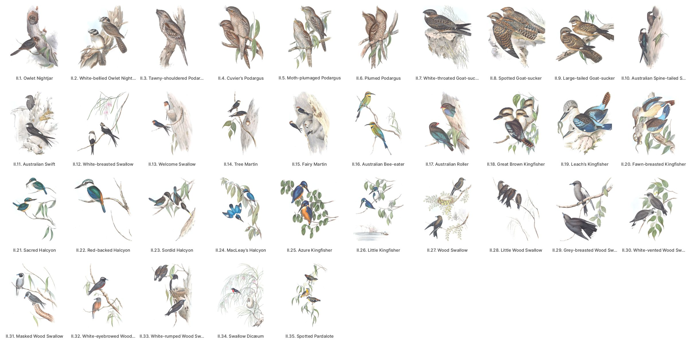

**Volume II, plates 36–70**

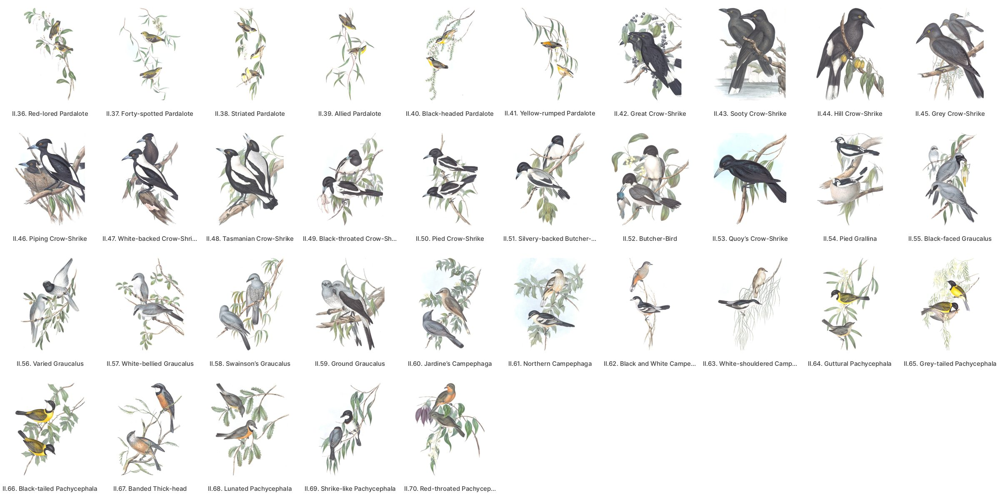

**Volume II, plates 71–104**

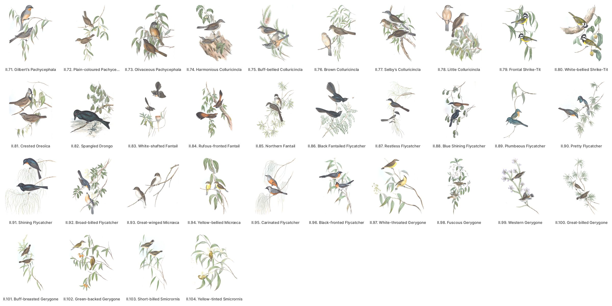

**Volume III, plates 1–49**

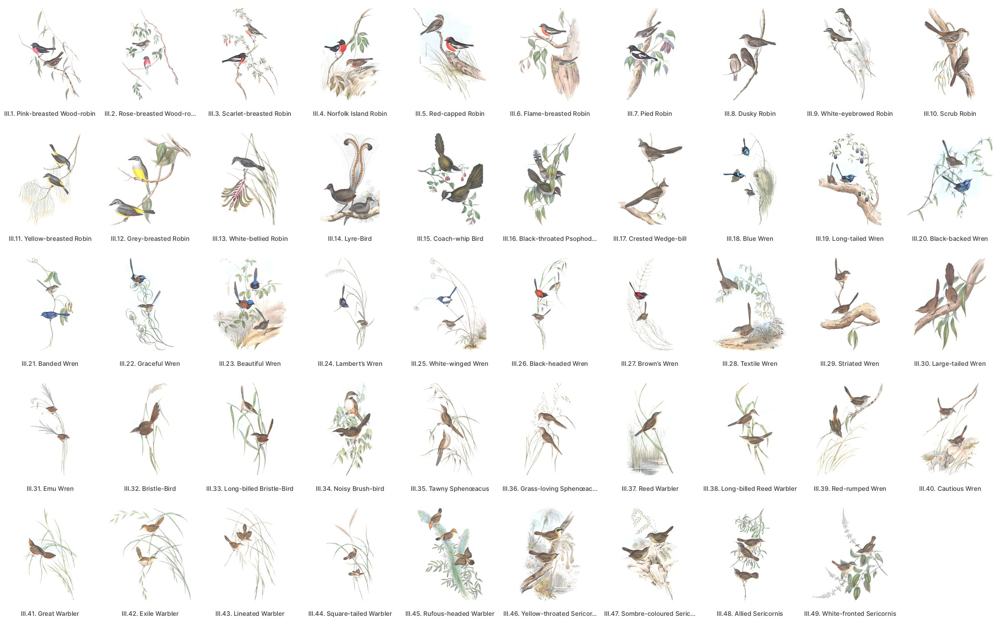

**Volume III, plates 50–97**

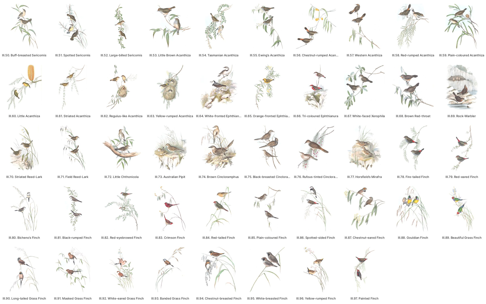

**Volume IV, plates 1–35**

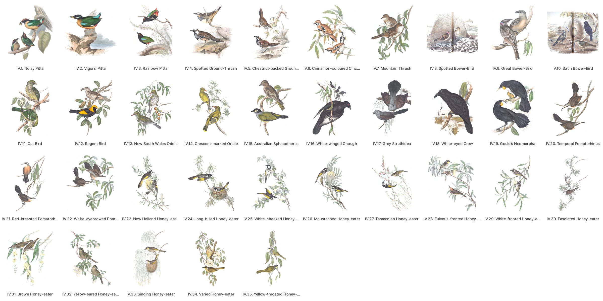

**Volume IV, plates 36–70**

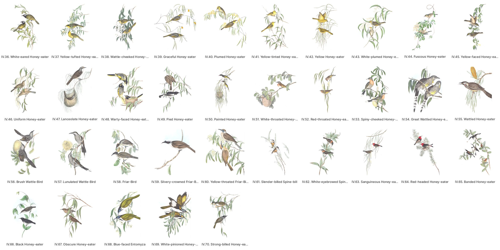

**Volume IV, plates 71–104**

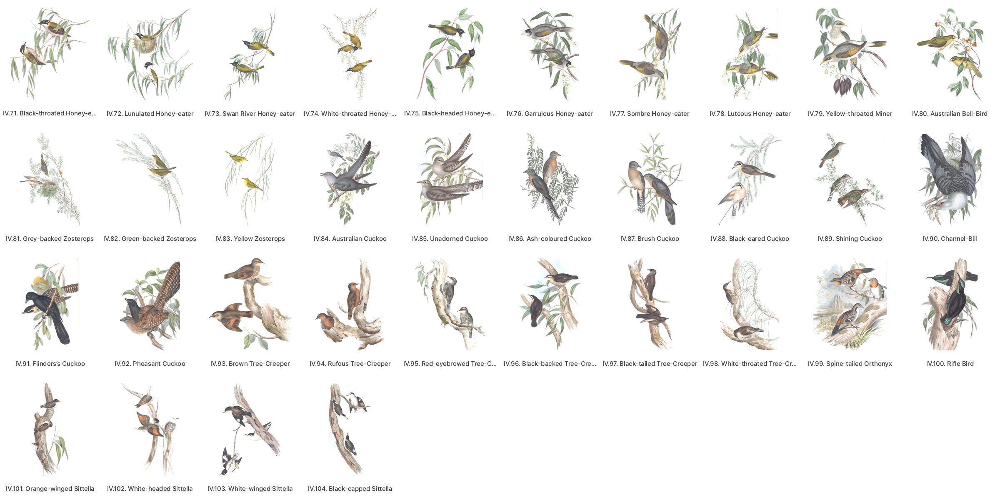

**Volume V, plates 1–46**

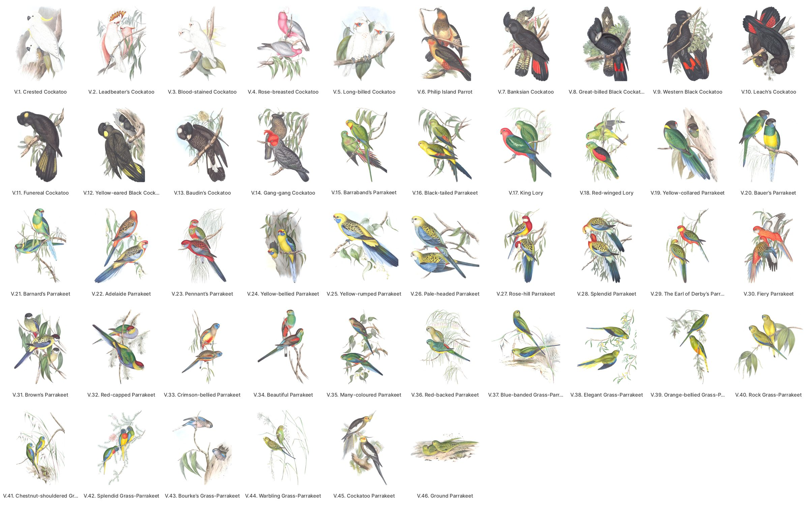

**Volume V, plates 47–92**

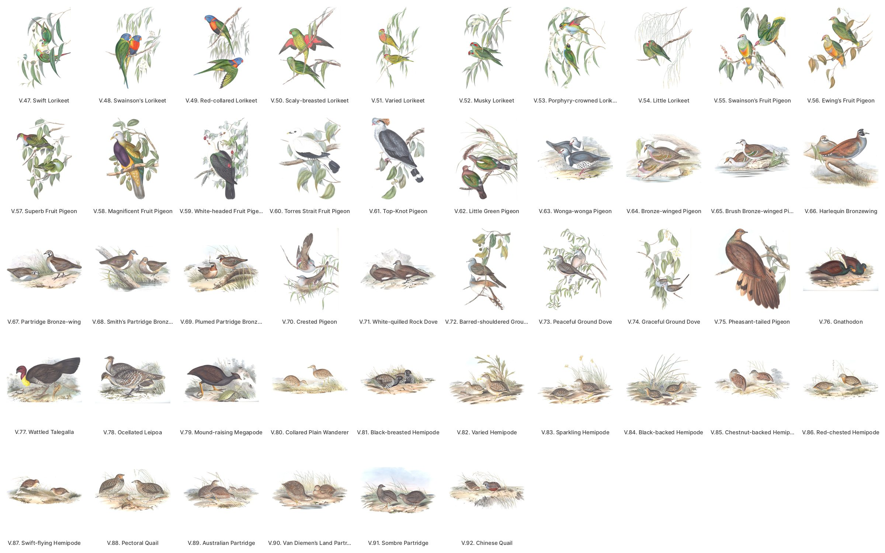

**Volume VI, plates 1–41**

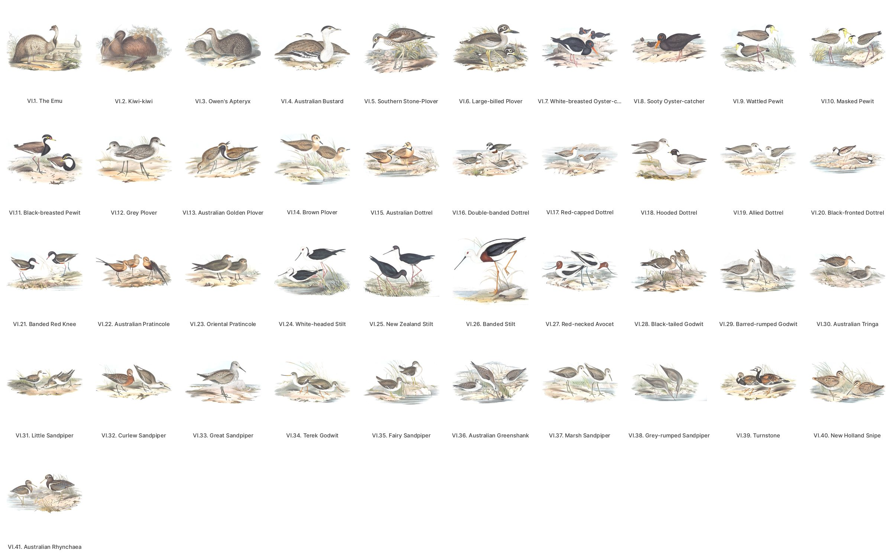

**Volume VI, plates 42–82**

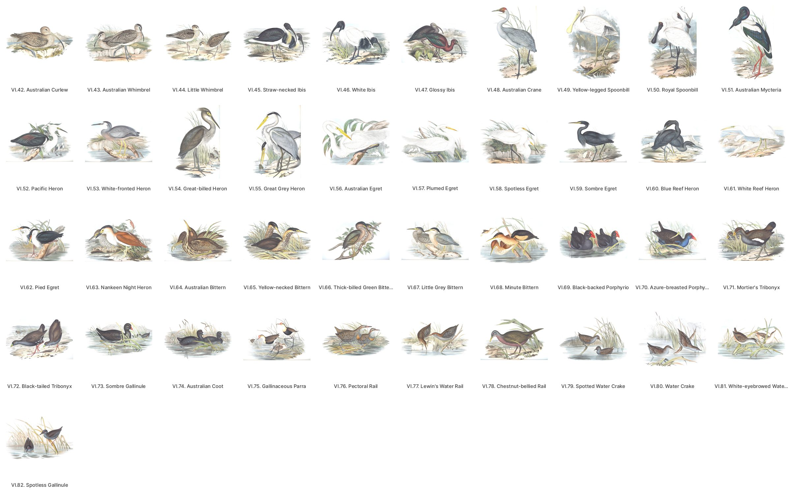

**Volume VII, plates 1–43**

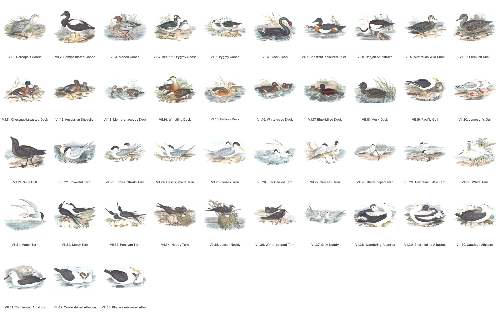

**Volume VII, plates 44–85**

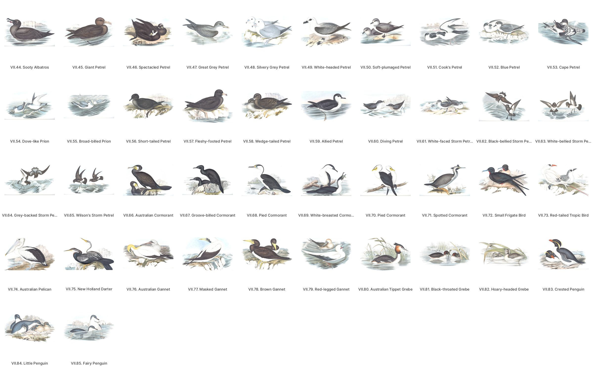

**Supplement, plates 1–41**

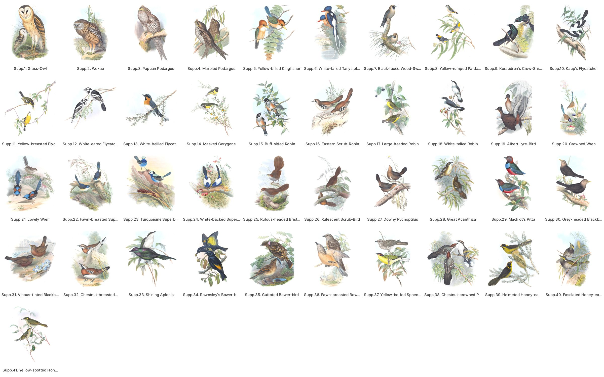

**Supplement, plates 42–81**

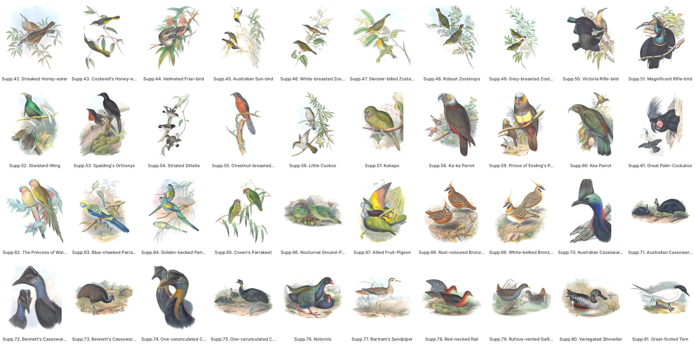

## Files

- **`plates.csv`**: one row per plate. It holds:
  - `volume` and `plate`: Gould numbers his plates per volume, as each volume's List of Plates does ("Australia, ii. pl. 18"). The sheets carry no number. Together the two are the plate's key.
  - the List's English and Latin names, and the Latin name engraved on the plate;
  - where the plate is: BHL item, leaf, BHL PageID, and a link to the page;
  - `scan_url`, the unaltered JPEG 2000 on BHL's open-data bucket;
  - the two release images;
  - `imprint`, the plate's credit lines (see [Who made the plates](#who-made-the-plates)).
- **`species.csv`**: one row per plate, including the three that name no species.
- **`credits.csv`**: one row per plate, name and role, from `imprint`.
- **`ku-disagreements.csv`**: the 75 plates where the Kansas catalogue names a different bird than this dataset, beyond a subspecies, an ending or a genus change. Each one is settled (see below).
- **`sources/`**: the working record.
  - `plate-leaves.csv`: every plate's leaf, its engraved caption as read, whether it agrees with the List, its orientation and where its caption starts.
  - `crosswalk.csv`: each plate mapped to a modern species and to BirdNET V2.4's label, with confidence and reason.
  - `ku-catalogue.csv`: the Kansas record for each plate.
  - `imprints.csv`: how each plate's credit lines were read: where they are on the sheet, the OCR draft, whether they were read off the crop (`eye`) or the scan (`scan`) or not at all (`none`), and what the readers noted.
  - `ku-check.csv`: the disagreements with Kansas and how each was settled.
  - `review.csv`: the 23 plates Featherframe does not show, and why.
  - `doubtful-decisions.csv`: how 24 doubtful plates were settled.
  - `decisions.csv`: every identification made or changed since, as `tools/identify.py` logged it.

## Who made the plates

Every plate is credited on its face, in small engraved lines below the art: on the left who drew it and put it on stone, on the right who printed it. `imprint` in `plates.csv` gives them as engraved, with spacing, initials and the mark after an abbreviation written by one convention (see [Credit lines](../README.md#credit-lines)). `credits.csv` gives one row per plate, name and role, read from them by `tools/credits.py`.

Lines that differ only in capitals, stops or commas are counted together, under their commonest form.

| Credit line | Credits | Plates |
|---|---|---:|
| J. Gould and H. C. Richter del et lith. | John Gould and H. C. Richter: drew, lithographed | 467 |
| J. Gould and H. C. Richter delt. | John Gould and H. C. Richter: drew | 49 |
| J. Gould & H. C. Richter, del et lith. | John Gould and H. C. Richter: drew, lithographed | 29 |
| J. & E. Gould delt. | John and Elizabeth Gould: drew | 28 |
| J. & E. Gould del et lith. | John and Elizabeth Gould: drew, lithographed | 25 |
| J. & E. Gould del. | John and Elizabeth Gould: drew | 18 |
| Drawn from Nature & on Stone by J. & E. Gould. | John and Elizabeth Gould: drew, lithographed | 5 |
| J. Gould and H. C. Richter lithog. | John Gould and H. C. Richter: lithographed | 4 |
| J. Gould H. C. Richter del et lith. | John Gould and H. C. Richter: drew, lithographed | 2 |

One plate each:
- John Gould and Richter drew: "J. Gould & H. C. Richter delt." (II.31), "I. Gould and H. C. Richter delt." (II.32), "J. Gould and H. C. Richter del." (VI.49), "Gould and H. C. Richter del" (VII.5).
- Both drew and lithographed: "J. Gould and H. C. Richter delt. et lith." (II.82), "J. Gould and H. C. Richter del et lithog." (III.10), "Gould and H. C. Richter del et lith." (V.8).
- Both lithographed: "J. Gould and H. C. Richter lith" (V.67).
- Richter alone drew and lithographed: "H. C. Richter del et lithog" (VI.4).
- Edward Lear drew, and John and Elizabeth Gould lithographed: "Drawn on Stone by I. & E. Gould from a Drawing by Edwd. Lear." (V.45).
- Benjamin Waterhouse Hawkins drew and lithographed: "Drawn from Nature and on Stone by Waterhouse Hawkins." (VI.1, the Emu).

That makes John Gould on 636 plates, H. C. Richter on 560 and Elizabeth Gould on 77, and Lear and Waterhouse Hawkins on one each.

| Printer | Credit line | Plates |
|---|---|---:|
| Hullmandel & Walton | Hullmandel & Walton Imp. | 334 |
| Charles Joseph Hullmandel | C. Hullmandel Imp. | 262 |
| Walter | Walter, Imp. | 32 |

C. Hullmandel prints in volumes I–VII, 7 times as "C. Hullmandel Impt." and 6 as "Printed by C. Hullmandel."; Hullmandel & Walton in every volume and the Supplement (once "Hullmandel and Walton Imp.", VI.8); Walter in the Supplement only.

A joint line credits both names with every role it gives, because that is all it says. Gould's own drawings "are never more than rough sketches", with colour notes for his artists (Australian Museum, "Gould the artist").

Elizabeth Gould is named on 77 plates, in volumes I–VII: as drawing 76, and as putting V.45 on stone. The literature gives 84 "produced by her hand" (Australian Museum, "Elizabeth Gould"; also KU Libraries, "Elizabeth Gould", and Helman 2023). The difference likely lies among the 42 plates of volumes V–VII whose artist's line can't be read in this copy; only another copy could say which.

No plate names her with Richter. When she died in 1841, Gould hired Richter (Australian Museum, "Henry Constantine Richter"), and "Richter's first task was to complete the illustrations for *Birds of Australia*" (KU Libraries, "Henry Constantine Richter", citing Jackson 1978, p. 12). He worked "from sketches and notes created by Elizabeth" (Australian Museum, "Elizabeth Gould"). The credit lines name him on 560 plates, all of them with John Gould but VI.4, and among them all 81 of the Supplement.

Four readings rest on this folio's own pattern, and `tools/credits.py` gives the reason for each:
- V.8 and VII.5 read "Gould and H. C. Richter": the initial is cut off at the sheet's edge (V.8) or did not print (VII.5). They are credited to John Gould, since every other line here that names Richter with a Gould reads J. Gould (once I. Gould), never J. & E. Gould.
- IV.3 reads "Hullmandel Imp.", with no C, and IV.93 "C. C. Hullmandel Imp.", with a stray C engraved before the name. Both are credited to Charles Joseph Hullmandel: every other plate of the folio printed by Hullmandel alone reads C. Hullmandel.

33 plates have no credit line read; `notes` says why for each. All are bound sideways, in volumes V–VII, with the foot of the plate in the binding or cut off at the sheet's edge:
- on 16 the sheet ends in the caption;
- on 11 it ends at the foot of the picture, above the caption;
- on 6 only the tops of the letters, or broken fragments, show.

30 more have one line only: the artist's on 20, the printer's on 10. On 16 of the 20 the printer's name can be read but not the wording after it, which is lost in the binding, faded or printed short ("Hullmandel & Walton I…"). Such a line is left out of `imprint`, with its legible text in `notes`, so these plates name no printer in `credits.csv`.

Sources:
- Australian Museum Research Library, *John Gould: illustrations and books*: "Gould the artist" (2021), [australian.museum](https://australian.museum/learn/collections/museum-archives-library/john-gould/gould-the-artist/); "Elizabeth Gould (1804–1841)", [australian.museum](https://australian.museum/learn/collections/museum-archives-library/john-gould/elizabeth-gould-1804-1841/); "Henry Constantine Richter (about 1821–1902)" (2018), [australian.museum](https://australian.museum/learn/collections/museum-archives-library/john-gould/henry-constantine-richter-about-1821-1902/).
- KU Libraries, *John Gould: Bird Illustration in the Age of Darwin* (online exhibit): "Elizabeth Gould" (M. Ashley, 2014), [exhibits.lib.ku.edu](https://exhibits.lib.ku.edu/exhibits/show/gould/about/elizabeth_gould); "Henry Constantine Richter", [exhibits.lib.ku.edu](https://exhibits.lib.ku.edu/exhibits/show/gould/art/henry_constantine_richter). The Richter page cites Jackson, C. E. 1978, "H. C. Richter – John Gould's unknown bird artist", *Journal of the Society for the Bibliography of Natural History* 9(1): 10–14, not seen here.
- Helman, S. 2023. "Conserving John Gould's Australian Bird Pattern Plates". National Library of Australia, 13 Jan. [library.gov.au](https://www.library.gov.au/news-media/conserving-john-goulds-australian-bird-pattern-plates)

## How the plates were identified

1. **Numbering.** Each volume prints its own List of Plates, and the Smithsonian copy is bound in List order, one plate every four leaves. The per-volume counts are 36, 104, 97, 104, 92, 82, 85 and 81 (Supplement).
2. **Leaves.** Every plate's leaf was read against its engraved caption (`sources/plate-leaves.csv`).
   - 660 captions name the listed plate.
   - 20 sideways plates have their caption lost in the binding's gutter. The text leaf after each names the species, and the bird agrees.
   - IV.80 is engraved *Myzantha viridis*, Gould's plate name for the Bell-bird. The facing text is the Bell-bird's.
3. **Names.** Each plate was mapped to a modern species from Gould's own text and synonymy, with a confidence and a written reason (`sources/crosswalk.csv`).
4. **Checking.** `caption_checked` is `yes` for the 660 plates whose engraved caption was read and names the plate as listed. The identification is carried from that name through Gould's text.
   - **Open:** seven rows, each asking what would settle it: VI.59, VII.21 and VII.42 are `medium`; V.13, V.30, VI.2 and VII.83 are `low` and name no species. The doubtful rows were researched on 1 Oct (W-931), and every row was checked again by an independent pass, each correction confirmed by a second reviewer (W-936).
   - **Forms:** until 1 Oct this folio set no `form`. 121 rows now mark a race (`subspecies`) and 10 a morph or plumage (`variant`), under the README's rule.
   - **No species:** Supp. 34, Rawnsley's Bower-bird, an intergeneric hybrid, besides the four open rows above.
5. **Modern names.** 498 of the birds are in BirdNET V2.4. `birdnet_label` gives the label, and it can be broader than the species. For example, III.73's Australian Pipit falls under BirdNET's Australasian Pipit. `scientific` and `common` are eBird/Clements 2025's names for the species. Where eBird has since moved a name (the goshawks to *Tachyspiza*, the dotterels to *Anarhynchus*, the bronze-cuckoos to *Chalcites*), the row carries eBird's.

## Traps

These are the plates a careful reader would still get wrong. Gould's binomial now names another bird, so match on the modern name, never on his.

- **Whistlers:** Gould's *Pachycephala pectoralis* (II.67) is the Rufous Whistler, not the Golden.
- **Flycatchers:** his *Myiagra nitida* (II.91) is the Satin Flycatcher. His "Shining Flycatcher" English name now belongs to II.88.
- **Harriers:** his *Circus assimilis* (I.26) is the Swamp Harrier. The Spotted Harrier is his *C. jardinii* (I.27).
- **Treecreepers:** his *Climacteris picumnus* (IV.98) is the White-throated Treecreeper. The Brown Treecreeper is his *C. scandens* (IV.93).
- **Rails:** his *Rallus pectoralis* (VI.76) is the Buff-banded Rail. Lewin's Rail is VI.77.
- **Bassian Thrush:** his *Oreocincla lunulata* (IV.7) is the Bassian Thrush, not the Mountain Thrush of Central America.
- **Thornbills:** his *Acanthiza diemenensis* (III.54) is the Brown Thornbill. The Tasmanian Thornbill is III.55.
- **III.41** *Cysticola magna* is not Australian: Gould's own synonymy makes it his *C. campestris*, the Rattling Cisticola of Natal.
- **The raven (IV.18)** is the Forest Raven (`judged`). Gould writes that the figure is "a male, killed in Van Diemen's Land", where only the Forest Raven lives, and the bill is the Forest Raven's massive one; the throat hackle, short at full size, doesn't separate the ravens.
- **The Fuscous Gerygone (II.98)** is the Brown Gerygone (`judged`): no white tail base (II.99, the Western, has one), and Gould's birds are from coastal New South Wales.
- **The Striated Wren (III.28)** is the Thick-billed Grasswren: Gould's birds are from the Lower Namoi, the extinct New South Wales race, not the Western Grasswren of *textilis*.
- **The Sooty Albatross (VII.44)**, *Diomedea fuliginosa*, is the Sooty, not the Light-mantled that Gmelin's name now belongs to: one even dark brown, and a cream groove on the bill.
- **The Giant Petrel (VII.45)** is the Northern (`judged`): Gould gives the bill tip "tinged with vinous", and the plate paints it pink.
- **The Sombre Egret (VI.59)** is open: long black legs, yellow toes and a slender bill are a dark Western Reef-Heron's, and Gould later renamed it after Sykes's Indian bird, but his skin is from Port Stephens.
- **VII.51**, "Cook's Petrel", is Gould's Petrel: birds from Cabbage Tree Island, and Gould synonymises his own *P. leucoptera*.
- **IV.2** is the Banda Sea Pitta, *Pitta vigorsii*, a species of its own in eBird 2025.
- **Splits:** a lumped name now belongs to another population. His Delicate Owl (I.31) is the Eastern Barn Owl, *Tyto javanica*, not *T. alba*; his White-bellied Shrike-Tit (II.80) is the Western Shrike-tit, *Falcunculus leucogaster*; his White Tern (VII.30) is the Blue-billed White-Tern, *Gygis candida*, not the Atlantic *G. alba*; his Plumed Egret (VI.57) is the Plumed Egret, *Ardea plumifera*, not the Medium Egret of Asia; his Australian Sun-bird (Supp.45) is the Sahul Sunbird, *Cinnyris frenatus*, not the Garden Sunbird that keeps *C. jugularis*; his Spotted Sericornis (III.51) is the Spotted Scrubwren, *Sericornis maculatus*.

## The Kansas catalogue

The University of Kansas Spencer Library's Ellis Collection copy gives each plate a modern scientific name (books `ku-gould:15183` for volume I to `ku-gould:12471` for the Supplement). Its names were matched from the printed Latin, not from the birds.

`ku-disagreements.csv` lists the 107 rows where the two differ, by kind:

| kind | plates | what it is |
|---|---|---|
| same | 56 | the same bird under an older name, a lump, or a split since |
| ku-error | 45 | Kansas matched the printed Latin, not the bird. It swaps V.15 with V.16 and IV.93 with IV.98 |
| doubtful | V.13, V.30, VI.2, VI.59, VII.21, VII.83 | open: the black cockatoo, the rosella, the kiwi, the reef heron, the skua and the rockhopper, each argued in `note` |

## The images: release `gould-australia-v1`

Two images per plate, 681 plates: the sheets as files, and the crops in `crops.zip` (a release holds at most 1000 files). `manifest.json` and `SHA256SUMS` give each file's sha256.

- **`sheet-<barcode>-<leaf>.jpg`, the cleaned full sheet:**
  - The JPEG 2000 master, stood upright. A sideways plate is turned so its caption runs along the bottom.
  - The paper is evened, as for *The Birds of Europe*. A quadratic surface is fitted to the paper and divided out, and anything within 6 % of the paper's own tone becomes pure white.
  - Caption and imprint are kept. JPEG quality 95.
- **`crop-<barcode>-<leaf>.jpg`, the art crop:**
  - An upright plate is cut just above its engraved caption, and at 95.5 % of its width, clear of the binding line every volume shows.
  - The art is then cropped to its own box, with a band of fresh white paper added.
  - This is Featherframe's cut for e-paper, and more opinionated than the sheet.
  - The 401 plates Featherframe shows had their crops reviewed on contact sheets, and each sideways one has margins of its own, set to the box of its ink. The other 280 are cut by the same rules but not reviewed (`notes`).

For the sheet as it is, with its paper and its age, follow the row's `scan_url` to BHL's original.
