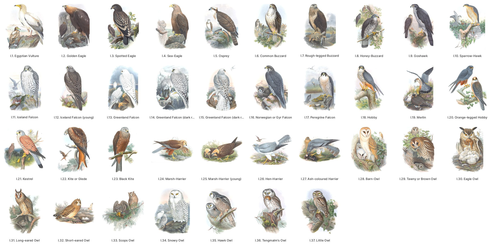
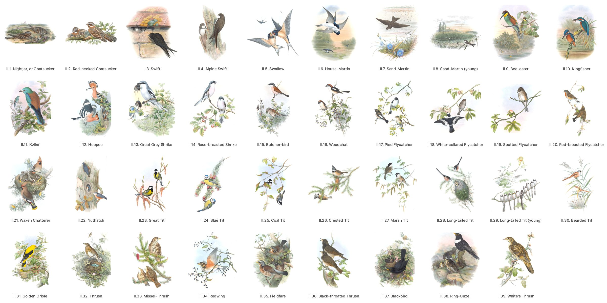
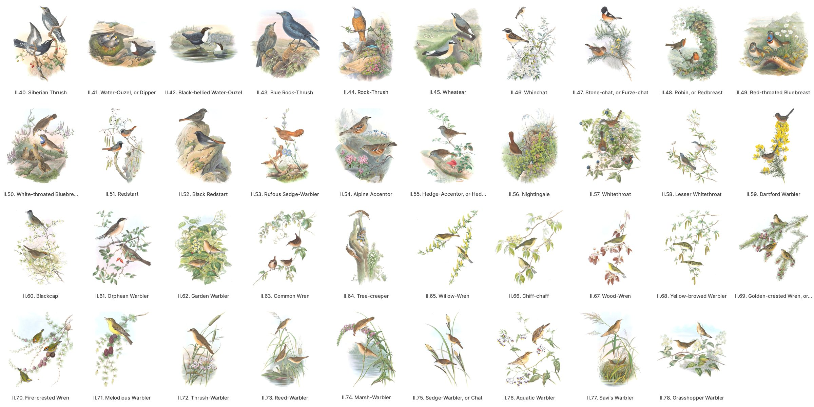
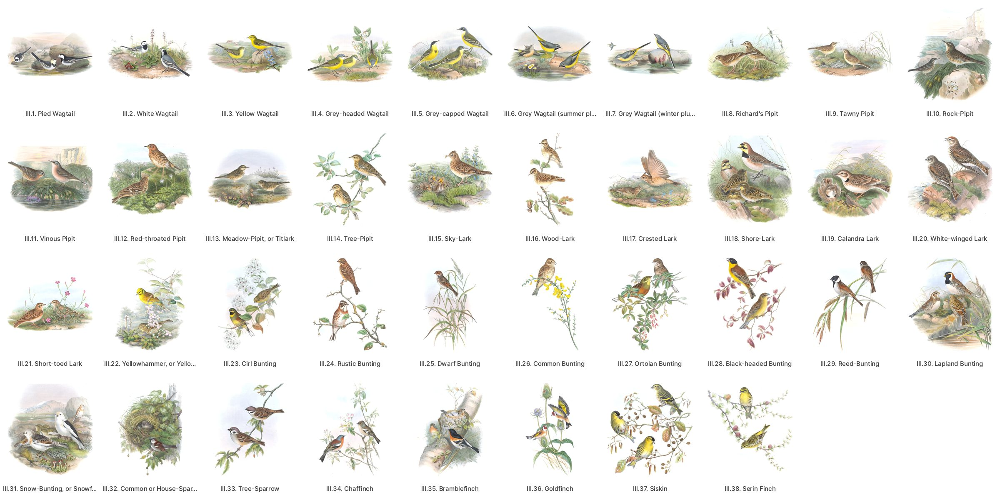
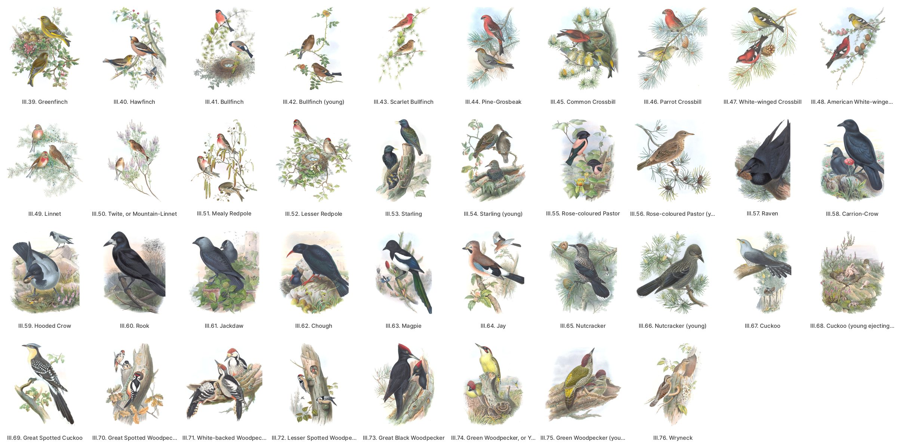
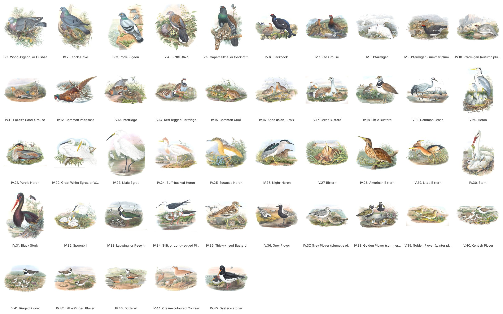
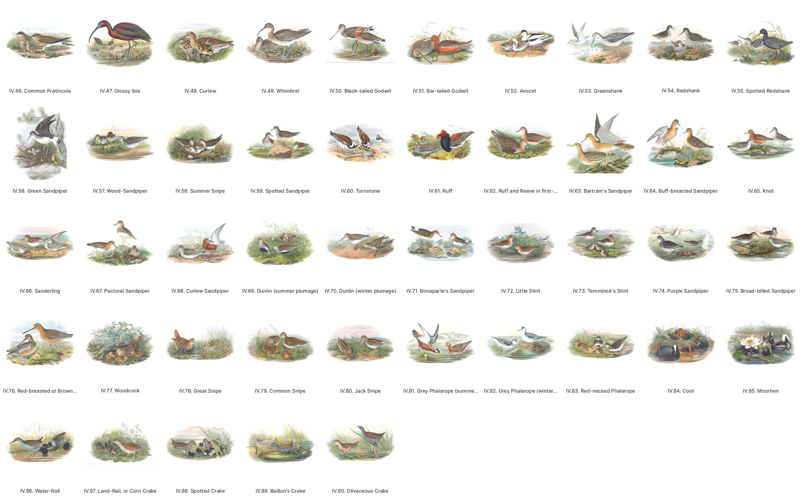
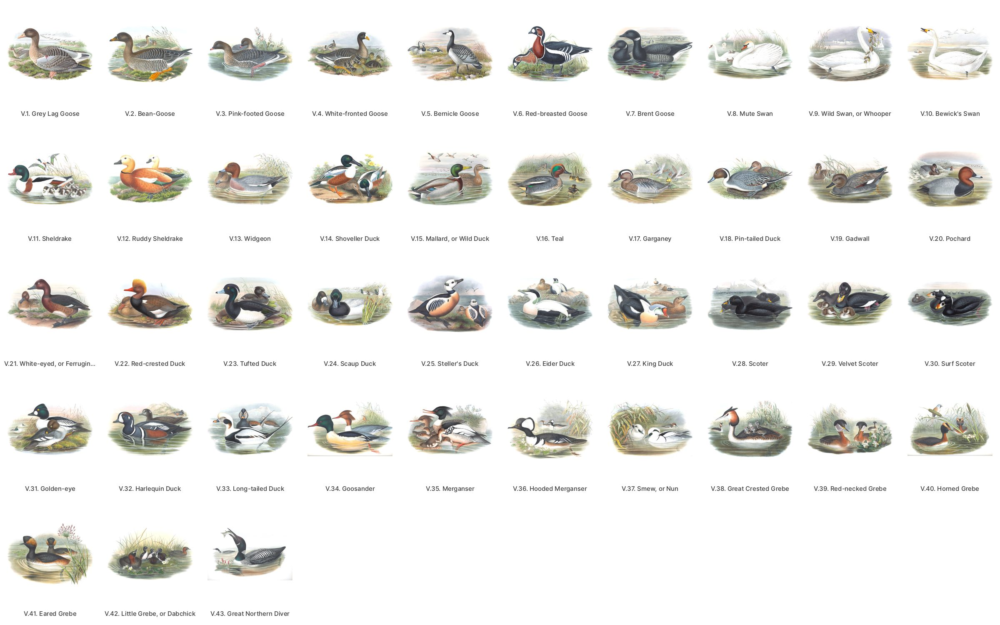
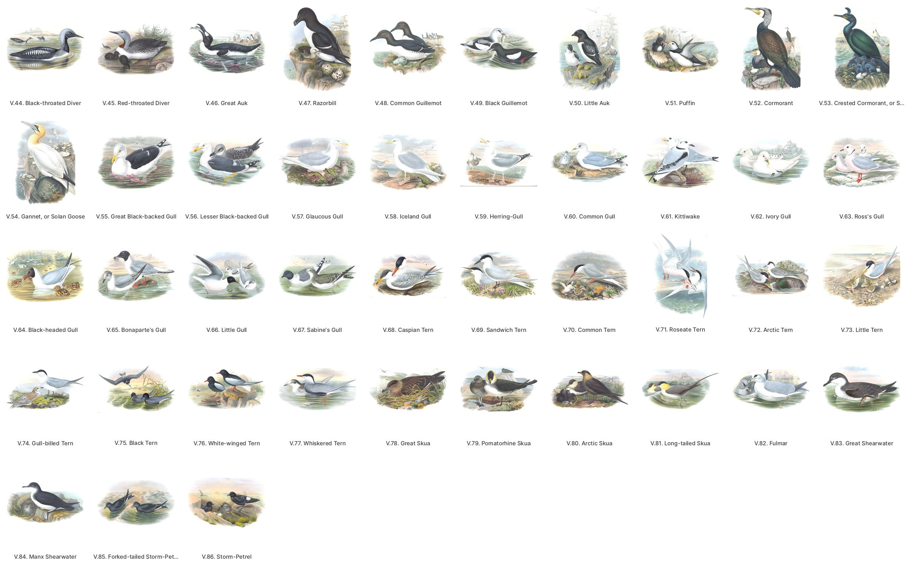

# John Gould, *The Birds of Great Britain* (1862–73)

Five volumes and 367 plates. Drawn by John Gould with H. C. Richter, W. Hart and J. Wolf, lithographed and hand-coloured, published in parts in London.

**Copy:** Smithsonian Libraries, scanned for the Biodiversity Heritage Library (BHL): [title 127814](https://www.biodiversitylibrary.org/bibliography/127814), BHL barcodes `birdsgreatbrita{1..5}goul`. Public domain. Credit: *Smithsonian Libraries and Archives, via the Biodiversity Heritage Library.*

## The plates

Every plate as its art crop, by volume and number. The full-size images are in the [`gould-britain-v1`](https://github.com/wr/historical-bird-plates/releases/tag/gould-britain-v1) release. Ten of its sheets are turned the wrong way; a corrected `gould-britain-v2` is built and will replace it. The contact sheets here already show v2's crops.

**Volume I, plates 1–37**

**Volume II, plates 1–39**

**Volume II, plates 40–78**

**Volume III, plates 1–38**

**Volume III, plates 39–76**

**Volume IV, plates 1–45**

**Volume IV, plates 46–90**

**Volume V, plates 1–43**

**Volume V, plates 44–86**

## Files

- **`plates.csv`**: one row per plate. It holds:
  - `volume` and `plate`: Gould numbers his plates per volume, as each volume's List of Plates does ("Gt. Brit. iii. pl. 10"). The sheets carry no number. Together the two are the plate's key.
  - the List's English and Latin names, and the Latin name engraved on the plate;
  - where the plate is: BHL item, leaf, BHL PageID, and a link to the page;
  - `scan_url`, the unaltered JPEG 2000 on BHL's open-data bucket;
  - the two release images.
- **`species.csv`**: one row per plate and species. Two plates have a second bird: the cuckoos' foster parents (`figure` `foster parent`).
- **`ku-disagreements.csv`**: the 74 plates where the Kansas catalogue differs, and the `kind` of each.
- **`sources/plate-leaves.csv`**: each plate's engraved caption as read, how it was read, where it starts, and the heading of the next text leaf.
- **`sources/ku-catalogue.csv`**: the Kansas catalogue's record for every plate.
- **`sources/decisions.csv`**: every identification as decided, in `tools/identify.py`'s log.
- **`sources/survey.csv`**: the first survey. For every plate it gives its leaf, the name as printed, a draft modern name, whether BirdNET V2.4 has it, and the matching plate of *The Birds of Europe* where there is one.

## How the plates were identified

1. **Numbering.** Each volume prints its own List of Plates: 37, 78, 76, 90 and 86 plates. The Smithsonian copy is bound in List order.
2. **Captions.** Every engraved caption was read on the scan: 360 with Apple's Vision OCR and 6 by eye, where the letters are too faint or too close to the binding. All 366 agree with the List. IV.63's caption is lost in the binding gutter of this copy; its text leaf and the bird identify it.
3. **Names.** Each plate was carried to its modern species through the caption, Gould's text and synonymy, and the same bird's caption-checked plate in *The Birds of Europe*, and the plate was looked at wherever the name, a split or a second bird left any doubt. 365 rows are `high` and four `judged`; none are open.
4. **Kansas.** The University of Kansas Spencer Library's copy (`ku-gould:9261`, `8935`, `8625`, `8257`, `7895`, vols. I–V) has a record for every plate. 74 differ from this table. Most are older genera, and 10 are a find-and-replace slip in Kansas's records (*Sturnus* for *Sterna*). Eight are errors, among them II.51 (Black Redstart for the Common), II.69 (the American Golden-crowned Kinglet for the Goldcrest), V.35 (Goosander for the Red-breasted Merganser) and V.71 (Arctic Tern for the Roseate).
5. **Modern names.** `scientific` and `common` are eBird/Clements 2025's. `birdnet_label` is BirdNET V2.4's label, where it has the bird.

Birds in the background that are not the plate's subject, such as the Bearded Tit on V.40 and the Kingfisher on V.34, have no row.

## Traps

These are the plates a careful reader would still get wrong.

- **Garden and Orphean Warblers:** II.62, printed *Curruca hortensis*, is BirdNET's exact label for the Western Orphean Warbler, but the bird is the Garden Warbler. II.61, *Curruca orphea*, is the Orphean: the Western, `judged`, for its brown back, apricot underparts and western sources.
- **Terns:** Gould's *Sterna paradisea* (V.71) is the Roseate Tern: rosy breast, dark bill. His *S. macrura* (V.72) is the Arctic Tern, today's *Sterna paradisaea*.
- **Melodious Warbler (II.71)** is the Icterine. *Ficedula hypolais* is Linnaeus's *hippolais*; Gould lists the Melodious, *polyglotta*, separately, and the plate shows the Icterine's long wingtip.
- **Spotted Eagle (I.3)** is the Greater, `judged`. The name covered both, but the young bird drawn after the Cornwall birds of 1860–61 has rows of large pale spots on every covert.
- **Bean-Goose (V.2)** is the Taiga Bean-Goose, `judged`: Gould's *segetum* and his Scandinavian range are the Taiga bird's, and the bill drawn at two-thirds life size leans the same way.
- **Dowitcher (IV.76):** Gould prints *Macrorhamphus griseus*, the Short-billed's name, but the summer bird figured, rufous to the vent and barred below, is the Long-billed (`judged`), and the British records are Long-billed.
- **Cattle Egret (IV.24):** Gould himself separates the eastern *coromandus*; his bird is the Western Cattle-Egret.
- **Crakes (IV.89, IV.90):** the Latin crosses. Gould's *Porzana pygmaea* is Baillon's Crake (*Zapornia pusilla*), and his "Olivaceous Crake", *P. minuta*, the Little Crake (*Z. parva*).
- **Hawk Owl (I.35):** *Surnia funerea* is the Hawk Owl, but Linnaeus's *Strix funerea* is now Tengmalm's Owl, I.36.
- **Reed Warblers (II.72, II.73):** Gould's *Calamoherpe arundinacea* is the Reed Warbler; today's *Acrocephalus arundinaceus* is his Thrush-Warbler.
- **Gyrfalcons (I.11–I.16):** six plates, one species. The Iceland and Greenland Falcons are `variant`, since Clements recognises no races.
- **Wagtails (III.1–III.5):** five plates, two species. III.4, Gould's Grey-headed *neglecta*, shows the white-browed Blue-headed nominate.
- **Redpolls (III.51, III.52):** eBird 2025 lumps them as Redpoll; BirdNET keeps Common and Lesser apart, so their labels differ.
- **Skuas (V.80, V.81):** here *parasiticus* is the Arctic Skua, as today, unlike *The Birds of Europe* 442.
- **Black-headed Gull (V.64)** is the modern Black-headed Gull, not the Mediterranean Gull that *Europe* 427 called by this name.
- **Great Shearwater (V.83):** the range in Gould's text is Cory's Shearwater's; the bird figured is a Great Shearwater.
- **Rock and Water Pipits (III.10, III.11):** *The Birds of Europe* has the two on one plate, as one species. This folio gives each its own plate.

## The images: release `gould-britain-v1`, and v2 to come

Two images per plate, 367 plates, made as for *The Birds of Europe*. `manifest.json` and `SHA256SUMS` give each file's sha256.

- **`sheet-<barcode>-<leaf>.jpg`, the cleaned full sheet:**
  - The JPEG 2000 master, stood upright. Half the plates are bound sideways, and they are turned so the caption runs along the bottom. In `gould-britain-v1` ten are turned wrong: I.25, II.8, III.7, IV.62, IV.70 and IV.82 upside down, and IV.9, IV.37, IV.39 and V.57 on their side. v2 checks every one by reading its caption.
  - The paper is evened, and anything within 6 % of its tone becomes pure white.
  - The later volumes' painted backgrounds are kept.
- **`crop-<barcode>-<leaf>.jpg`, the art crop:** in v2, cut just above the read caption (`caption_top` in `sources/plate-leaves.csv`), with the right edge of upright plates trimmed clear of the binding line, then cropped to the art's own box. Every crop was reviewed on contact sheets. A few keep the hairline of the painted ground's lower edge, which is part of the print.

These scans are about 265 ppi, and BHL's masters are lossy: the lowest resolution of Gould's folios here. For the sheet as it is, follow the row's `scan_url` to BHL's original.
