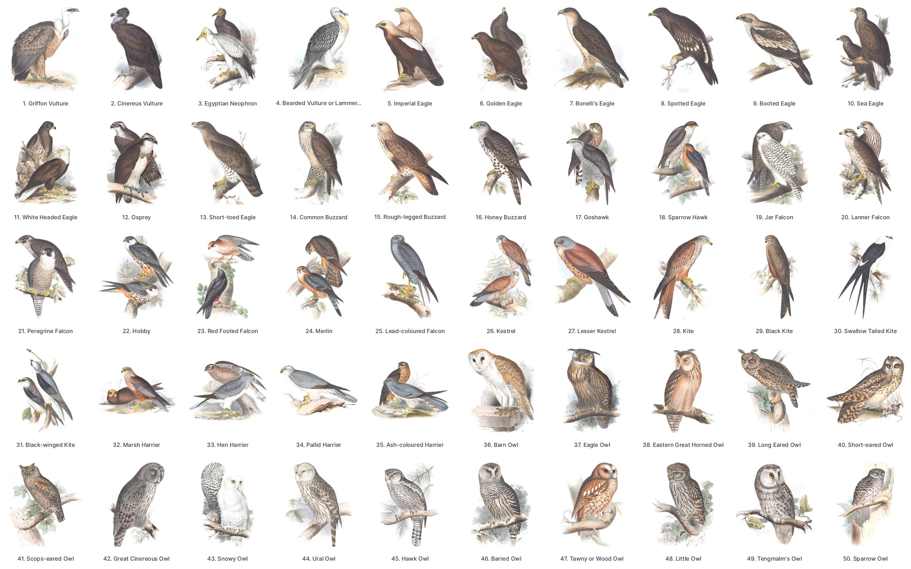
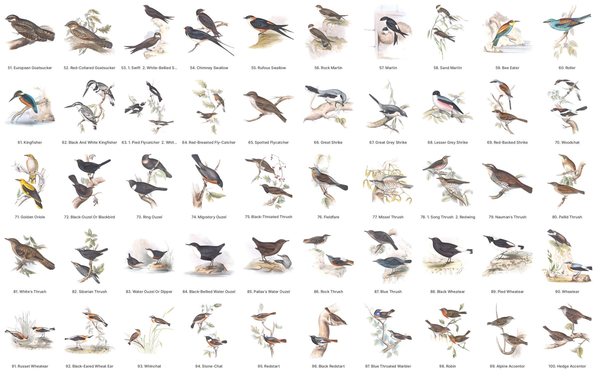
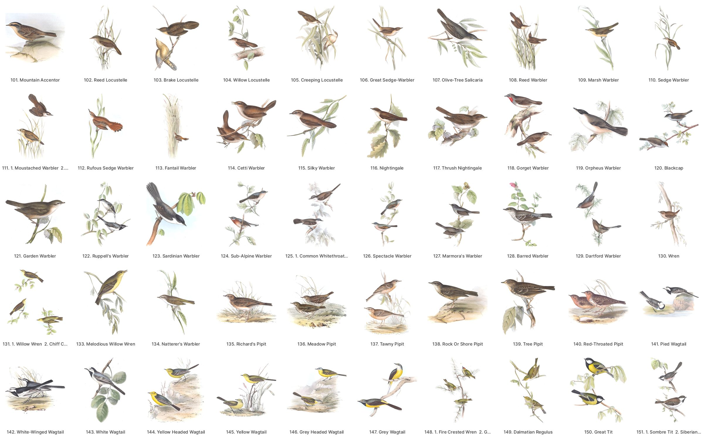
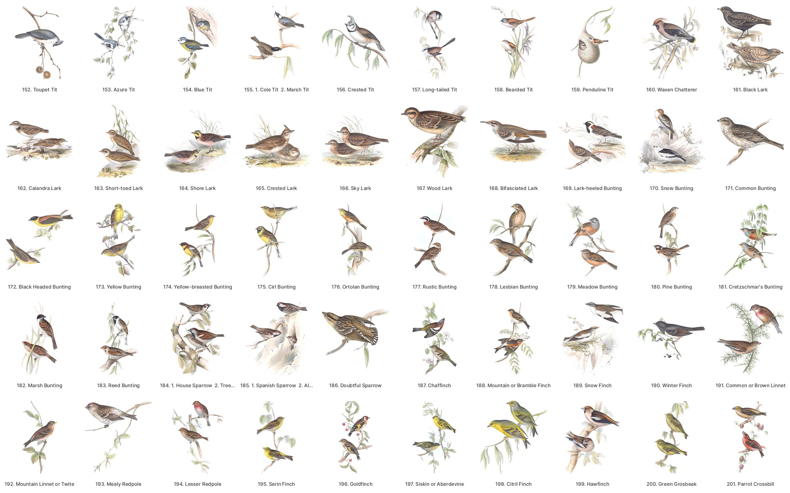
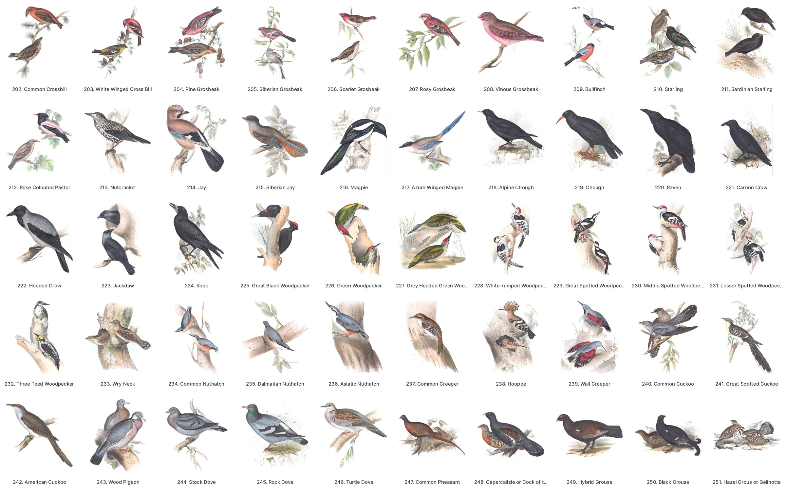
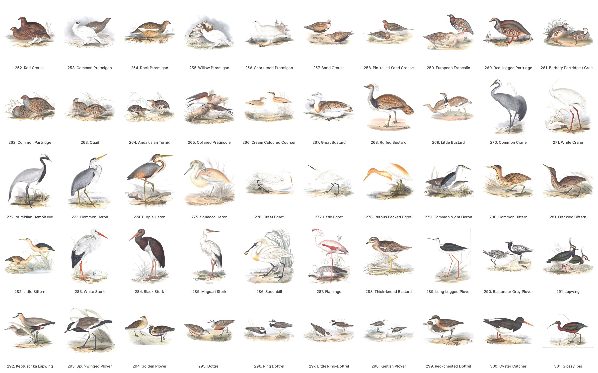
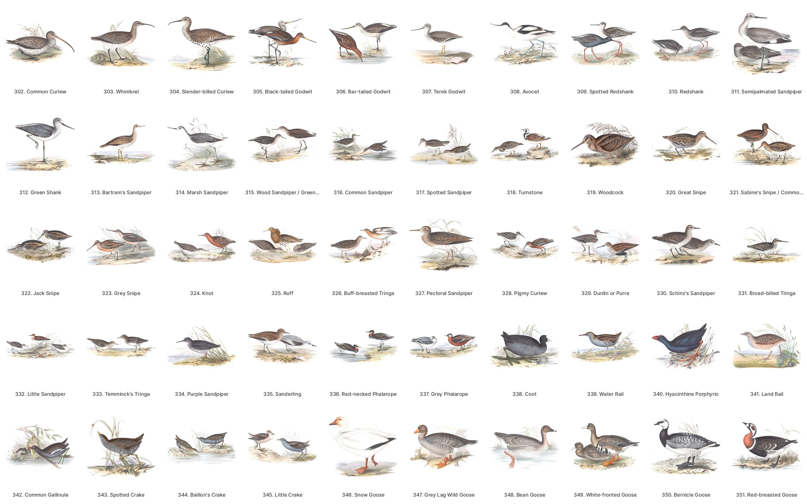
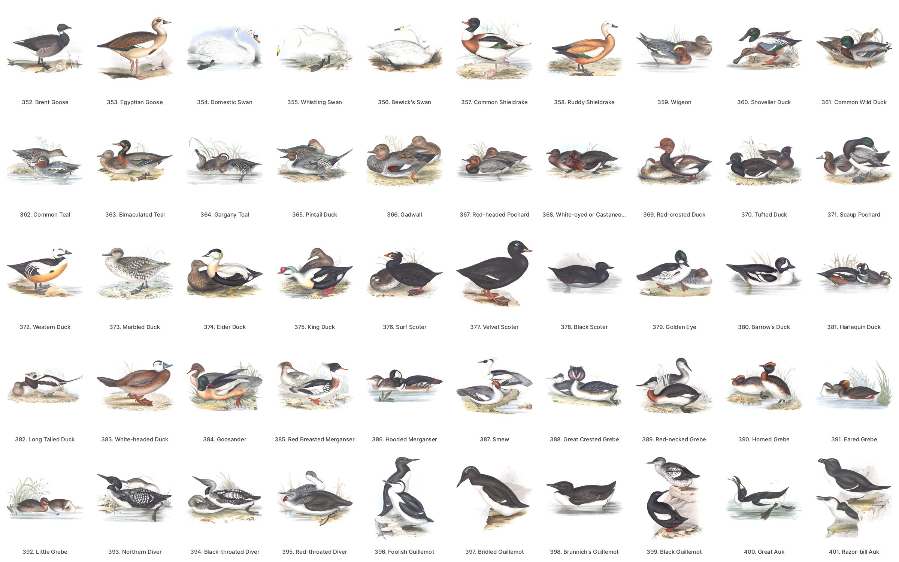
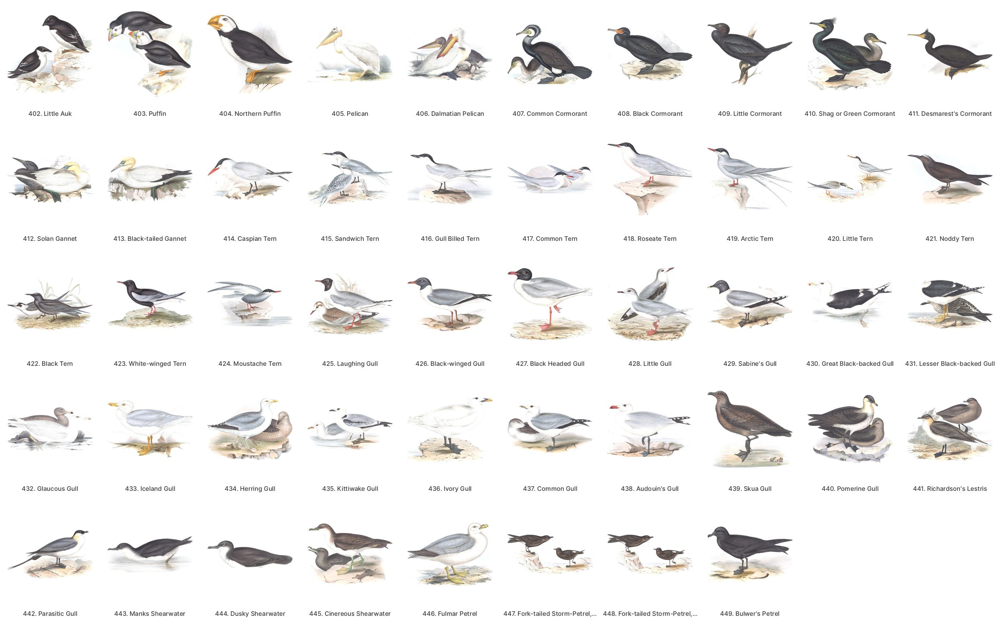

# John Gould, *The Birds of Europe* (1832–37)

Five volumes and 449 plates: 448 in this copy, as one was never found. Drawn and lithographed by John and Elizabeth Gould (356 plates) and Edward Lear (56), printed by Charles Hullmandel, hand-coloured, published in parts in London.

**Copy:** Smithsonian Libraries, scanned for the Biodiversity Heritage Library (BHL): [title 65989](https://www.biodiversitylibrary.org/bibliography/65989), items 132863, 132861, 133913, 132862 and 133915, i.e. volumes I–V, BHL barcodes `birdsEurope{I..V}Goul`. Public domain. Credit: *Smithsonian Libraries and Archives, via the Biodiversity Heritage Library.*

## The plates

Every plate as its art crop, by General List number. The full-size images are in the [`gould-europe-v1`](https://github.com/wr/historical-bird-plates/releases/tag/gould-europe-v1) release.

**Plates 1–50**

**Plates 51–100**

**Plates 101–151**

**Plates 152–201**

**Plates 202–251**

**Plates 252–301**

**Plates 302–351**

**Plates 352–401**

**Plates 402–449**

## Files

- **`plates.csv`**: one row per plate. It holds:
  - the General List's name for the plate, and the name engraved on the plate itself;
  - where the plate is: volume, BHL item, leaf, BHL PageID, and a link to the page;
  - `scan_url`, the unaltered JPEG 2000 on BHL's open-data bucket;
  - the two release images;
  - `imprint`, the plate's credit lines (see [Who made the plates](#who-made-the-plates)).
- **`species.csv`**: one row per plate and bird on the General List, including every row that isn't identified.
- **`credits.csv`**: one row per plate, name and role, from `imprint`.
- **`ku-disagreements.csv`**: every plate where the Kansas catalogue names a different species, and what the disagreement is (see below).
- **`sources/`**: the working record.
  - `general-list.csv`: the General List of Plates, transcribed from volume I.
  - `plate-leaves.csv`: every plate leaf in the five volumes, with its pencilled number, engraved caption and orientation.
  - `crosswalk.csv`: each List row mapped to a modern name, with confidence and reason, as first settled.
  - `decisions.csv`: every identification made or changed since, as `tools/identify.py` logged it.
  - `ku-catalogue.csv`: the Kansas record for each plate.
  - `imprints.csv`: how each plate's credit lines were read: where they are on the sheet, the OCR draft, whether they were read off the crop (`eye`) or the scan (`scan`) or not at all (`none`), and what the readers noted.

## Who made the plates

Every plate is credited on its face, in small engraved lines below the art: on the left who drew it and put it on stone, on the right who printed it. `imprint` in `plates.csv` gives them as engraved, with spacing, initials and the mark after an abbreviation written by one convention (see [Credit lines](../README.md#credit-lines)). `credits.csv` gives one row per plate, name and role, read from them by `tools/credits.py`.

Lines that differ only in capitals, stops or commas are counted together, under their commonest form.

| Credit line | Credits | Plates |
|---|---|---:|
| Drawn from Nature & on Stone by J. & E. Gould. | John and Elizabeth Gould: drew, lithographed | 250 |
| Drawn from Life & on Stone by J. & E. Gould. | John and Elizabeth Gould: drew, lithographed | 70 |
| Drawn from Life and on Stone by J. & E. Gould. | John and Elizabeth Gould: drew, lithographed | 34 |
| E. Lear del et lith. | Edward Lear: drew, lithographed | 32 |
| E. Lear del et lithog. | Edward Lear: drew, lithographed | 16 |
| E. Lear del. | Edward Lear: drew | 4 |
| Drawn on Stone by E. Lear. | Edward Lear: lithographed | 3 |

One plate each: "Drawn from Life & on Stone by E. Lear" (12), "Drawn on Stone from Life by J. & E. Gould." (91) and "Drawn on Stone from Nature by J. & E. Gould." (322). That makes John and Elizabeth Gould on 356 plates and Edward Lear on 56. No plate names both.

| Printer | Credit line | Plates |
|---|---|---:|
| Charles Joseph Hullmandel | Printed by C. Hullmandel. | 411 |

On 202 the printer's name did not print past "Hullman". It is credited to Hullmandel, as every other plate of the folio that names a printer names him, and the plate's note says so.

The Goulds' line credits both of them with drawing and lithographing, because that is all it says. Gould's preface says that "by far the greater number of the Plates" were his wife's, "drawn and lithographed by Mrs. Gould, from sketches and designs by myself", and that "the remainder of the drawings have been made by Mr. Lear" (Gould 1837, preface). Gould's own drawings "are never more than rough sketches", with colour notes for his artists (Australian Museum, "Gould the artist"). Sketches in the Ralph Ellis Collection suggest that he would "either make minor changes to or simply approve Elizabeth's sketches" (Newman 2019).

The credit lines name Lear on 56 plates: as drawing 53 and as lithographing 52. The literature gives 68 of the 448 (KU Libraries, "Edward Lear", citing Jackson 1975, pp. 35–36, and Lambourne 1987, pp. 37–38; Ashworth 2023) or 67 (Sotheby's 2022; Museums Victoria, seen only in a search snippet). This copy can't tell how those counts were made, or which plates make the 11 or 12 between them and the credit lines. Some may be among the 34 plates with no credit line read. On 348 the faint artist's line shows only "…ear del.": it may be his, but too little of it shows to read (`notes`). The counts may also take in plates he signed in the art: 400 carries his signature in the picture and the Goulds' credit line, and 405 carries it with no artist's line on the sheet (`notes`). Neither a signature nor a fragment is a credit line, so none of these is credited to him here.

34 plates have no credit line read; `notes` says why for each. All are bound sideways:
- on 25 the sheet ends in the caption, so the lines are cut off;
- on 2 (256, 306) they are cut off at the sheet's foot, and only the tops of the letters show;
- on 7 (257, 258, 266, 269, 415, 416, 419) the paper below the caption is blank to the sheet's foot, so the lines may be cut off or may never have been printed.

Seven more have one line only: the artist's on 62, 281, 298 and 353, and the printer's on 348, 405 and 407.

Sources:
- Gould, J. 1837. *The Birds of Europe*, vol. I, Preface (1 Aug 1837). [archive.org/details/birdsEuropeIGoul](https://archive.org/details/birdsEuropeIGoul)
- Australian Museum Research Library 2021. "Gould the artist", in *John Gould: illustrations and books*. [australian.museum](https://australian.museum/learn/collections/museum-archives-library/john-gould/gould-the-artist/)
- Newman, A. K. 2019. "Elizabeth Gould: An Accomplished Woman". Biodiversity Heritage Library blog, 18 Mar. [blog.biodiversitylibrary.org](https://blog.biodiversitylibrary.org/2019/03/elizabeth-gould)
- KU Libraries. "Edward Lear", in *John Gould: Bird Illustration in the Age of Darwin* (online exhibit). [exhibits.lib.ku.edu](https://exhibits.lib.ku.edu/exhibits/show/gould/art/edward_lear). It cites Jackson, C. E. 1975, *Bird Illustrators: Some Artists in Early Lithography* (Witherby), and Lambourne, M. 1987, *John Gould – Bird Man* (Osburton), not seen here.
- Ashworth, W. B. 2023. "Edward Lear". Linda Hall Library. [lindahall.org](https://www.lindahall.org/about/news/scientist-of-the-day/edward-lear-2/)
- Sotheby's 2022. John Gould, *The Birds of Europe*, 1832–1837, 5 volumes; the library of Henry Rogers Broughton, 2nd Baron Fairhaven. [sothebys.com](https://www.sothebys.com/en/buy/auction/2022/the-library-of-henry-rogers-broughton-2nd-baron-fairhaven/john-gould-the-birds-of-europe-1832-1837-5-volumes)
- Museums Victoria. *The Birds of Europe*, vol. 1, item 1599244. [collections.museumsvictoria.com.au](https://collections.museumsvictoria.com.au/items/1599244)

## How the plates were identified

1. **Numbering.** The plates were issued unnumbered. The book's own order is the *General List of Plates* in volume I (leaves 23–26): 449 numbers, some with two or three species. The List was transcribed by reading the page images, and its numbers are the plate numbers here. The Smithsonian copy carries each List number in pencil on its plate.
2. **Leaves.** Every leaf of all five volumes was walked. Each plate leaf's pencilled number, its engraved caption and whether it is bound sideways were written down (`sources/plate-leaves.csv`).
3. **Names.** Each List row was mapped to a modern species through its Latin name, its English name and the literature. Each mapping got a confidence and a written reason (`sources/crosswalk.csv`).
4. **Checking.** An identification is `caption_checked: yes` only when its leaf's engraved caption names that bird, by Latin epithet or the whole English name, never a shared family word. It was checked by eye on the scan. 411 identifications on 392 plates meet that bar.
   - **High but unchecked:** 43 more `high` rows are not caption-checked: secondary plates of species checked elsewhere, and 26 birds BirdNET has no class for. Until 1 Oct those 26 had their species left blank; they carry it now.
   - **Open:** three rows ask a specific question (132, 348, 444). 249 (Capercaillie × Black Grouse) and 363 (the British "Bimaculated Duck", a Common Teal hybrid) are hybrids, with no species. The first pass's 20 `low` rows were researched on 1 Oct (W-931) and every row checked again by an independent pass (W-936).
5. **Modern names.** Each identification was first made to BirdNET V2.4's labels (Featherframe's use), then carried to eBird/Clements 2025. Where the two taxonomies differ, `reason` says so. The Wikidata, GBIF and Avibase ids come from the species' Wikidata item. Wikidata often has two items for one species, one under an older genus; the item used is the one Wikipedia links to (the most sitelinks) among those at species rank that carry the row's `scientific` name or eBird code, or are listed as their synonym with the same species epithet. Where GBIF doesn't accept that item's key as a species, GBIF's accepted species for the name is used.

## Traps

These are the plates a careful reader would still get wrong.

- **The gulls:** Gould's "Black-headed Gull" (*Xema melanocephala*, 427) is today's Mediterranean Gull. The modern Black-headed Gull is his "Laughing Gull" (*Xema ridibunda*, 425), and today's American Laughing Gull is his "Black-winged Gull" (*Xema atricilla*, 426). Match on the modern binomial, never the common name.
- **Pencil numbers:** this copy's pencil moves Bulwer's Petrel to 448 and puts both storm-petrels on 447's sheet. It also swaps the pencil numbers of 132 and 133. Where the pencil and the caption disagree, the caption decides.
- **Plate 138**, "Rock or Shore Pipit, *Anthus aquaticus*", is the Rock Pipit (`judged`). The two were one species then, but Gould describes the resident British coastal bird, and Dresser cites this plate under *A. obscurus*.
- **The Lanner** (20) is the Saker. Gould himself lists this plate under *F. sacer* (*Birds of Asia* I.5), as Dresser and Sharpe do, and the figure has no grey on the back.
- **The Grey-headed Wagtail** (146) is the Blue-headed nominate *flava*: the male has a bold white eyebrow.
- **Plate 445** shows two shearwaters: the Great above and the Sooty (Strickland's *fuliginosus*) below.
- **Plate 408**'s orange gular pouch edged white is the Neotropic Cormorant's, a South American bird.
- **The Dalmatian Regulus** (149) is Pallas's Leaf Warbler.
- **The Imperial Eagle** (5) is the eastern bird.
- **A plate drawn before a split** stands for the species as it was then understood (`form: pre-split`).
- **133**, Gould's "Melodious Willow Wren", is the Icterine Warbler (`judged`): his range runs to Sweden, which the Melodious doesn't reach, and Seebohm and Dresser cite the plate under the Icterine. Its legs are painted pink, the Melodious's colour, which keeps it from `high`.
- **One bird per figure:** 119 is the Western Orphean Warbler (western localities, buff flanks), 134 the Western Bonelli's (Natterer's Algeciras bird) and 217 the Iberian Magpie (Captain Cook's specimen from near Madrid). Until 1 Oct each also carried the other daughter of the split.
- **Naumann's Thrush** (79) is the Dusky Thrush: a blackish breast scaled white, and Seebohm and Dresser cite the plate there.
- **The Short-toed Ptarmigan** (256) is the Willow Ptarmigan: Temminck's specimen, lent for this plate, survives in Naturalis, Leiden (van der Mije et al. 2023).
- **The Rufous-backed Egret** (278) is the Eastern Cattle-Egret: orange over the whole head and throat.
- **The Bimaculated Teal** (363) is not the Baikal Teal but the British "Bimaculated Duck" pair, a Common Teal hybrid (Salvadori).
- **The Northern Puffin** (404) is the Horned Puffin: an all-orange bill and long horns over the eyes (Ogilvie-Grant).
- **Sabine's Snipe** (321) is the Common Snipe's dark morph (`form: variant`), not a species.
- **Chough and grebe:** on 219 and 391, Gould's Latin names have since moved to the other species. The plates decide:
  - 219 has the Red-billed Chough's long, curved red bill;
  - 391 has the Eared Grebe's black neck and fanned ear plumes.
- **Red-rumped Swallow** (55): eBird 2025 splits it, and *Cecropis daurica* now names the eastern bird. Gould's European bird is *Cecropis rufula*, European Red-rumped Swallow.
- **Goshawk** (17): BirdNET's Northern Goshawk is split in eBird. Gould's is the Eurasian Goshawk, *Astur gentilis*.
- **Red Grouse** (252): eBird 2025 splits it from Willow Ptarmigan as *Lagopus scotica*. BirdNET still lumps it, so its label is Willow Ptarmigan's.
- **Redpolls** (193, 194): eBird 2025 lumps the redpolls. 193, *Linaria canescens*, is the Mealy form by Gould's own later synonymy (*Great Britain* III.51); 194 is the Lesser.

## The Kansas catalogue

The University of Kansas Spencer Library's Ellis Collection copy (volume I: [ku-gould:11233](https://digital.lib.ku.edu/ku-gould/11233)) gives each plate a modern scientific name. It is the one other public identification of this folio. Its names were matched from the printed Latin, not from the birds.

Of the 410 caption-checked species, 409 match a KU plate. `ku-disagreements.csv` lists the 54 rows where KU names something else, by kind:

| kind | plates | what it is |
|---|---|---|
| error | 14, 20, 50, 63, 65, 67, 75, 79, 86, 108, 130, 133, 137, 149, 193, 205, 207, 249, 360, 363, 404, 408, 442 | KU names another species. Some are unrelated: 360, the Shoveler, is labelled a warbler; 63 is labelled an Australian monarch. Others are Latin look-alikes. |
| crossed | 219, 391 | Gould's Latin has since moved to the other species (see Traps) |
| typo | 247, 273, 274, 276, 371 | same species, KU's spelling (*Aquila* for *Ardea*, a space in a name) |
| old name | 122, 127, 194, 259, 321, 409, 410 | an older binomial for the same bird |
| subspecies | 411 | KU names the race |
| pre-split | 8, 55, 81, 94, 124, 138, 217, 252, 278, 287, 299, 348, 444 | KU gives the parent species before the split |
| composite | 151, 445 | KU's record names a different figure on the same sheet |
| open | 132 | KU names a bird the row leaves open |

That is 23 misidentified plates out of about 445, roughly one in 19. On the brace plates, KU's record names only one figure.

## The images: release `gould-europe-v1`

Two images per plate leaf, 448 leaves. `manifest.json` and `SHA256SUMS` give each file's sha256.

- **`sheet-<barcode>-<leaf>.jpg`, the cleaned full sheet:**
  - The JPEG 2000 master, stood upright: 90° clockwise for a landscape plate, so its caption runs along the bottom.
  - The paper is evened. A quadratic surface is fitted to the paper pixels and divided out, removing foxing and the lighting gradient. Anything within 6 % of the paper's own tone becomes pure white.
  - The ink keeps its tone. Caption and imprint are kept.
  - JPEG quality 95.
- **`crop-<barcode>-<leaf>.jpg`, the art crop:**
  - The engraved caption and the pencilled number are cut away. The art is cropped to its own box, and a band of fresh white paper is added.
  - A plate with several birds keeps every one.
  - This is Featherframe's cut for e-paper, and more opinionated than the sheet.
  - The Ivory Gull (436) is white on white paper, so its crop is cut from the whole sheet instead.

Clearing the paper is a choice. For the sheet as it is, with its paper and its age, follow the row's `scan_url` to BHL's original.

**Plates found by pencil alone:** 56 plates (`notes`: *leaf found by its pencilled number*) were located by their pencil number and cleaned the same way. Their captions were not checked against an identification. A landscape one was stood up in the same direction as every checked landscape plate.
