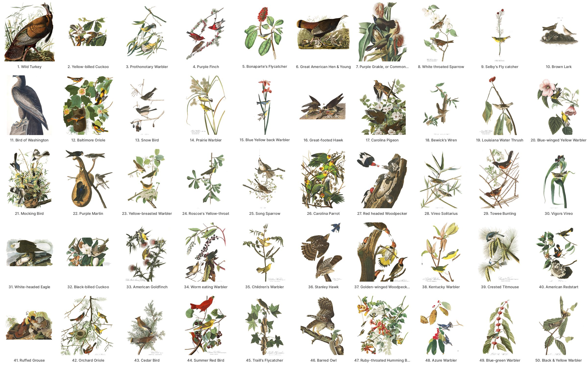
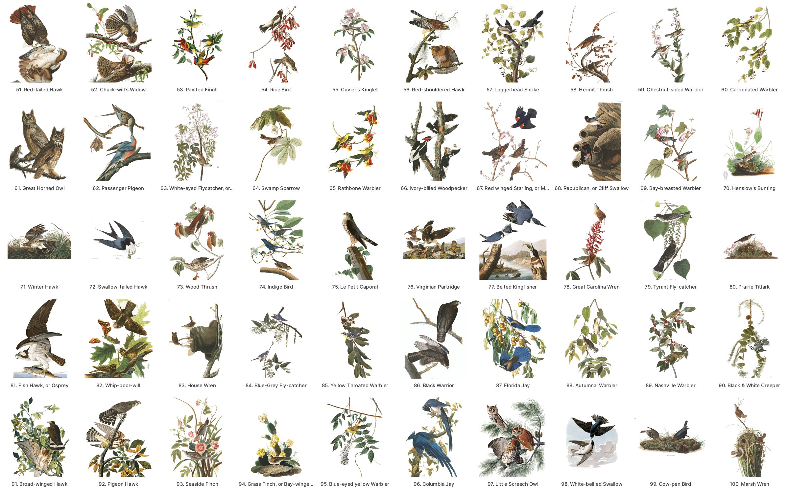
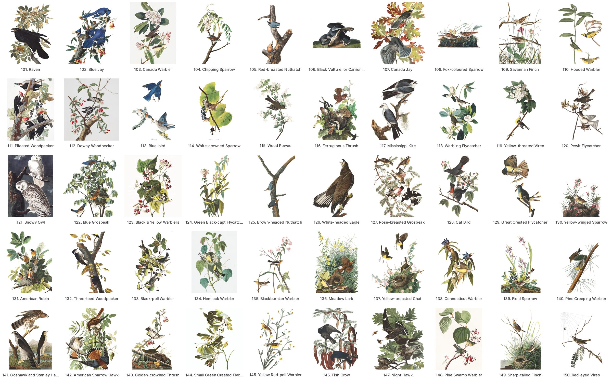
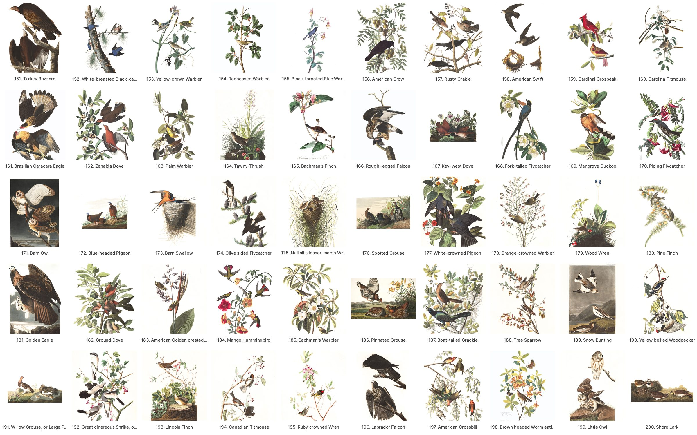
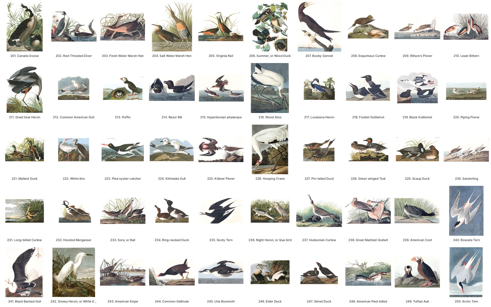
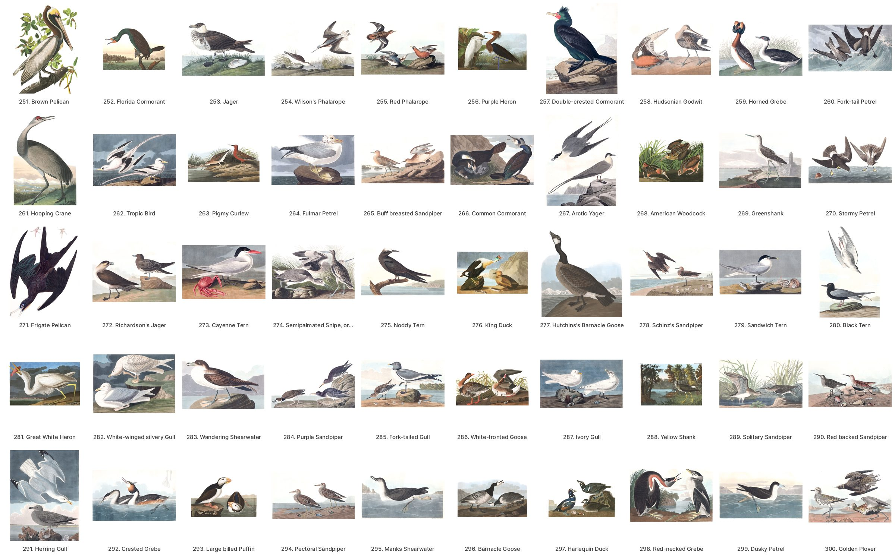
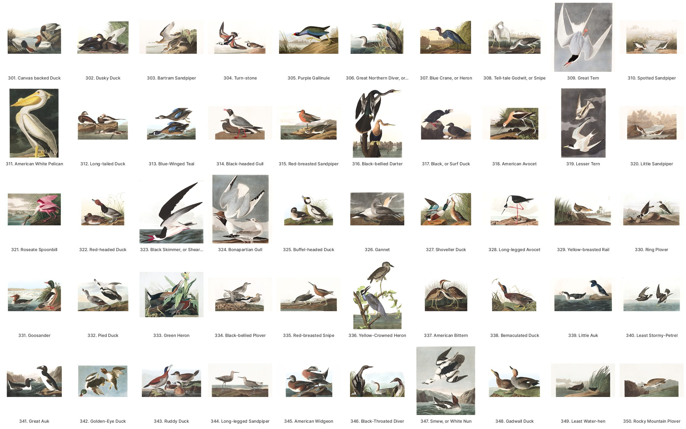
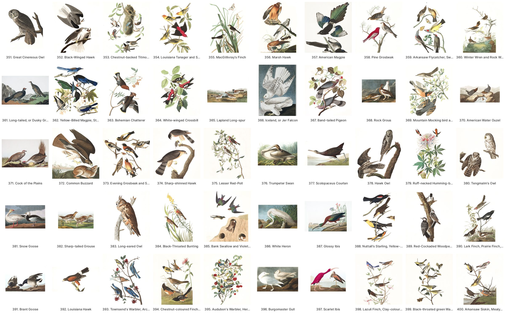
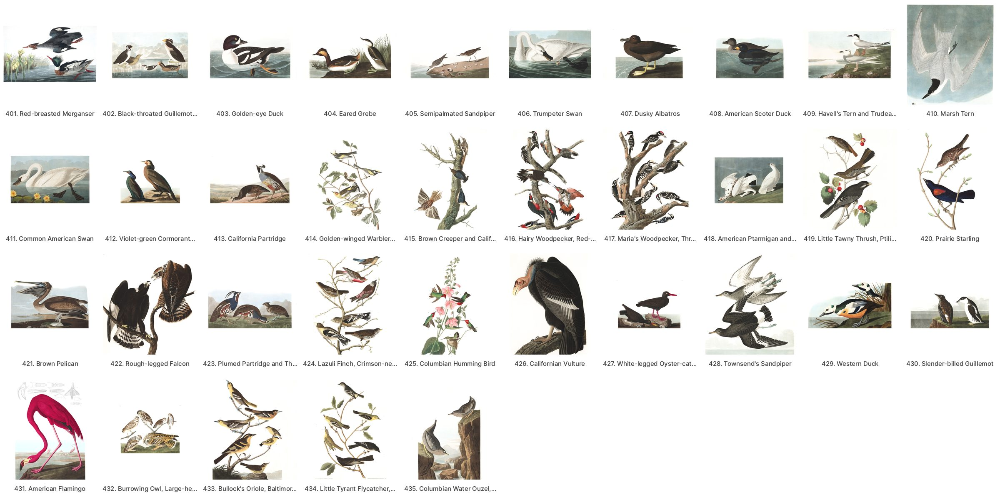

# John James Audubon, *The Birds of America*, Havell edition (1827–38)

435 plates, engraved, printed and hand-coloured by Robert Havell Jr. in London from Audubon's watercolours. Numbered 1–435 on the plates themselves.

## Images

Release [`havell-v1`](https://github.com/wr/historical-bird-plates/releases/tag/havell-v1) has two images of every plate. `manifest.json` and `SHA256SUMS` give each file's sha256.

- **`sheet-NNN.jpg`**: the full plate, as audubon.org publishes it, unaltered. About 2.7 GB.
- **`crop-NNN.jpg`**: the same plate with its lettering trimmed away: the plate number along the top and the engraved caption along the bottom. It is the whole engraving, never one bird of a sheet. About 250 MB.

Credit the scans: *Courtesy of the John James Audubon Center at Mill Grove, Montgomery County Audubon Collection, and Zebra Publishing.*

- **Rights:** the plates are public domain, and a faithful photograph of a public-domain plate carries no copyright of its own in the US. The images are marked with the [Public Domain Mark](https://creativecommons.org/publicdomain/mark/1.0/). audubon.org offers them under its [terms of use](https://www.audubon.org/terms-use); please follow its credit line.
- **Other mirrors:** Nathan Buchar's [audubon-bird-plates](https://github.com/nathanbuchar/audubon-bird-plates) holds the same files. Public-domain scans of other copies are on [Wikimedia Commons](https://commons.wikimedia.org/wiki/Category:The_Birds_of_America) and at the University of Pittsburgh's [Darlington Library](https://digital.library.pitt.edu/collection/audubon-birds-america).

## The plates

Every plate with its lettering trimmed, by Havell number.

**Plates 1–50**

**Plates 51–100**

**Plates 101–150**

**Plates 151–200**

**Plates 201–250**

**Plates 251–300**

**Plates 301–350**

**Plates 351–400**

**Plates 401–435**

## Files

- **`plates.csv`**: plate, title and legend. The titles and image links come from Nathan Buchar's [`data.json`](https://github.com/nathanbuchar/audubon-bird-plates/blob/master/data.json). Its titles run one plate late from 361 to 399, though its file names and images are right, so those titles are corrected here.
  - `title` is Audubon's title as audubon.org gives it. That is the plate's *first-state* lettering, which some plates later changed. Plate 50 reads "Black & Yellow Warbler" there, while the later state is lettered "Swainson's Warbler".
  - `legend` is the lines engraved under the title and Latin name: the figure key and the plant or setting, in Audubon's spelling, transcribed from the scans' caption bands.
- **`species.csv`**: one row per plate and modern species. On a sheet with several species, `figure` is that species' own key.

## How the plates were identified

- **Sources:** each plate was mapped from two independent sources, joined and read against the titles by hand:
  - Wikimedia Commons' per-plate species categories;
  - the Havell titles (the Commons gallery and the mirror's file names).
- **Hard cases:** the 76 plates whose modern name shares no word with Audubon's title were verified one by one against audubon.org, the University of Pittsburgh's Havell catalogue and the New-York Historical Society.
- **Modern names:** made first to BirdNET V2.4's labels, then carried to eBird/Clements 2025 (see *Splits* below).
- **Extinct species:** extinct and far out-of-range species are included, so the map is complete. BirdNET has no class for 22 of them, including the Carolina Parakeet, Passenger Pigeon, Labrador Duck, Great Auk, Eskimo Curlew and Ivory-billed Woodpecker. Their `birdnet_label` is empty.
- **Caption checks:** `caption_checked` is left empty here. These identifications were checked against catalogues, not recorded caption by caption as Gould's were.

## Traps

- **Plate 50 is re-lettered.** It is Swainson's Warbler in its later state, not the Magnolia Warbler its first-state title suggests. Audubon's Magnolia Warbler ("Black & Yellow Warbler, *Sylvia maculosa*") is plate 123.
- **Nelson's Sparrow is not on 149.** Wilson's "Sharp-tailed Finch" there is the Saltmarsh Sparrow.
- **Black-throated Diver (346)** is the Pacific Loon on audubon.org and at NYHS. Pitt still says Arctic Loon.
- **Splits since BirdNET's taxonomy:** the old binomial stays with the Old World bird, so Audubon's plates go to the American daughter:
  - Goshawk (141): American Goshawk, *Astur atricapillus*.
  - Yellow Warbler (95): Northern Yellow Warbler, *Setophaga aestiva*.
  - Barn Owl (171): American Barn Owl, *Tyto furcata*.
  - Hudsonian Curlew (237): Hudsonian Whimbrel, *Numenius hudsonicus*.
  - Herring Gull (291): American Herring Gull, *Larus smithsonianus*.
- **Redpoll (375):** eBird 2025 lumps the redpolls; the plate's Common Redpoll is now "Redpoll".

## Not identified

36 plates have no species here. Each row's `reason` says why.

**Disputed birds, left out on purpose rather than guessed:**
- 11, Bird of Washington;
- 55, Cuvier's Kinglet;
- 60, Carbonated Warbler;
- 164, Tawny Thrush: traditionally the Veery, disputed (Halley 2018);
- 184, Mangrove Humming Bird;
- 338, Bemaculated Duck: a hybrid;
- 407, Dusky Albatros: Light-mantled or Sooty, unsettled.

The fifth "species" on 402 (Kittlitz's Murrelet) is also left out: curatorial sources list four birds there.

**Second plates:** the rest are mostly a second plate of a species identified on another plate, for example 6 (the Wild Turkey hen and young) and 126 (a second "White-headed Eagle", the Bald Eagle). They are open for anyone to fill in.
