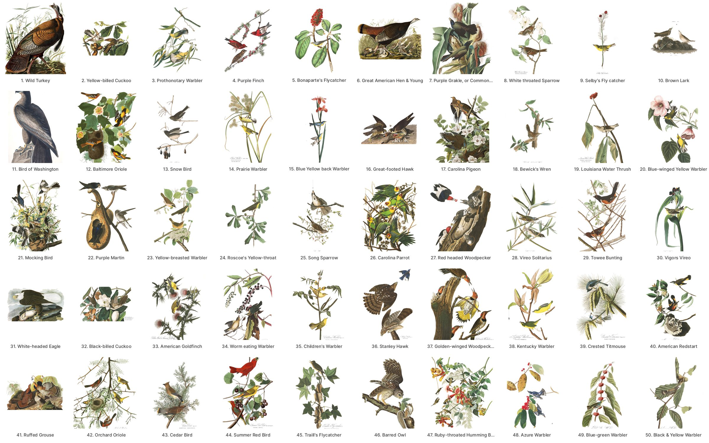
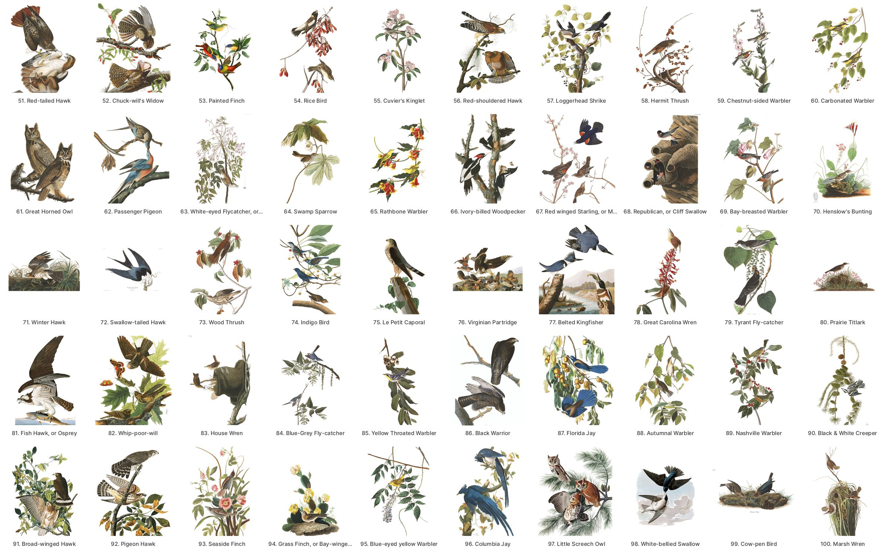
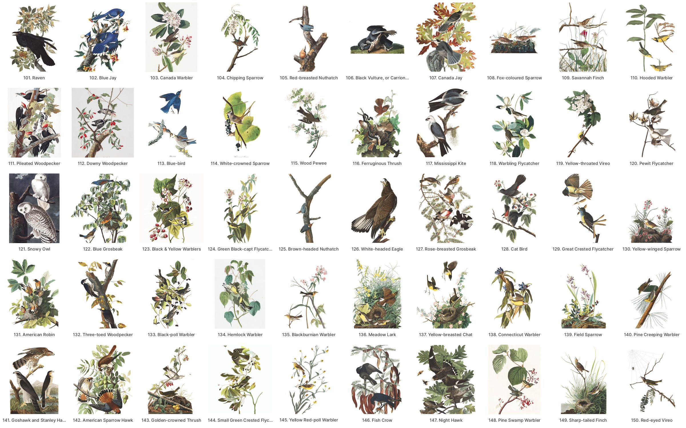
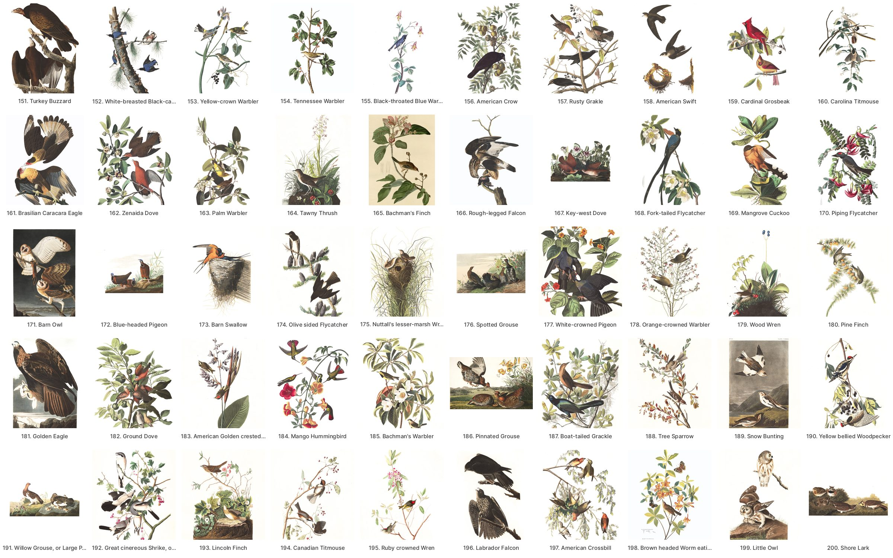
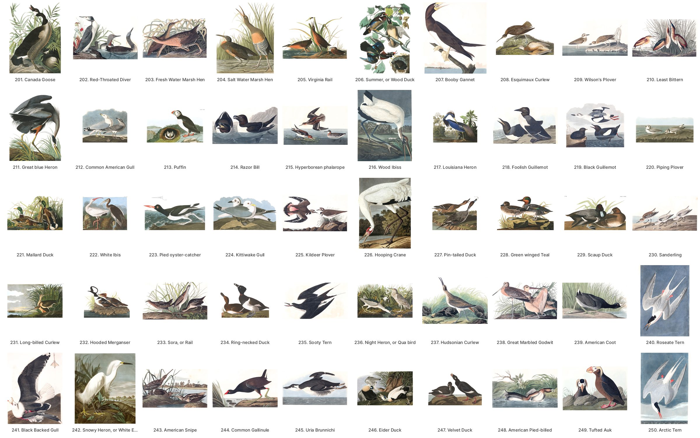
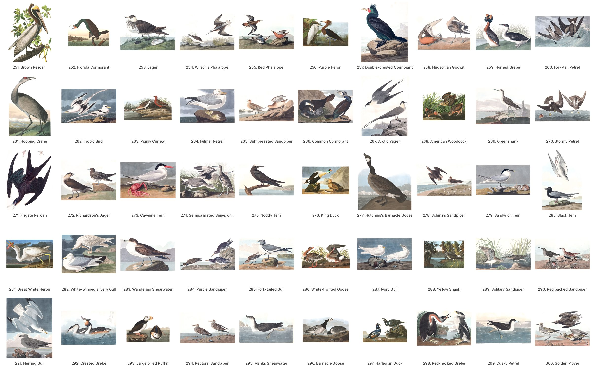
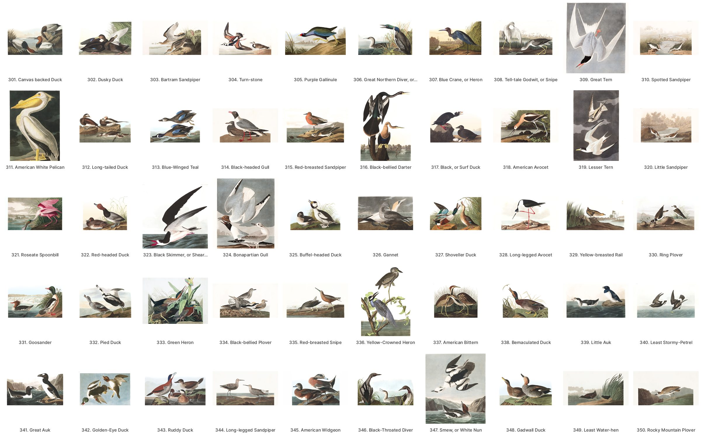
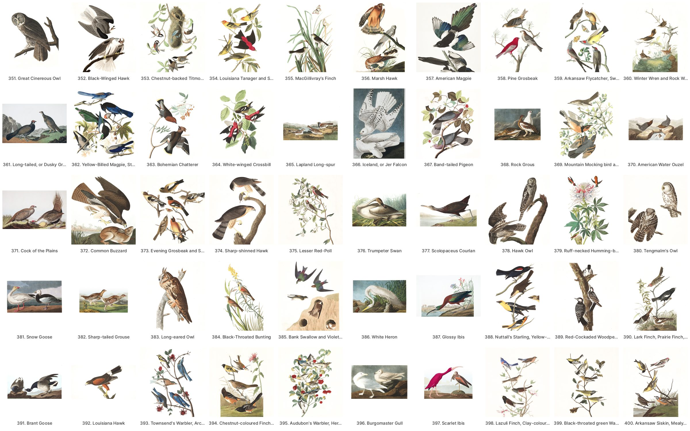
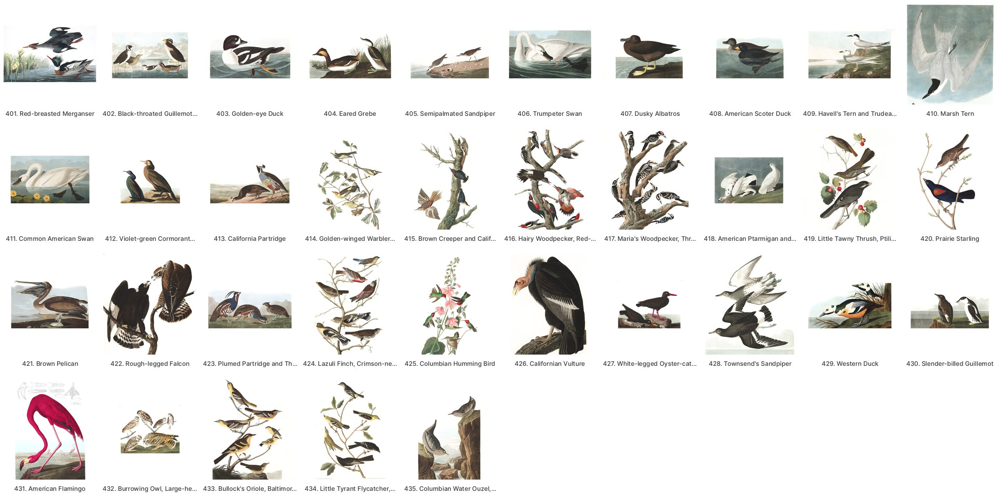

# John James Audubon, *The Birds of America*, Havell edition (1827–38)

435 plates, engraved, printed and hand-coloured from Audubon's watercolours. Their credit lines name W. H. Lizars of Edinburgh as the engraver of 7 of the first ten, Robert Havell Jr. in London as the engraver of 411, and the firm R. Havell & Son of 16; Havell's father, Robert Havell Sr., coloured 22 and printed 21 (see [Who made the plates](#who-made-the-plates)). Numbered 1–435 on the plates themselves.

## Images

Release [`havell-v2`](https://github.com/wr/historical-bird-plates/releases/tag/havell-v2) has two images of every plate. `manifest.json` and `SHA256SUMS` give each file's sha256.

- **`sheet-NNN.jpg`**: the full plate, as audubon.org publishes it, unaltered. About 2.7 GB. Plate 165 is the exception: audubon.org's file is the octavo lithograph, so `havell-v2` cuts the Havell plate at its plate mark from the University of Pittsburgh's scan on [Wikimedia Commons](https://commons.wikimedia.org/wiki/File:165_Bachmans_Finch.jpg) (public domain).
- **`crop-NNN.jpg`**: the same plate with its lettering trimmed away: the plate number along the top and the engraved caption along the bottom. It is the whole engraving, never one bird of a sheet. About 250 MB.

Credit the scans: *Courtesy of the John James Audubon Center at Mill Grove, Montgomery County Audubon Collection, and Zebra Publishing.* Plate 165: *University of Pittsburgh, via Wikimedia Commons.*

- **Rights:** the plates are public domain, and a faithful photograph of a public-domain plate carries no copyright of its own in the US. The images are marked with the [Public Domain Mark](https://creativecommons.org/publicdomain/mark/1.0/). audubon.org offers them under its [terms of use](https://www.audubon.org/terms-use); please follow its credit line.
- **Other mirrors:** Nathan Buchar's [audubon-bird-plates](https://github.com/nathanbuchar/audubon-bird-plates) holds the same files. Public-domain scans of other copies are on [Wikimedia Commons](https://commons.wikimedia.org/wiki/Category:The_Birds_of_America) and at the University of Pittsburgh's [Darlington Library](https://digital.library.pitt.edu/collection/audubon-birds-america).

## The plates

Every plate with its lettering trimmed, by Havell number.

**Plates 1–50**

**Plates 51–100**

**Plates 101–150**

**Plates 151–200**

**Plates 201–250**

**Plates 251–300**

**Plates 301–350**

**Plates 351–400**

**Plates 401–435**

## Files

- **`plates.csv`**: plate, title and legend. The titles and image links come from Nathan Buchar's [`data.json`](https://github.com/nathanbuchar/audubon-bird-plates/blob/master/data.json). Its titles run one plate late from 361 to 399, though its file names and images are right, so those titles are corrected here.
  - `title` is Audubon's title as audubon.org gives it. That is usually the plate's *first-state* lettering, which some plates later changed. Plate 50 is the exception: audubon.org titles it "Black & Yellow Warbler", the later lettering, while its scan carries the 1828 first state, "Swainson's Warbler".
  - `legend` is the lines engraved under the title and Latin name: the figure key and the plant or setting, in Audubon's spelling, transcribed from the scans' caption bands.
  - `imprint` is the plate's credit lines, and `notes` says what is odd about them (see [Who made the plates](#who-made-the-plates)).
- **`species.csv`**: one row per plate and modern species. On a sheet with several species, `figure` is that species' own key.
  - `printed_name` is the English title engraved on this release's scan, read off all 435 sheets on 1 Oct 2026, in the engraver's spelling: "Ruffed Grous", "Belted Kingsfisher", "Great Red brested Rail or Fresh-water Marsh hen". Case and hyphens are not compared. On a sheet with several species it is that bird's own title; a bird named only in the legend (284 fig. 3, 285 fig. 2) or a plate with no English title (245) carries its Latin. Where the scan and audubon.org's `title` differ, as on plates 48, 153, 198 and 263, the row's `reason` gives both.
  - `printed_latin` is the line of capitals under the title, without its author, written as *Genus epithet* in the engraver's spelling and ligatures: *Fringilla corulea*, *Litta carolinensis*, *Hœmatopus bachmani*. It was read twice, independently, and the reads agreed on all but five lines, each settled on the scan. It is blank on 270 (too faint to read letter by letter) and 419 fig. 2, whose title "Ptiliogony's Townsendi" is itself the Latin. Plate 28 swaps the two: its script title is *Vireo Solitarius* and its capitals "SOLITARY FLYCATCHER".
- **`credits.csv`**: one row per plate, name and role, from `imprint`.
- **`sources/imprints.csv`**: how each plate's credit lines were read: where they are on the sheet, the OCR draft, whether they were read off the crop (`eye`) or the release sheet (`scan`) or not at all (`none`), and the record notes, with each stop-or-comma measurement.

## Who made the plates

A plate is credited in small engraved lines below the art: on the left who drew it, on the right who engraved, printed and coloured it. `imprint` in `plates.csv` gives them as engraved, with spacing, initials and the mark after an abbreviation written by one convention (see [Credit lines](../README.md#credit-lines)). `credits.csv` gives one row per plate, name and role, read from them by `tools/credits.py`. All 435 plates have a line read; 165's is read from the University of Pittsburgh's scan (see below).

Lines that differ only in capitals, spacing, stops, commas or colons are counted together, under their commonest form.

The artist's line, on the left:

| Credit line | Credits | Plates |
|---|---|---:|
| Drawn from Nature by J. J. Audubon, F. R. S. F. L. S. | John James Audubon: drew | 336 |
| Drawn from Nature and Published by John J. Audubon, F. R. S. F. L. S. | John James Audubon: drew | 38 |
| Drawn from Nature and Published by John J. Audubon, F. R. S. E. F. L. S. M. W. S. | John James Audubon: drew | 16 |
| Drawn from Nature & Published by John J. Audubon. F. R. S. F. L. S. | John James Audubon: drew | 11 |
| Drawn from Nature and Published by John J. Audubon, F. R. S. E. M. W. S. | John James Audubon: drew | 7 |
| Drawn from Nature by John J. Audubon, F. R. S. E. M. W. S. | John James Audubon: drew | 6 |
| Drawn from Nature & Published by John J. Audubon. F. R. S. E. F. L. S. M. W. S. | John James Audubon: drew | 3 |
| Drawn from Nature & Published by John J. Audubon. F. R. S. E. M. W. S. | John James Audubon: drew | 2 |

The last row is 27 and 26, which reads "Drawn From". One plate each: "Drawn by J. J. Audubon. F. R. S. E." (2), "Drawn from Nature by John J. Audubon. F. R. S. E. F. L. S. M. W. S." (6), "Drawn from Nature by John J. Audubon. F. R. S. M. W. S." (14), "Drawn by J. J. Audubon. F. R. S. E. M. W. S." (15), and "Drawn from Nature by Lucy Audubon." (64), which credits Audubon's wife with the drawing. Eleven more name Audubon in the forms `FOLIO_NAMES` lists, below.

"Published" is not one of the roles in `credits.csv`, so "Drawn from Nature and Published by" (or "&"), on 81 plates (16, 17, 21–63 and 65–100), credits Audubon with the drawing only. "Drawn by" is on 2 and 15 alone. That makes John James Audubon the artist on 434 plates, and Lucy Audubon on one.

The engraver's and printer's lines, on the right. Most go on to the place and year, as "London, 1832.", which the table leaves out: lines that differ only in them are counted together. The years run from 1828 (plates 32–50) to 1838 (from 401).

| Credit line | Credits | Plates |
|---|---|---:|
| Engraved, Printed, & Coloured, by R. Havell | Robert Havell Jr.: engraved, printed, coloured | 269 |
| Engraved. Printed and Coloured by R. Havell | Robert Havell Jr.: engraved, printed, coloured | 81 |
| Engraved. Printed and Coloured by Robt. Havell | Robert Havell Jr.: engraved, printed, coloured | 34 |
| Engraved, Printed & Coloured by R. Havell & Son | R. Havell & Son: engraved, printed, coloured | 13 |
| Engraved by R. Havell. Junr. Printed & Coloured by R. Havell. Senr. | Robert Havell Jr.: engraved; Robert Havell Sr.: printed, coloured | 10 |
| Engraved, Printed & Coloured by R. Havell Junr. | Robert Havell Jr.: engraved, printed, coloured | 8 |
| Engraved by W. H. Lizars Edinr. | W. H. Lizars: engraved | 7 |
| Printed & Coloured by R. Havell. Senr. | Robert Havell Sr.: printed, coloured | 7 |
| Engraved by R. Havell, Junr. | Robert Havell Jr.: engraved | 6 |
| Retouched by R. Havell Junr. | Robert Havell Jr.: retouched | 4 |
| Engraved, Printed and Coloured by R. Havell & Son | R. Havell & Son: engraved, printed, coloured | 2 |
| Engraved by Robt. Havell, Junr. Printed & Coloured by R. Havell, Senr. | Robert Havell Jr.: engraved; Robert Havell Sr.: printed, coloured | 2 |

One plate each: "Coloured by R. Havell. Senr." (6), "Printed & Coloured by R. Havell Sen." (9), "Printed and Coloured by R. Havell Senr" (10), "Engraved, Printed & Coloured by R. Havell and Son." (24), and "Engraved Printed & Colotured by R. Havell" (296, "Colotured" as engraved).

On ten plates (6, 8–10, 13–15, 18–20) the father's line is a separate small line at the foot of the right corner. A year is recorded only where every digit shows: on 192, 195, 197, 272 and 422 it is too faint to read, and the line is given without it. A low dash between London and the year (33, 45, 110, 112, 113, 115) is written `_`, and 114's year reads 1881, as it shows, its 3 closed like an 8. 237 has no right line read: it is too faint, with only specks and traces of a date (`notes`).

That makes Robert Havell Jr. the engraver of 411 plates, the printer and colourist of 393, and the retoucher of 4 (1, 2, 6, 7): 415 in all. The firm R. Havell & Son engraved, printed and coloured 16: 17, 22, 24–30, 32–36, 38 and 39. Robert Havell Sr. printed 21 and coloured 22: 6 (colouring only), 8–10, 13–15, 18–20, 37 and 40–50, each engraved by Lizars or by his son. W. H. Lizars engraved 7: 1, 2 and 6–10.

A line gives a name and a role, and no more. The sources say more.

W. H. Lizars engraved the first ten plates, on copper, in 1826–27 (Low 2002, p. 1). Some of his workers then went on strike (Giller 2016); Low has his colourists striking before the third part, plates XI–XV (Low 2002, p. 9). Havell added aquatint only to plates I, II, VI and VII (Low 2002, p. 10), the four whose lines here read "Retouched by R. Havell Junr.". Later states of III, IV, V and X drop Lizars's name (Low 2002, p. 10). In this copy the lines name him on 7 plates, 1, 2 and 6–10. Of the four whose later states drop his name, 3, 4 and 5 here credit Robert Havell Jr. alone, while 10 names Lizars. Williams counts five plates of volume I marked as engraved by Lizars, three of them retouched (Williams 1916, p. 242). The later states Low describes may explain why both counts fall short of ten.

Robert Havell Sr. and Jr. worked as one firm, "henceforth known as Robert Havell & Son" (Williams 1916, p. 235), and the father worked on some of the early plates (Low 2002, p. 2). Williams gives the plates' wordings as "Engraved Printed and Coloured by R. Havell and Son", "R. Havell" or "R. Havell, Junior" (Williams 1916, pp. 239–40), and Low lists "Printed & Coloured by R. Havell, Senr." among the variants of the first ten (Low 2002, p. 9). The partnership was dissolved in 1828; the father went on printing and colouring for a time, then retired, and died in 1832 (Williams 1916, p. 242). Lane gives 1828 for his retirement and 21 November 1832 for his death (Lane 1978, via Wikipedia); Low dates the death 1831 (Low 2002, p. 2). At his father's death the son "designated himself Robert Havell" (Williams 1916, p. 243), and Low agrees (Low 2002, p. 2).

The sources consulted don't say on which plate "& Son" stops. This copy's lines name the firm on 16 plates, from 17 to 39, and on none after; those with a date read 1828. They name the father on 22 plates, none after 50: beside Lizars on 6 and 8–10, and as printer and colourist of his son's engraving on 13–15, 18–20, 37 and 40–50. Those with a date read 1828, except 6, whose one date, 1829, is on the son's retouching line.

No line names Joseph Mason, George Lehman, Maria Martin or John Woodhouse Audubon, who worked on Audubon's drawings with him. Low places Mason with him from 1820 to the summer of 1822, Lehman in 1829 and in Florida in 1831–32, and Martin from 1831; his sons and Havell helped too. Low warns that a background's date alone does not prove who painted it (Low 2002, p. 2).
- Joseph Mason painted plants and backgrounds: the flowers of many of the plates are his (Florida Museum). Aberdeen gives him at least 50 of Audubon's illustrations (Aberdeen 2019), and *Audubon in Louisiana* 49 habitats (Louisiana State Museum 1966). Audubon credited him by name only for plates XV and CXL (Louisiana State Museum 1966); in this copy neither the credit lines nor the legends of 15 and 140 name him. A definitive count probably needs Douglas Lewis's *The Life of Joseph R. Mason* (2022), which has a checklist of the plates; it was not consulted here.
- George Lehman painted landscapes. Audubon calls him "a highly talented Swiss, Mr George Lehman" (Audubon 1834), and the Florida Museum says he composed plate 321, the Roseate Spoonbill. Aberdeen gives him just under 40 backgrounds (Aberdeen 2019), and *Audubon in Louisiana* 36 habitats (Louisiana State Museum 1966).
- Maria Martin painted plants and insects for the later volumes. Audubon thanks "my friend's sister-in-law Miss M. Martin" for help "in the finishing of the plants, branches of trees, and flowers" (Audubon 1838, p. xiii). The counts of her plates disagree (below). The credits by Audubon that the sources quote are in his text, not on the plates; one, to "Miss MARTIN" for Bachman's Warbler (185), was seen only in a search snippet of the *Ornithological Biography*.
- John Woodhouse Audubon worked on birds and backgrounds. Audubon credited him with five bird drawings, and three more have been attributed to him (Louisiana State Museum 1966); Aberdeen has him contributing to about 45 of the backgrounds (Aberdeen 2019). Which of the later plates show birds by him is not established.

Maria Martin's plates, as the sources count them:

| Credited by Audubon | Attributed by scholars | Source |
|---:|---|---|
| 6 | 18 | Louisiana State Museum 1966 |
| 9 | over 30 | New-York Historical Society 2015, via Wikipedia |
| – | at least 22 | Brown 2024 |
| – | about 35 | Aberdeen 2019 |

Two kinds of reading rest on this folio's own pattern, and `FOLIO_NAMES` in `tools/credits.py` gives the reason for each.

A bare "R. Havell" (351 plates) or "Robt. Havell" (34: 401–405 and 407–435), with no "Junr.", is credited to Robert Havell Jr. These 385 plates have no note on this reading; `as_printed` in `credits.csv` gives each one's form. Wherever a line names the father or the firm, it says "Senr." ("Sen." on 9) or "& Son" ("and Son" on 24); the partnership was dissolved in 1828 (Williams 1916, p. 242); and from his father's death the son signed himself Robert Havell (Williams 1916, p. 243). 58 of the plates come before 106, the first dated 1831: 11, 12, 16, 21, 23, 31, 51–94, 96–102 and 105, none of them dated. The father may still have been alive, so for these the reading rests on the dissolution of the partnership alone, not on the plate's wording. Williams has plates 108–111 signed "Junior" and the later ones a bare "R. Havell" (Williams 1916, p. 243). In this copy the two forms stand side by side in 1831: "Junr." on 108 and 110, the bare form on 106, 107, 109, 112, 113 and 115. "Junr." is last on 110.

Eleven plates spell Audubon's name or honours in ways the rest of the folio doesn't. Each is credited to him, and each has a note:
- 10: "E. R. S. E." for F. R. S. E.;
- 51: "Audnbon";
- 60: "F. R. S. E. L. S." for F. R. S. F. L. S.;
- 88: "F. R. S. P. L. S." for F. R. S. F. L. S.;
- 95: "F. R. S's. L. & E. F. L. S. &c.", the fullest string of honours in the folio;
- 167: "Aududon";
- 216 and 251: "Aububon";
- 244: "Aubudon";
- 286: "F. R. S. F. L", with no final S;
- 291: "J. J. Audubon", with no honours.

Plate 165's lines are read from the release's `sheet-165.jpg`, the University of Pittsburgh's scan of the Havell plate: "Drawn from Nature by J. J. Audubon, F. R. S. F. L. S." and "Engraved, Printed & Coloured by R. Havell, London 1833.". audubon.org's file for it is the octavo edition's lithograph, lettered by J. T. Bowen of Philadelphia, which `havell-v1` carried; no lines were read from that. The capitals on the sheet are 23 and 24 px tall, so the mark after Audubon was measured like the others: a comma, with a tail. No stop can be seen after London, only the foot serif of its n (`notes` and the record note in `sources/imprints.csv`).

Sources:
- Low, S. M. 2002. *A Guide to Audubon's Birds of America*. William Reese Co. & Donald A. Heald. Introduction, pp. 1–22. [audubongalleries.com](https://www.audubongalleries.com/pdf/low_audubon_book_intro_only.pdf)
- Williams, G. A. 1916. "Robert Havell, Junior, Engraver of Audubon's 'The Birds of America'". *Print-Collector's Quarterly* 6(3), October. [archive.org/details/printcollectorsq6319unse](https://archive.org/details/printcollectorsq6319unse)
- Lane, C. 1978. *Sporting Aquatints and their Engravers*, pp. 45ff. Not seen here; cited in Wikipedia, "Havell family".
- Giller, G. 2016. *Yale Alumni Magazine*, Mar/Apr, via the Beinecke Library. [beineckeaudubon.yale.edu](https://beineckeaudubon.yale.edu/news/audubon-copper-plates-peabody-museum)
- Audubon, J. J. 1834. *Ornithological Biography*, vol. 2, Introduction. [en.wikisource.org](https://en.wikisource.org/wiki/Ornithological_Biography/Volume_2/Introduction)
- Audubon, J. J. 1838. *Ornithological Biography*, vol. 4, Introduction, p. xiii. [archive.org/details/ornithologicalbi04audu](https://archive.org/details/ornithologicalbi04audu)
- Florida Museum of Natural History. "John James Audubon". [floridamuseum.ufl.edu](https://www.floridamuseum.ufl.edu/naturalists/audubon/)
- University of Aberdeen 2019. "Who made Birds of America?" [exhibitions.abdn.ac.uk](https://exhibitions.abdn.ac.uk/university-collections/exhibits/show/walking-with-birds/birds-of-america/who-made-birds-of-america)
- Louisiana State Museum 1966. *Audubon in Louisiana*. Not seen here; quoted on a dealer's page, [audubon-prints.com](https://www.audubon-prints.com/audubon-method-and-technique/).
- New-York Historical Society 2015. "Meet Audubon's Assistant Painter: Maria Martin Bachman". [nyhistory.org](https://www.nyhistory.org/blogs/meet-audubons-assistant). The page could not be opened; cited in Wikipedia, "Maria Martin".
- Brown, M. 2024. *The Scientific Vision of Women*. Duke University Libraries (online exhibit). [exhibits.library.duke.edu](https://exhibits.library.duke.edu/exhibits/show/2024sciencewomen/women/mbachman)
- Lewis, D. 2022. *The Life of Joseph R. Mason*. Not consulted.

## How the plates were identified

- **Sources:** each plate was mapped from two independent sources, joined and read against the titles by hand:
  - Wikimedia Commons' per-plate species categories;
  - the Havell titles (the Commons gallery and the mirror's file names).
- **Hard cases:** the 76 plates whose modern name shares no word with Audubon's title were verified one by one against audubon.org, the University of Pittsburgh's Havell catalogue and the New-York Historical Society.
- **Second plates:** the 29 plates that repeat a species shown on another plate were matched later, against audubon.org, Wikimedia Commons, the Boston Public Library's prints on Digital Commonwealth and Pitt's catalogue. Each row's `sources` names the ones that agree.
- **Modern names:** made first to BirdNET V2.4's labels, then carried to eBird/Clements 2025 (see *Splits* below).
- **Extinct species:** extinct and far out-of-range species are included, so the map is complete. BirdNET has no class for 22 of them, including the Carolina Parakeet, Passenger Pigeon, Labrador Duck, Great Auk, Eskimo Curlew and Ivory-billed Woodpecker. Their `birdnet_label` is empty.
- **Caption checks:** `caption_checked` is left empty here. These identifications were checked against catalogues, not recorded caption by caption as Gould's were.

## Traps

- **Plate 50 is a young Magnolia Warbler.** These scans carry its 1828 lettering, "Swainson's Warbler, *Sylvicola swainsonia*". Audubon wrote in 1831 that one drawing had been engraved in place of another while he was away from London, and the plate was re-lettered "Black and yellow warbler, *Sylvia maculosa*, young male". It is not the Swainson's Warbler of plate 198, which Audubon described in 1834. The adult Magnolia pair is plate 123.
- **Plate 165's audubon.org file is not the Havell plate.** It is the octavo edition's small lithograph (J. T. Bowen, Philadelphia), lettered "Bachman's Pinewood-Finch", at 1082 × 1314 pixels; `havell-v1` carried it. From `havell-v2`, `sheet-165.jpg` is the Havell plate, from the University of Pittsburgh's copy.
- **Plate 132's "Three-toed Woodpecker" is the Black-backed.** Every back on the plate is solid black, and Audubon himself called it Swainson's *Apternus arcticus* (1839). The American Three-toed is 417, figs. 3–4.
- **Plate 229's "Scaup Duck" is the Lesser Scaup.** Audubon wrote in 1844 that the bird "figured in my large plates" was the smaller species.
- **Plate 247's "Velvet Duck" is the White-winged Scoter**, the American daughter of the split; BirdNET still lumps the two, so its label is the Velvet Scoter's.
- **Plate 45, Traill's Flycatcher, can't be split.** Halley (2025) shows the type, this bird, can't be told as Alder or Willow; both rows are `pre-split`, `judged`.
- **Plate 407, the "Dusky Albatros", is the Light-mantled** (`judged`): Audubon describes the skin's pale body against a dark head and a long wedge tail, which the colourist's all-brown plate hides.
- **Plate 394 fig. 2, the "Black-headed Siskin", is the Hooded Siskin** (`judged`), by Audubon's own measurements.
- **Plate 399's "Mourning Warbler" (figs. 4–5) is MacGillivray's Warbler.** Audubon wrote in 1839 that these Columbia River birds were misnamed on the plate, and named them *Sylvia macgillivrayi*. He has no plate of the true Mourning Warbler.
- **Nelson's Sparrow is not on 149.** Wilson's "Sharp-tailed Finch" there is the Saltmarsh Sparrow.
- **Black-throated Diver (346)** is the Pacific Loon on audubon.org and at NYHS. Pitt still says Arctic Loon.
- **Splits since BirdNET's taxonomy:** the old binomial stays with the Old World bird, so Audubon's plates go to the American daughter:
  - Goshawk (141): American Goshawk, *Astur atricapillus*.
  - Yellow Warbler (95): Northern Yellow Warbler, *Setophaga aestiva*.
  - Barn Owl (171): American Barn Owl, *Tyto furcata*.
  - Hudsonian Curlew (237): Hudsonian Whimbrel, *Numenius hudsonicus*.
  - Herring Gull (291): American Herring Gull, *Larus smithsonianus*.
- **Trudeau's Tern (409, fig. 2)** is the Snowy-crowned Tern, *Sterna trudeaui*: the plate is its type. Audubon's New Jersey locality is doubted, not the bird. Figure 1, Havell's Tern, is Forster's.
- **Redpoll (375):** eBird 2025 lumps the redpolls; the plate's Common Redpoll is now "Redpoll".

## Not identified

6 plates have no species here. Each row's `reason` says what is known and what would settle it.

**Disputed birds, left out on purpose rather than guessed:**
- 11, Bird of Washington;
- 55, Cuvier's Kinglet;
- 60, Carbonated Warbler;
- 164, Tawny Thrush: traditionally the Veery, disputed (Halley 2018);
- 184, Mangrove Humming Bird;
- 338, Bemaculated Duck: a hybrid.

Some figures on composite plates are left out for the same reason:
- 400 fig. 4, Townsend's Bunting;
- 434 fig. 2, Small-headed Flycatcher, fig. 3, Blue Mountain Warbler, and fig. 4, Bartram's Vireo (yellow-throated and brown-eyed, so not plainly the Red-eyed Vireo that NYHS and the Boston Public Library give);

**Composite plates** carry one row per species, with its figure key from the legend. Until 1 Oct only the species Featherframe needed had rows; 21 plates gained 32 birds, and 402 now has all five, Kittlitz's Murrelet included (fig. 2, Audubon's "young" Black-throated Guillemot). Prey, such as the ducks under the Great-footed Hawk (16), has no row.
